# Acquisition engine

The acquisition engine will turn each scheduled eight-channel ADC conversion into a timestamped record, retain invalid intervals and move completed blocks into protected memory. A separate synthetic prototype provides the digital slot, record and stop guard in [drg5_acquisition_guard.sv](../rtl/drg5_acquisition_guard.sv). It accepts synthetic completed frames and reports record ownership through ready/valid handshakes. It does not drive ADC pins, capture a serial frame or implement the external FIFO, capture DMA, ring or host transport.

The [control and fault foundation](control-foundation.md) provides a synchronous MMIO peripheral in [drg5_acquisition_control.sv](../rtl/drg5_acquisition_control.sv). It retains command results, configuration and fault evidence through CPU reset and event backpressure. Its eight lifecycle states distinguish unqualified, startup, configuration, ready, running, closing, stopped and fault. The [timing wrapper](timing-integration.md) connects it to the [timebase and slot scheduler](slot-scheduler.md), which issue on-time CONVST register pulses or explicitly retain missing/lost slot decisions. CPU fabric, ADC service/capture and independently supervised storage closure remain external.

The [record reservation ledger](record-reservations.md) now reserves complete-record capacity before slot admission and retains it through capture, placeholder construction, assembly, FIFO waiting and DMA ownership. The [storage adapter](storage-integration.md) connects these reservations to scheduler launches and missing notifications. It uses one acquisition clock and synthetic capture/DMA peers; asynchronous crossing, actual recording-memory writes and CPU board integration remain outstanding.

[run_acquisition_control.py](../tests/run_acquisition_control.py) builds the independent [control testbench](../tests/drg5_acquisition_control_tb.sv) with Verilator and Icarus Verilog, then checks generic synthesis with Yosys. Run it with `--output` naming a new directory. The [initial control evidence](evidence/control-2026-11-06/README.md) preserves its original checked revisions. The [scheduler and integration evidence](evidence/scheduler-2026-11-06/README.md) retains the current control, scheduler and wrapper campaigns, with tool versions, logs, waveforms and source hashes.

The **[ACQ-R1 contract](contract.md)** now freezes the first implementation's supported ADC tuple, configuration/command rejection, epochs, timing, validity, record format and all stop outcomes. The **[ADC profile](adc-profile.md)** fixes register bytes, serial edges, CRC conventions and startup. The **[review record](review.md)** records corrections and verification. These definitions are normative targets; the complete engine remains unimplemented.

The **[timing budget](timing-budget.md)** separates ADC limits from controller choices before state-machine design. Revision 3 retains the nominal 14 µs read deadline because 13 µs cannot cover the entire accepted 2 µs BUSY-fall window. It allocates clock tolerance, FPGA/board capture paths, bounded service/storage waits and independent supervision; arithmetic passes do not establish physical timing closure.

The **[binary formats](formats.md)** freeze revision 4's 48-byte records, 64-byte block headers and publication descriptors, immutable configuration/epoch bindings and exact loss intervals. Independent producer and host-parser code checks byte agreement, canonical validity, integrity, allocation generations and counter exhaustion. These offline format tools do not implement ADC control, DMA or concurrent memory publication.

Reproduce the format check from the repository root with Python 3, choosing a new output directory for each attempt:

```sh
python3 -B -O microcontroller/acquisition/check_formats.py --output /tmp/drg-acquisition-formats-check
```

The [cross-platform Python instructions](../../docs/README.md#python-only-checks) provide Linux, macOS and native Windows PowerShell commands for the format, timing and lifecycle checks.

The runner retains source snapshots, binary golden vectors and individual positive/negative results. Its predicates remain active under `-O`. See the [format review](evidence/formats-2026-11-05/review.json) for the retained revision history and current result.

The **[clock/reset lifecycle](clock-reset-lifecycle.md)** fixes domain ownership, retained coherent mailboxes, complete-record FIFO crossings, STOP receipts and separate CPU/acquisition/system/reconfiguration scopes. ACQ-R1-CDC1 supplements the frozen revision-4 format without changing its bytes. Reset cannot create a trigger, record, acknowledgment or free allocation. Its [abstract protocol checker](check_lifecycle.py) explores reset/clock interleavings and unsafe counterexamples; physical CDC and reset qualification remain open.

Run `python3 -O microcontroller/acquisition/check_lifecycle.py --output /tmp/drg-acquisition-lifecycle-check` from the repository root, using a new directory. The [lifecycle evidence](evidence/lifecycle-2026-11-05/review.json) records the finite models, assumptions and revision history.

The [board qualification](board-qualification.md) traces the documented ADC nets, power/reference selection and ownership. J1–J8 are the positive/negative connectors for channels 1–4, not eight independent channel sockets. The [electrical and Ubuntu qualification](qualification.md) separates executable tool checks from physical gates. Physical assembly inspection, rail/continuity measurements and programming remain unperformed because no board was available.

The physical recording connection remains undecided. Cultured DRG neurons provide the provisional extracellular target; the initial electrical qualification uses synthetic sources. The proposed analog path combines the [INA819](../../datasheets/ina819.pdf), [OPA2140](../../datasheets/opa2140.pdf) and [AD7606C-18](../../datasheets/ad7606c-18.pdf). The [evaluation-board guide](../../datasheets/eval-ad7606c-fmcz-ug-1870.pdf), [schematic](../../datasheets/eval-ad7606c18fmcz-schematic.pdf) and [layout](../../datasheets/eval-ad7606c18fmcz-layout.pdf) define board constraints. The implementation includes no physical ADC connection or biological recording, and the source interface does not identify a documented neural-sample output from an Abbott system.

| Area | Current implementation or verification boundary | Proposed extension |
| --- | --- | --- |
| Control and faults | [Control peripheral](../rtl/drg5_acquisition_control.sv) with separate MMIO acceptance/completion, configuration, snapshots and fault evidence, connected to the scheduler by [drg5_acquisition_timing.sv](../rtl/drg5_acquisition_timing.sv). | Connect the CPU fabric, coherent domain bridges, ADC service/capture and ownership/closure backend; qualify independent supervision. |
| Timebase and slot grid | [Timebase](../rtl/drg5_acquisition_timebase.sv) and [scheduler](../rtl/drg5_acquisition_scheduler.sv) implement fixed 1600-tick slots, eight-tick CONVST pulses, typed missing decisions and retained end accounting. | Qualify the routed launch path and physical ADC-pin offset; connect capture and record assembly. |
| Record reservations | [Record ledger](../rtl/drg5_acquisition_records.sv) and [storage adapter](../rtl/drg5_acquisition_storage.sv) reserve ordered 56-byte entries and retain complete-record owners through DMA completion. | Connect serial capture, full quality annotations, actual DMA and the qualified asynchronous path. |
| Cadence and identity | The guard admits the 80 MHz, 1600-clock slot profile and tracks slot, tick and epoch identity. Its clock continues through CPU halt/reset. These are logical simulation timings. | Qualify a physical sample clock and its tolerance, conversion timing and external pin delays. |
| Prototype records and faults | The guard accepts matching synthetic frames, marks invalid or missing completion, rejects stale identity and retains records until handshake. It records stop reasons and bounded counters. | Decode actual samples, status and CRC after qualified serial capture; preserve per-slot analog validity. |
| Prototype stop and closure | The guard stops trigger admission and accepts explicit external drain completion or loss accounting. | Implement FIFO, DMA and publication logic that proves the reported drain outcome. |
| Storage and transport | [synthetic_cpu_sim.cpp](../tests/synthetic_cpu_sim.cpp) supplies modeled FIFO, capture DMA, arbitration and host behavior around real CPU and guard RTL. | Implement shared-memory ownership, bounded service, transport and a host archive. |
| Verification | [run_acquisition_guard.py](../tests/run_acquisition_guard.py) drives [acquisition_guard_sim.cpp](../tests/acquisition_guard_sim.cpp); [run_synthetic_cpu.py](../tests/run_synthetic_cpu.py) exercises compiled firmware with the modeled platform. | Close pin-level, board, analog, continuous-recording and physical stop/recovery gates. |

The proposed storage budget includes metadata. A full block contains 256 scheduled 48-byte records and a 64-byte header. Invalid slots retain their position; the scheduled count does not assert that every sample is valid. The ACQ-R1 contract freezes header packing, record flags and CRC32C; implementation and qualification remain outstanding. The synthetic CPU fixture's diagnostic headers do not establish that production format.

| Proposed quantity | Value | Interpretation |
| --- | --- | --- |
| Sampling cadence | Eight channels at 50 kSPS each; one frame every 20 µs | 400,000 channel samples per second. |
| Serial transfer | 224 bits per frame; 11.2 Mbit/s payload | A 20 MHz serial clock spends 11.2 µs on clocks alone; conversion, guards and board delays also consume the slot. |
| Complete block | 12,352 bytes every 5.12 ms | Raw storage including the proposed header requires 2,412,500 bytes/s. |
| Ring capacity | 64 blocks; 790,528 bytes | The nominal span is 327.68 ms before considering owned blocks and service deadlines. |
| Host-stall admission | At least 24 truly free blocks | 122.88 ms of new block capacity provides margin for a 100 ms host stall; FIFO or memory-service failure remains a separate fault. |

The following diagrams describe the broader proposed architecture, including modules that have no RTL implementation yet. ACQ-R1 admits only the contract's single tuple: diagram alternatives such as coalescing, external events, partial reset, another clock or pin voltage are not supported R1 modes. The implemented guard covers only the subset described above. The [memory design](../memory/README.md) defines storage ownership, and the [signal-processing design](../signal-processing/README.md) keeps optional analysis separate from mandatory raw retention.

## Acquisition boundary

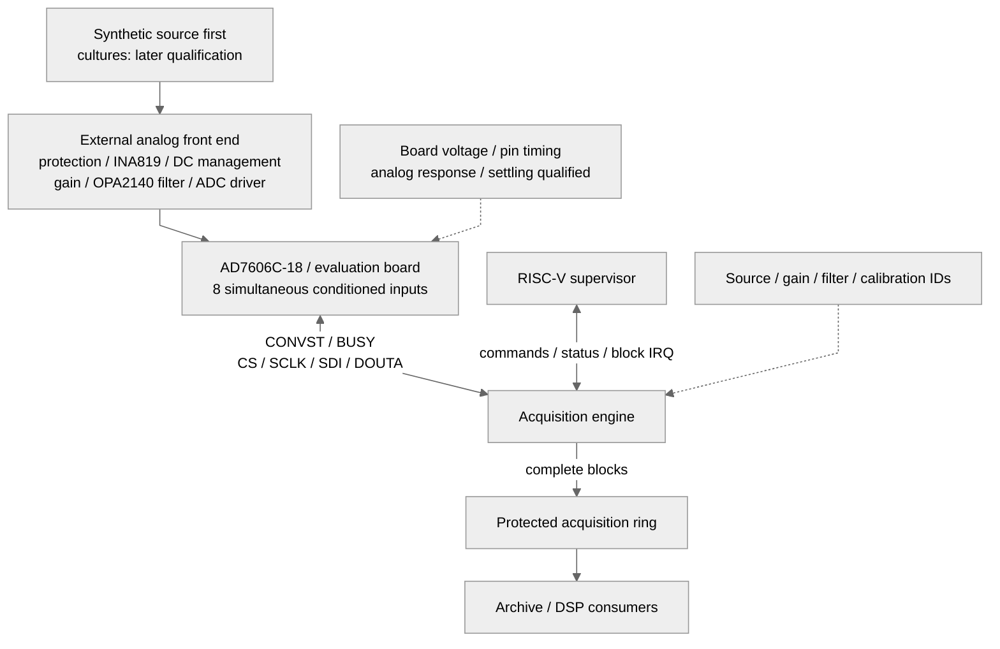
```mermaid
%%{init: {"theme":"neutral","themeVariables":{"fontFamily":"Arial,sans-serif","fontSize":"14px"},"flowchart":{"htmlLabels":true,"minNodeWidth":0,"wrappingWidth":240,"nodeSpacing":28,"rankSpacing":32,"curve":"linear"}}}%%
flowchart TB
    SRC["Synthetic source first<br/>cultures: later qualification"] --> AFE["External analog front end<br/>protection / INA819 / DC management<br/>gain / OPA2140 filter / ADC driver"]
    AFE --> ADC["AD7606C-18 / evaluation board<br/>8 simultaneous conditioned inputs"]
    ADC <-->|"CONVST / BUSY<br/>CS / SCLK / SDI / DOUTA"| ENG["Acquisition engine"]
    ENG -->|"complete blocks"| RAM["Protected acquisition ring"]
    CPU["RISC-V supervisor"] <-->|"commands / status / block IRQ"| ENG
    RAM --> CONS["Archive / DSP consumers"]
    QUAL["Board voltage / pin timing<br/>analog response / settling qualified"] -.-> ADC
    META["Source / gain / filter / calibration IDs"] -.-> ENG
```

## Acquisition data path

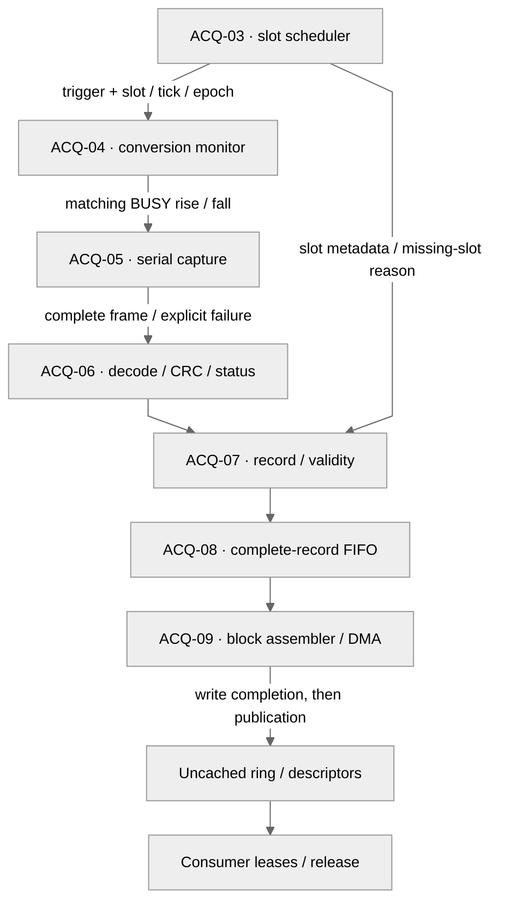
```mermaid
%%{init: {"theme":"neutral","themeVariables":{"fontFamily":"Arial,sans-serif","fontSize":"14px"},"flowchart":{"htmlLabels":true,"minNodeWidth":0,"wrappingWidth":240,"nodeSpacing":28,"rankSpacing":32,"curve":"linear"}}}%%
flowchart TB
    S["ACQ-03 · slot scheduler"] -->|"trigger + slot / tick / epoch"| B["ACQ-04 · conversion monitor"]
    B -->|"matching BUSY rise / fall"| SPI["ACQ-05 · serial capture"]
    SPI -->|"complete frame / explicit failure"| DEC["ACQ-06 · decode / CRC / status"]
    DEC --> REC["ACQ-07 · record / validity"]
    S -->|"slot metadata / missing-slot reason"| REC
    REC --> FIFO["ACQ-08 · complete-record FIFO"]
    FIFO --> DMA["ACQ-09 · block assembler / DMA"]
    DMA -->|"write completion, then publication"| RING["Uncached ring / descriptors"]
    RING --> OUT["Consumer leases / release"]
```

## Acquisition control plane

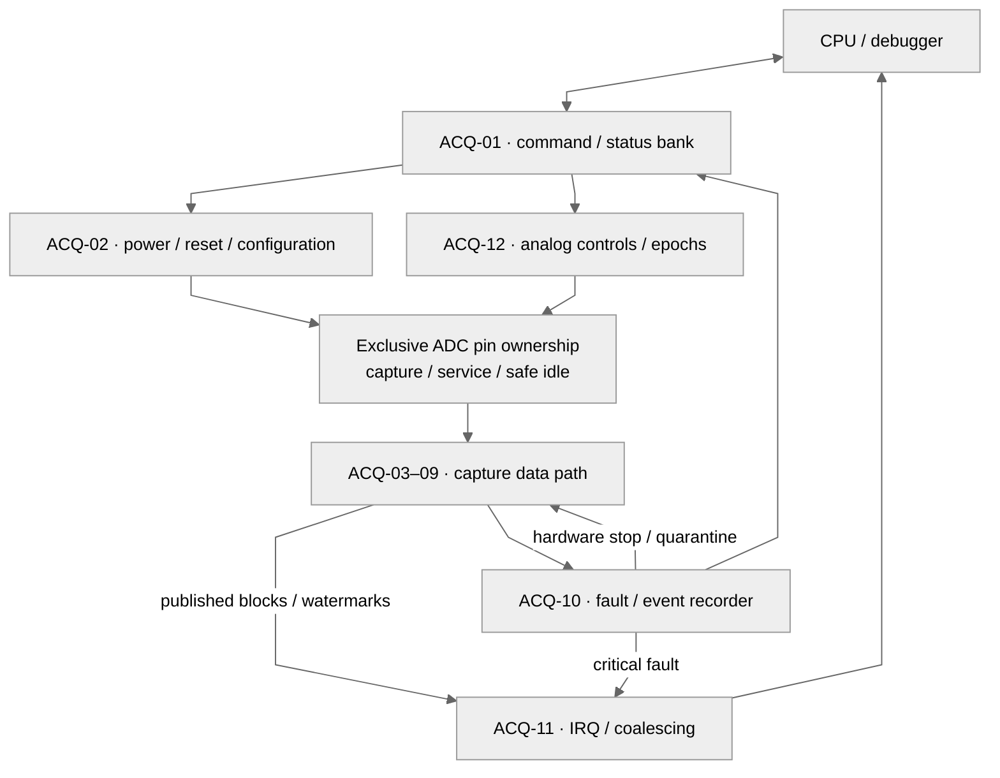
```mermaid
%%{init: {"theme":"neutral","themeVariables":{"fontFamily":"Arial,sans-serif","fontSize":"14px"},"flowchart":{"htmlLabels":true,"minNodeWidth":0,"wrappingWidth":240,"nodeSpacing":28,"rankSpacing":32,"curve":"linear"}}}%%
flowchart TB
    CPU["CPU / debugger"] <--> REG["ACQ-01 · command / status bank"]
    REG --> SEQ["ACQ-02 · power / reset / configuration"]
    REG --> EPOCH["ACQ-12 · analog controls / epochs"]
    SEQ --> OWNER["Exclusive ADC pin ownership<br/>capture / service / safe idle"]
    EPOCH --> OWNER
    OWNER --> RUN["ACQ-03–09 · capture data path"]
    RUN --> EVENTS["ACQ-10 · fault / event recorder"]
    EVENTS -->|"hardware stop / quarantine"| RUN
    RUN -->|"published blocks / watermarks"| IRQ["ACQ-11 · IRQ / coalescing"]
    EVENTS -->|"critical fault"| IRQ
    IRQ --> CPU
    EVENTS --> REG
```

## Acquisition clocks, crossings and reset

The [normative lifecycle supplement](clock-reset-lifecycle.md) supplies the reset matrix and protocol rules for this proposed diagram. The fixed acquisition clock uses enables; CPU reset preserves peripheral owners; destructive reset fences both crossing endpoints before clearing history. The record FIFO prepares static context before ARM and installs ARM-created ACE1 before system-side reads.

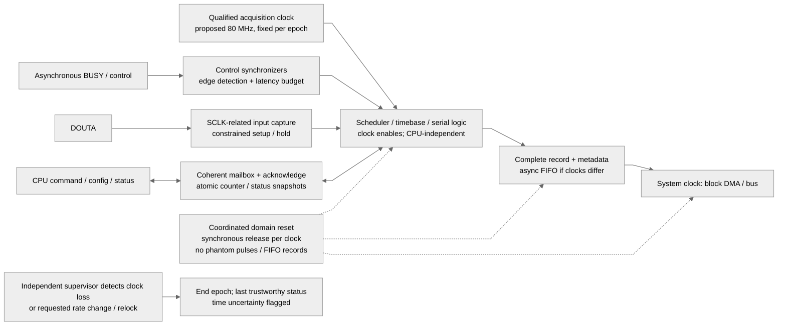
```mermaid
%%{init: {"theme":"neutral","themeVariables":{"fontFamily":"Arial,sans-serif","fontSize":"14px"},"flowchart":{"htmlLabels":true,"minNodeWidth":0,"wrappingWidth":240,"nodeSpacing":28,"rankSpacing":32,"curve":"linear"}}}%%
flowchart LR
    OSC["Qualified acquisition clock<br/>proposed 80 MHz, fixed per epoch"] --> ACQ["Scheduler / timebase / serial logic<br/>clock enables; CPU-independent"]
    BUSY["Asynchronous BUSY / control"] --> SYNC["Control synchronizers<br/>edge detection + latency budget"]
    SYNC --> ACQ
    DATA["DOUTA"] --> IO["SCLK-related input capture<br/>constrained setup / hold"]
    IO --> ACQ
    ACQ --> FIFO["Complete record + metadata<br/>async FIFO if clocks differ"]
    FIFO --> SYS["System clock: block DMA / bus"]
    CFG["CPU command / config / status"] <--> MB["Coherent mailbox + acknowledge<br/>atomic counter / status snapshots"]
    MB <--> ACQ
    RESET["Coordinated domain reset<br/>synchronous release per clock<br/>no phantom pulses / FIFO records"] -.-> ACQ
    RESET -.-> FIFO
    RESET -.-> SYS
    LOSS["Independent supervisor detects clock loss<br/>or requested rate change / relock"] --> END["End epoch; last trustworthy status<br/>time uncertainty flagged"]
```

## ACQ-01 · Control and register bank

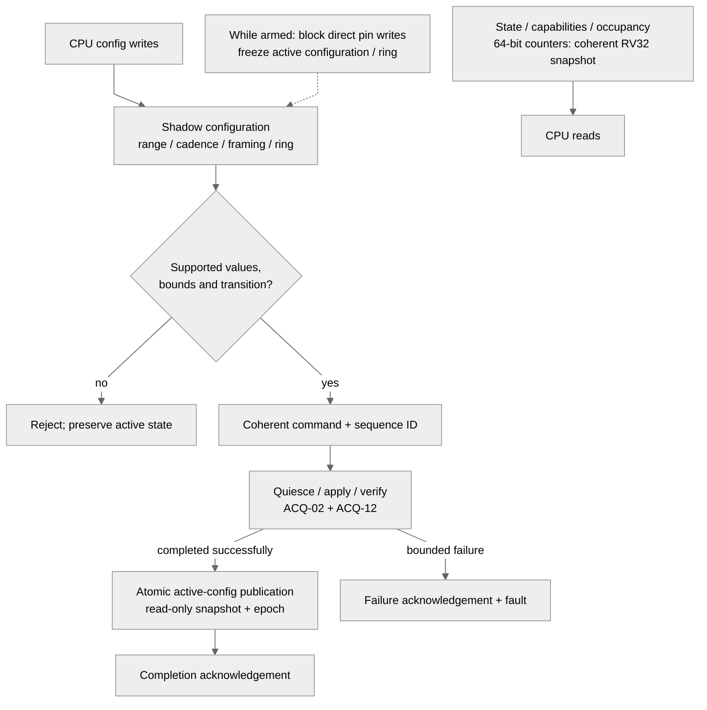
```mermaid
%%{init: {"theme":"neutral","themeVariables":{"fontFamily":"Arial,sans-serif","fontSize":"14px"},"flowchart":{"htmlLabels":true,"minNodeWidth":0,"wrappingWidth":240,"nodeSpacing":28,"rankSpacing":32,"curve":"linear"}}}%%
flowchart TB
    WR["CPU config writes"] --> SH["Shadow configuration<br/>range / cadence / framing / ring"]
    SH --> CHECK{"Supported values,<br/>bounds and transition?"}
    CHECK -->|"no"| ERR["Reject; preserve active state"]
    CHECK -->|"yes"| CMD["Coherent command + sequence ID"]
    CMD --> EXEC["Quiesce / apply / verify<br/>ACQ-02 + ACQ-12"]
    EXEC -->|"completed successfully"| ACTIVE["Atomic active-config publication<br/>read-only snapshot + epoch"]
    ACTIVE --> ACK["Completion acknowledgement"]
    EXEC -->|"bounded failure"| FAIL["Failure acknowledgement + fault"]
    READ["State / capabilities / occupancy<br/>64-bit counters: coherent RV32 snapshot"] --> CPU["CPU reads"]
    LOCK["While armed: block direct pin writes<br/>freeze active configuration / ring"] -.-> SH
```

## ACQ-02 · Power and startup

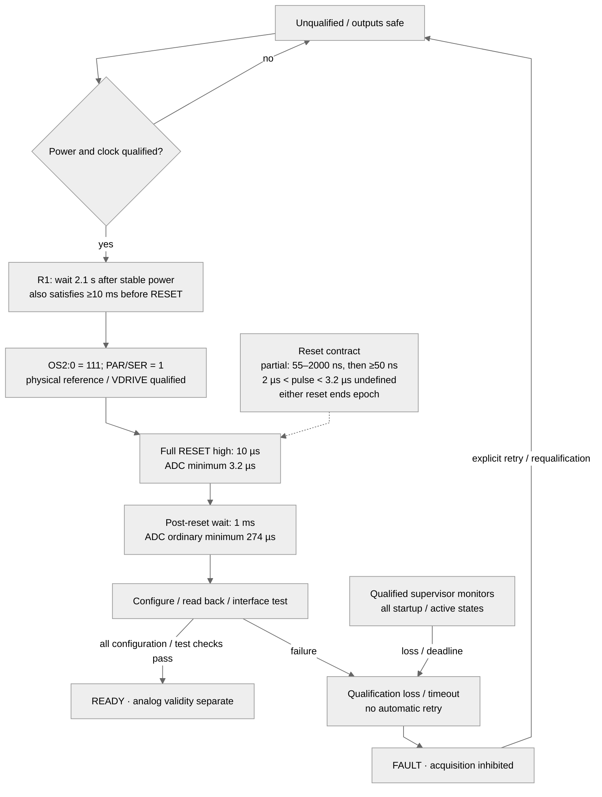
```mermaid
%%{init: {"theme":"neutral","themeVariables":{"fontFamily":"Arial,sans-serif","fontSize":"14px"},"flowchart":{"htmlLabels":true,"minNodeWidth":0,"wrappingWidth":240,"nodeSpacing":28,"rankSpacing":32,"curve":"linear"}}}%%
flowchart TB
    OFF["Unqualified / outputs safe"] --> PWR{"Power and clock qualified?"}
    PWR -->|"no"| OFF
    PWR -->|"yes"| WAIT["R1: wait 2.1 s after stable power<br/>also satisfies ≥10 ms before RESET"]
    WAIT --> PINS["OS2:0 = 111; PAR/SER = 1<br/>physical reference / VDRIVE qualified"]
    PINS --> RESET["Full RESET high: 10 µs<br/>ADC minimum 3.2 µs"]
    RESET --> SETTLE["Post-reset wait: 1 ms<br/>ADC ordinary minimum 274 µs"]
    SETTLE --> CONFIG["Configure / read back / interface test"]
    CONFIG -->|"all configuration / test checks pass"| READY["READY · analog validity separate"]
    CONFIG -->|"failure"| BAD
    BAD["Qualification loss / timeout<br/>no automatic retry"] --> FAULT["FAULT · acquisition inhibited"]
    MON["Qualified supervisor monitors<br/>all startup / active states"] -->|"loss / deadline"| BAD
    FAULT -->|"explicit retry / requalification"| OFF
    PART["Reset contract<br/>partial: 55–2000 ns, then ≥50 ns<br/>2 µs < pulse < 3.2 µs undefined<br/>either reset ends epoch"] -.-> RESET
```

## ACQ-02 · Configuration and service sequence

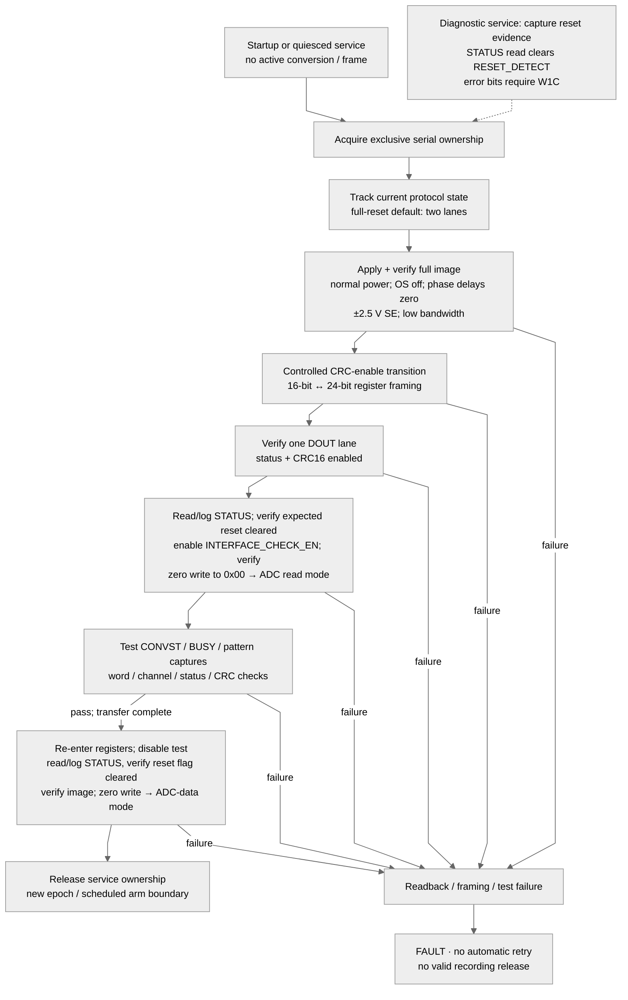
```mermaid
%%{init: {"theme":"neutral","themeVariables":{"fontFamily":"Arial,sans-serif","fontSize":"14px"},"flowchart":{"htmlLabels":true,"minNodeWidth":0,"wrappingWidth":240,"nodeSpacing":28,"rankSpacing":32,"curve":"linear"}}}%%
flowchart TB
    ENTER["Startup or quiesced service<br/>no active conversion / frame"] --> OWN["Acquire exclusive serial ownership"]
    OWN --> MODE["Track current protocol state<br/>full-reset default: two lanes"]
    MODE --> IMAGE["Apply + verify full image<br/>normal power; OS off; phase delays zero<br/>±2.5 V SE; low bandwidth"]
    IMAGE --> CRC["Controlled CRC-enable transition<br/>16-bit ↔ 24-bit register framing"]
    CRC --> FRAME["Verify one DOUT lane<br/>status + CRC16 enabled"]
    FRAME --> ENABLE["Read/log STATUS; verify expected reset cleared<br/>enable INTERFACE_CHECK_EN; verify<br/>zero write to 0x00 → ADC read mode"]
    ENABLE --> TEST["Test CONVST / BUSY / pattern captures<br/>word / channel / status / CRC checks"]
    TEST -->|"pass; transfer complete"| EXIT["Re-enter registers; disable test<br/>read/log STATUS, verify reset flag cleared<br/>verify image; zero write → ADC-data mode"]
    EXIT --> RELEASE["Release service ownership<br/>new epoch / scheduled arm boundary"]
    DIAG["Diagnostic service: capture reset evidence<br/>STATUS read clears RESET_DETECT<br/>error bits require W1C"] -.-> OWN
    ERROR["Readback / framing / test failure"] --> STOP["FAULT · no automatic retry<br/>no valid recording release"]
    IMAGE -->|"failure"| ERROR
    CRC -->|"failure"| ERROR
    FRAME -->|"failure"| ERROR
    ENABLE -->|"failure"| ERROR
    TEST -->|"failure"| ERROR
    EXIT -->|"failure"| ERROR
```

## ACQ-03 · Timebase and scheduled slots

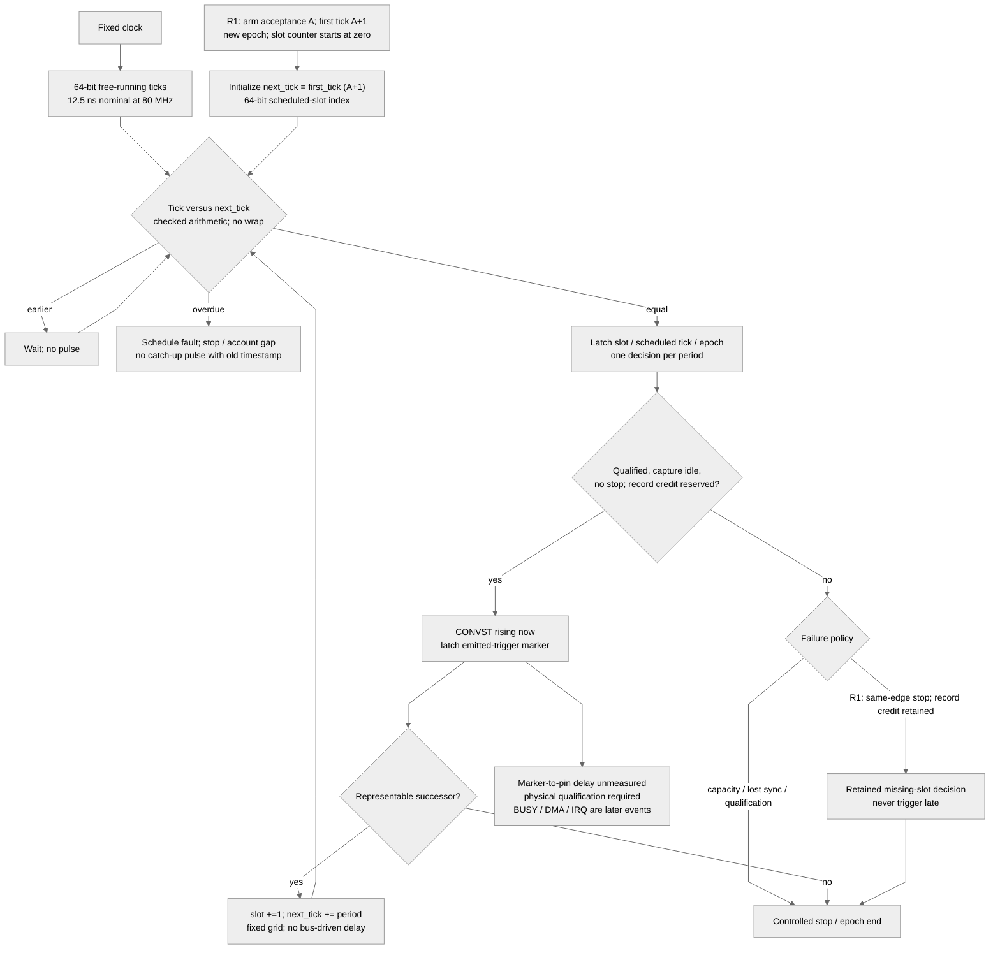
```mermaid
%%{init: {"theme":"neutral","themeVariables":{"fontFamily":"Arial,sans-serif","fontSize":"14px"},"flowchart":{"htmlLabels":true,"minNodeWidth":0,"wrappingWidth":240,"nodeSpacing":28,"rankSpacing":32,"curve":"linear"}}}%%
flowchart TB
    CLK["Fixed clock"] --> TICK["64-bit free-running ticks<br/>12.5 ns nominal at 80 MHz"]
    ARM["R1: arm acceptance A; first tick A+1<br/>new epoch; slot counter starts at zero"] --> NEXT["Initialize next_tick = first_tick (A+1)<br/>64-bit scheduled-slot index"]
    TICK --> DUE{"Tick versus next_tick<br/>checked arithmetic; no wrap"}
    NEXT --> DUE
    DUE -->|"earlier"| WAIT["Wait; no pulse"]
    WAIT --> DUE
    DUE -->|"overdue"| LATE["Schedule fault; stop / account gap<br/>no catch-up pulse with old timestamp"]
    DUE -->|"equal"| SLOT["Latch slot / scheduled tick / epoch<br/>one decision per period"]
    SLOT --> READY{"Qualified, capture idle,<br/>no stop; record credit reserved?"}
    READY -->|"yes"| TRIG["CONVST rising now<br/>latch emitted-trigger marker"]
    READY -->|"no"| WHY{"Failure policy"}
    WHY -->|"R1: same-edge stop; record credit retained"| GAP["Retained missing-slot decision<br/>never trigger late"]
    WHY -->|"capacity / lost sync / qualification"| STOP["Controlled stop / epoch end"]
    TRIG --> LIMIT{"Representable successor?"}
    LIMIT -->|"yes"| ADV["slot +=1; next_tick += period<br/>fixed grid; no bus-driven delay"]
    LIMIT -->|"no"| STOP
    GAP --> STOP
    ADV --> DUE
    TRIG --> OFFSET["Marker-to-pin delay unmeasured<br/>physical qualification required<br/>BUSY / DMA / IRQ are later events"]
```

## Acquisition baseline timing budget

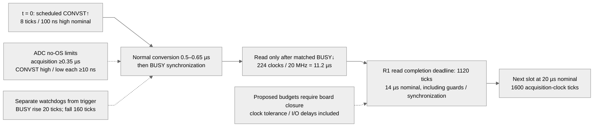
```mermaid
%%{init: {"theme":"neutral","themeVariables":{"fontFamily":"Arial,sans-serif","fontSize":"14px"},"flowchart":{"htmlLabels":true,"minNodeWidth":0,"wrappingWidth":240,"nodeSpacing":28,"rankSpacing":32,"curve":"linear"}}}%%
flowchart LR
    T0["t = 0: scheduled CONVST↑<br/>8 ticks / 100 ns high nominal"] --> BUSY["Normal conversion 0.5–0.65 µs<br/>then BUSY synchronization"]
    BUSY --> READ["Read only after matched BUSY↓<br/>224 clocks / 20 MHz = 11.2 µs"]
    READ --> DONE["R1 read completion deadline: 1120 ticks<br/>14 µs nominal, including guards / synchronization"]
    DONE --> NEXT["Next slot at 20 µs nominal<br/>1600 acquisition-clock ticks"]
    LIMIT["ADC no-OS limits<br/>acquisition ≥0.35 µs<br/>CONVST high / low each ≥10 ns"] -.-> BUSY
    WATCH["Separate watchdogs from trigger<br/>BUSY rise 20 ticks; fall 160 ticks"] -.-> BUSY
    GATE["Proposed budgets require board closure<br/>clock tolerance / I/O delays included"] -.-> DONE
```

## ACQ-04 · Conversion monitor

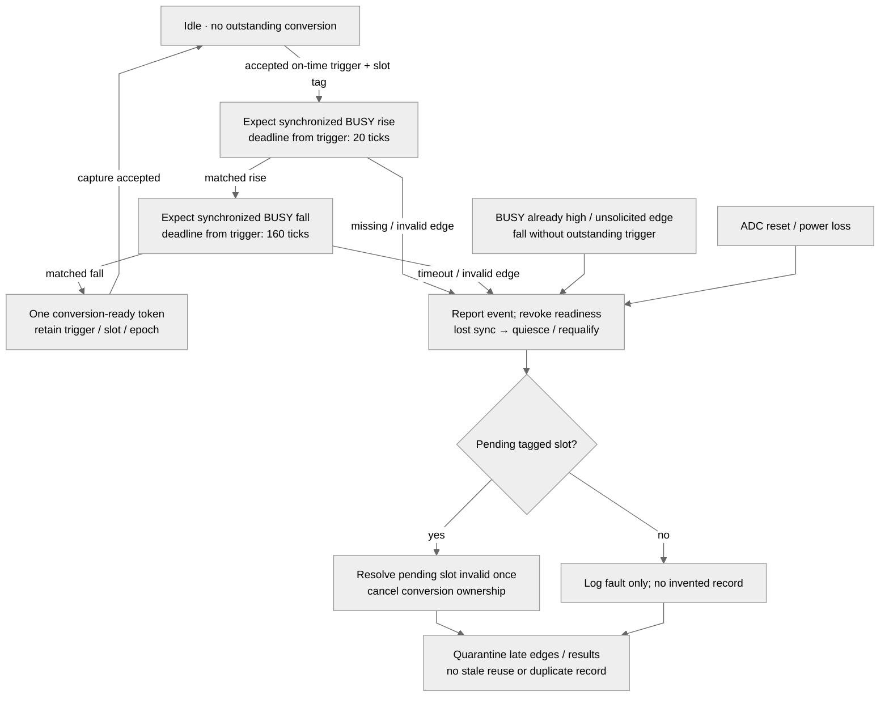
```mermaid
%%{init: {"theme":"neutral","themeVariables":{"fontFamily":"Arial,sans-serif","fontSize":"14px"},"flowchart":{"htmlLabels":true,"minNodeWidth":0,"wrappingWidth":240,"nodeSpacing":28,"rankSpacing":32,"curve":"linear"}}}%%
flowchart TB
    IDLE["Idle · no outstanding conversion"] -->|"accepted on-time trigger + slot tag"| RISE["Expect synchronized BUSY rise<br/>deadline from trigger: 20 ticks"]
    RISE -->|"matched rise"| FALL["Expect synchronized BUSY fall<br/>deadline from trigger: 160 ticks"]
    FALL -->|"matched fall"| READY["One conversion-ready token<br/>retain trigger / slot / epoch"]
    READY -->|"capture accepted"| IDLE
    RISE -->|"missing / invalid edge"| BAD["Report event; revoke readiness<br/>lost sync → quiesce / requalify"]
    FALL -->|"timeout / invalid edge"| BAD
    STRAY["BUSY already high / unsolicited edge<br/>fall without outstanding trigger"] --> BAD
    BAD --> PENDING{"Pending tagged slot?"}
    PENDING -->|"yes"| CANCEL["Resolve pending slot invalid once<br/>cancel conversion ownership"]
    PENDING -->|"no"| EVENT["Log fault only; no invented record"]
    CANCEL --> HOLD["Quarantine late edges / results<br/>no stale reuse or duplicate record"]
    EVENT --> HOLD
    RESET["ADC reset / power loss"] --> BAD
```

## ACQ-05 · Serial ownership and capture

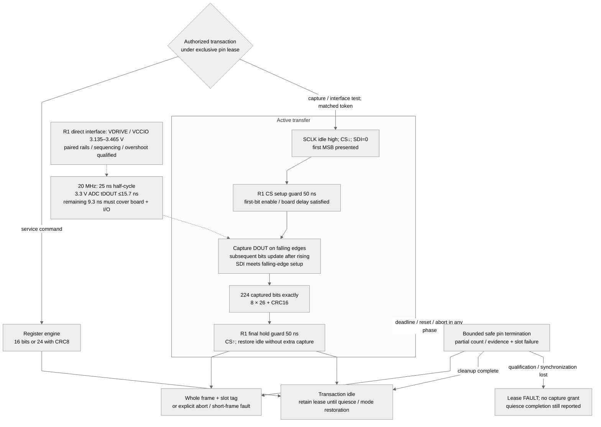
```mermaid
%%{init: {"theme":"neutral","themeVariables":{"fontFamily":"Arial,sans-serif","fontSize":"14px"},"flowchart":{"htmlLabels":true,"minNodeWidth":0,"wrappingWidth":240,"nodeSpacing":28,"rankSpacing":32,"curve":"linear"}}}%%
flowchart TB
    OWN{"Authorized transaction<br/>under exclusive pin lease"} -->|"service command"| REG["Register engine<br/>16 bits or 24 with CRC8"]
    OWN -->|"capture / interface test; matched token"| CS
    subgraph ACTIVE["Active transfer"]
        CS["SCLK idle high; CS↓; SDI=0<br/>first MSB presented"] --> PRE["R1 CS setup guard 50 ns<br/>first-bit enable / board delay satisfied"]
        PRE --> SHIFT["Capture DOUT on falling edges<br/>subsequent bits update after rising<br/>SDI meets falling-edge setup"]
        SHIFT --> COUNT["224 captured bits exactly<br/>8 × 26 + CRC16"]
        COUNT --> POST["R1 final hold guard 50 ns<br/>CS↑; restore idle without extra capture"]
    end
    ACTIVE -->|"deadline / reset / abort in any phase"| ABORT["Bounded safe pin termination<br/>partial count / evidence + slot failure"]
    POST --> OUT["Whole frame + slot tag<br/>or explicit abort / short-frame fault"]
    ABORT --> OUT
    ABORT -->|"cleanup complete"| IDLE
    ABORT -->|"qualification / synchronization lost"| FAULT["Lease FAULT; no capture grant<br/>quiesce completion still reported"]
    REG --> IDLE["Transaction idle<br/>retain lease until quiesce / mode restoration"]
    POST --> IDLE
    TIMING["20 MHz: 25 ns half-cycle<br/>3.3 V ADC tDOUT ≤15.7 ns<br/>remaining 9.3 ns must cover board + I/O"] -.-> SHIFT
    VOLT["R1 direct interface: VDRIVE / VCCIO 3.135–3.465 V<br/>paired rails / sequencing / overshoot qualified"] -.-> TIMING
```

## ACQ-05 · Pin lease transitions

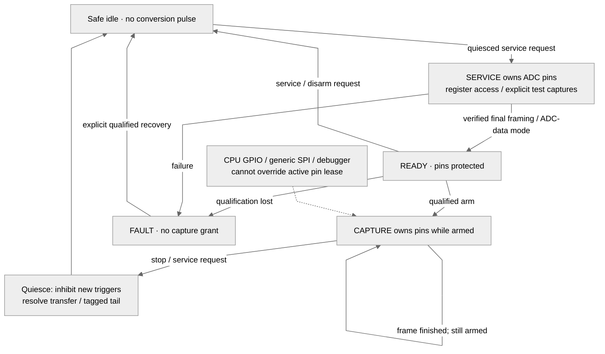
```mermaid
%%{init: {"theme":"neutral","themeVariables":{"fontFamily":"Arial,sans-serif","fontSize":"14px"},"flowchart":{"htmlLabels":true,"minNodeWidth":0,"wrappingWidth":240,"nodeSpacing":28,"rankSpacing":32,"curve":"linear"}}}%%
flowchart TB
    SAFE["Safe idle · no conversion pulse"] -->|"quiesced service request"| SERVICE["SERVICE owns ADC pins<br/>register access / explicit test captures"]
    SERVICE -->|"verified final framing / ADC-data mode"| READY["READY · pins protected"]
    READY -->|"qualified arm"| CAP["CAPTURE owns pins while armed"]
    READY -->|"service / disarm request"| SAFE
    READY -->|"qualification lost"| FAULT
    CAP -->|"frame finished; still armed"| CAP
    CAP -->|"stop / service request"| QUIET["Quiesce: inhibit new triggers<br/>resolve transfer / tagged tail"]
    QUIET --> SAFE
    SERVICE -->|"failure"| FAULT["FAULT · no capture grant"]
    FAULT -->|"explicit qualified recovery"| SAFE
    LOCK["CPU GPIO / generic SPI / debugger<br/>cannot override active pin lease"] -.-> CAP
```

## ACQ-05 · Pipelined register access

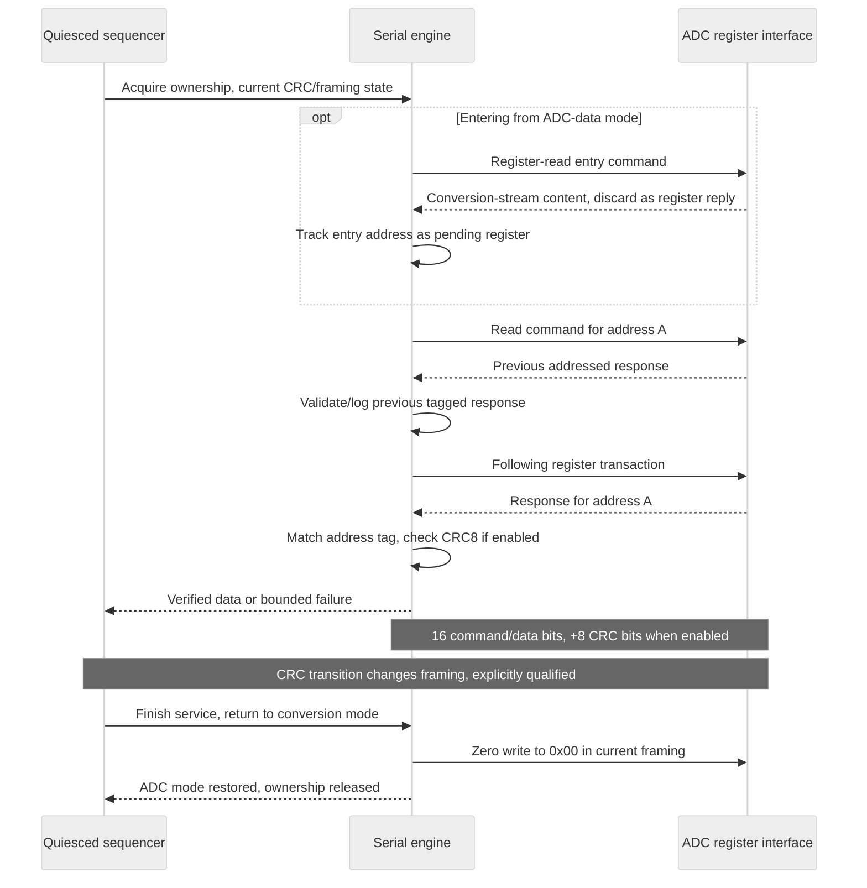
```mermaid
%%{init: {"theme":"neutral","themeVariables":{"fontFamily":"Arial,sans-serif","fontSize":"14px"},"flowchart":{"htmlLabels":true,"minNodeWidth":0,"wrappingWidth":240,"nodeSpacing":28,"rankSpacing":32,"curve":"linear"}}}%%
sequenceDiagram
    participant Q as Quiesced sequencer
    participant S as Serial engine
    participant A as ADC register interface
    Q->>S: Acquire ownership, current CRC/framing state
    opt Entering from ADC-data mode
        S->>A: Register-read entry command
        A-->>S: Conversion-stream content, discard as register reply
        S->>S: Track entry address as pending register
    end
    S->>A: Read command for address A
    A-->>S: Previous addressed response
    S->>S: Validate/log previous tagged response
    S->>A: Following register transaction
    A-->>S: Response for address A
    S->>S: Match address tag, check CRC8 if enabled
    S-->>Q: Verified data or bounded failure
    Note over S,A: 16 command/data bits, +8 CRC bits when enabled
    Note over Q,A: CRC transition changes framing, explicitly qualified
    Q->>S: Finish service, return to conversion mode
    S->>A: Zero write to 0x00 in current framing
    S-->>Q: ADC mode restored, ownership released
```

## ACQ-06 · Frame decoder and status

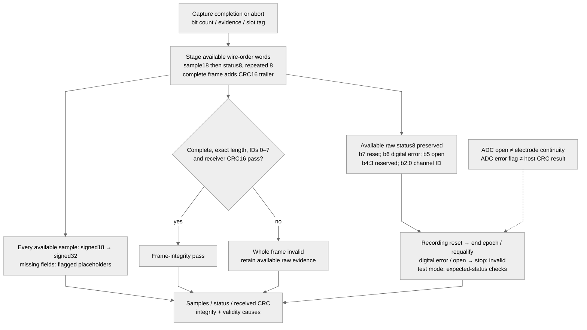
```mermaid
%%{init: {"theme":"neutral","themeVariables":{"fontFamily":"Arial,sans-serif","fontSize":"14px"},"flowchart":{"htmlLabels":true,"minNodeWidth":0,"wrappingWidth":240,"nodeSpacing":28,"rankSpacing":32,"curve":"linear"}}}%%
flowchart TB
    IN["Capture completion or abort<br/>bit count / evidence / slot tag"] --> STAGE["Stage available wire-order words<br/>sample18 then status8, repeated 8<br/>complete frame adds CRC16 trailer"]
    STAGE --> CHECK{"Complete, exact length, IDs 0–7<br/>and receiver CRC16 pass?"}
    CHECK -->|"yes"| PASS["Frame-integrity pass"]
    CHECK -->|"no"| BAD["Whole frame invalid<br/>retain available raw evidence"]
    STAGE --> NUM["Every available sample: signed18 → signed32<br/>missing fields: flagged placeholders"]
    STAGE --> STATUS["Available raw status8 preserved<br/>b7 reset; b6 digital error; b5 open<br/>b4:3 reserved; b2:0 channel ID"]
    STATUS --> FLAGS["Recording reset → end epoch / requalify<br/>digital error / open → stop; invalid<br/>test mode: expected-status checks"]
    NUM --> OUT["Samples / status / received CRC<br/>integrity + validity causes"]
    PASS --> OUT
    BAD --> OUT
    FLAGS --> OUT
    NOTE["ADC open ≠ electrode continuity<br/>ADC error flag ≠ host CRC result"] -.-> FLAGS
```

## ACQ-06 · CRC qualification gate

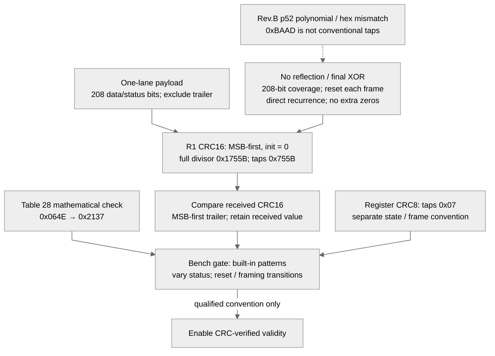
```mermaid
%%{init: {"theme":"neutral","themeVariables":{"fontFamily":"Arial,sans-serif","fontSize":"14px"},"flowchart":{"htmlLabels":true,"minNodeWidth":0,"wrappingWidth":240,"nodeSpacing":28,"rankSpacing":32,"curve":"linear"}}}%%
flowchart TB
    WIRE["One-lane payload<br/>208 data/status bits; exclude trailer"] --> CRC["R1 CRC16: MSB-first, init = 0<br/>full divisor 0x1755B; taps 0x755B"]
    CRC --> MATCH["Compare received CRC16<br/>MSB-first trailer; retain received value"]
    SPEC["No reflection / final XOR<br/>208-bit coverage; reset each frame<br/>direct recurrence; no extra zeros"] --> CRC
    EX["Table 28 mathematical check<br/>0x064E → 0x2137"] --> QUAL["Bench gate: built-in patterns<br/>vary status; reset / framing transitions"]
    MATCH --> QUAL
    QUAL -->|"qualified convention only"| PASS["Enable CRC-verified validity"]
    ISSUE["Rev.B p52 polynomial / hex mismatch<br/>0xBAAD is not conventional taps"] -.-> SPEC
    REG["Register CRC8: taps 0x07<br/>separate state / frame convention"] --> QUAL
```

## ACQ-07 · Record and validity assembler

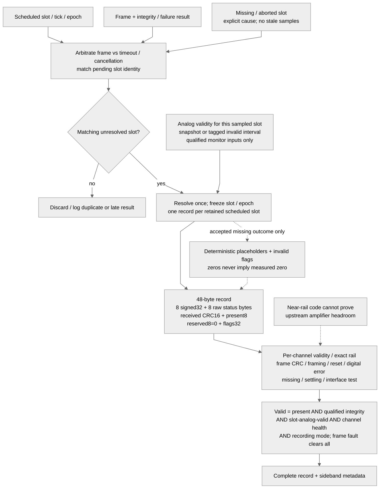
```mermaid
%%{init: {"theme":"neutral","themeVariables":{"fontFamily":"Arial,sans-serif","fontSize":"14px"},"flowchart":{"htmlLabels":true,"minNodeWidth":0,"wrappingWidth":240,"nodeSpacing":28,"rankSpacing":32,"curve":"linear"}}}%%
flowchart TB
    SLOT["Scheduled slot / tick / epoch"] --> MATCH["Arbitrate frame vs timeout / cancellation<br/>match pending slot identity"]
    DATA["Frame + integrity / failure result"] --> MATCH
    MISS["Missing / aborted slot<br/>explicit cause; no stale samples"] --> MATCH
    MATCH --> LIVE{"Matching unresolved slot?"}
    LIVE -->|"no"| DROP["Discard / log duplicate or late result"]
    LIVE -->|"yes"| JOIN["Resolve once; freeze slot / epoch<br/>one record per retained scheduled slot"]
    AFE["Analog validity for this sampled slot<br/>snapshot or tagged invalid interval<br/>qualified monitor inputs only"] --> JOIN
    JOIN --> RECORD["48-byte record<br/>8 signed32 + 8 raw status bytes<br/>received CRC16 + present8<br/>reserved8=0 + flags32"]
    RECORD --> FLAGS["Per-channel validity / exact rail<br/>frame CRC / framing / reset / digital error<br/>missing / settling / interface test"]
    FLAGS --> VALID["Valid = present AND qualified integrity<br/>AND slot-analog-valid AND channel health<br/>AND recording mode; frame fault clears all"]
    VALID --> FIFO["Complete record + sideband metadata"]
    JOIN -.->|"accepted missing outcome only"| ZERO["Deterministic placeholders + invalid flags<br/>zeros never imply measured zero"]
    ZERO -.-> RECORD
    LIMIT["Near-rail code cannot prove<br/>upstream amplifier headroom"] -.-> FLAGS
```

## Acquisition records and blocks

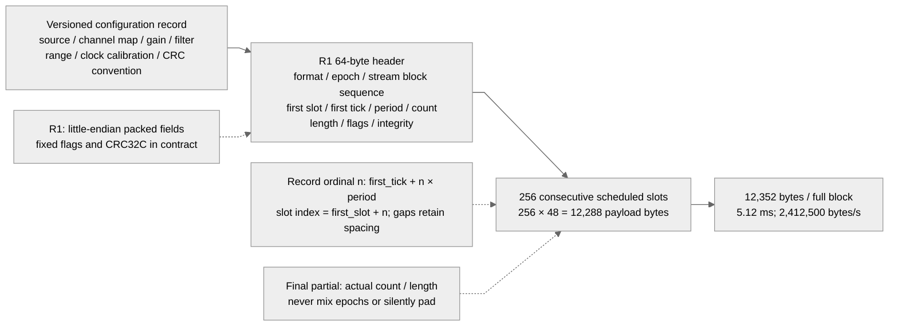
```mermaid
%%{init: {"theme":"neutral","themeVariables":{"fontFamily":"Arial,sans-serif","fontSize":"14px"},"flowchart":{"htmlLabels":true,"minNodeWidth":0,"wrappingWidth":240,"nodeSpacing":28,"rankSpacing":32,"curve":"linear"}}}%%
flowchart LR
    SESSION["Versioned configuration record<br/>source / channel map / gain / filter<br/>range / clock calibration / CRC convention"] --> HEADER["R1 64-byte header<br/>format / epoch / stream block sequence<br/>first slot / first tick / period / count<br/>length / flags / integrity"]
    HEADER --> PAY["256 consecutive scheduled slots<br/>256 × 48 = 12,288 payload bytes"]
    PAY --> TOTAL["12,352 bytes / full block<br/>5.12 ms; 2,412,500 bytes/s"]
    TIME["Record ordinal n: first_tick + n × period<br/>slot index = first_slot + n; gaps retain spacing"] -.-> PAY
    PART["Final partial: actual count / length<br/>never mix epochs or silently pad"] -.-> PAY
    FORMAT["R1: little-endian packed fields<br/>fixed flags and CRC32C in contract"] -.-> HEADER
```

## ACQ-08 · Elastic capture FIFO

The current [single-clock ledger](record-reservations.md) implements ordered reservations and complete-record holding. The diagram below remains the proposed complete engine, including the separately required asynchronous crossing and physical service qualification.

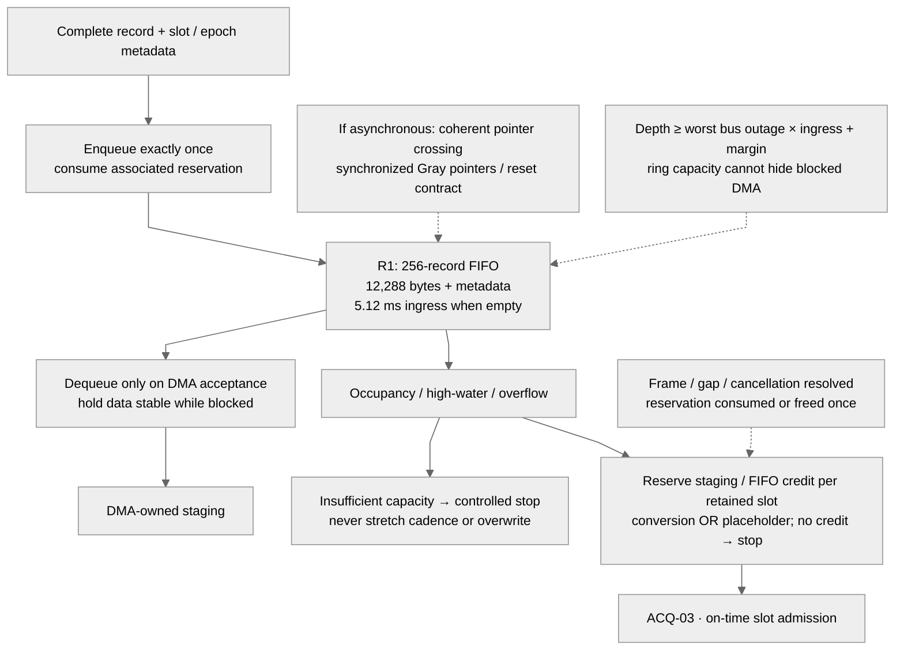
```mermaid
%%{init: {"theme":"neutral","themeVariables":{"fontFamily":"Arial,sans-serif","fontSize":"14px"},"flowchart":{"htmlLabels":true,"minNodeWidth":0,"wrappingWidth":240,"nodeSpacing":28,"rankSpacing":32,"curve":"linear"}}}%%
flowchart TB
    IN["Complete record + slot / epoch metadata"] --> PUSH["Enqueue exactly once<br/>consume associated reservation"]
    PUSH --> FIFO["R1: 256-record FIFO<br/>12,288 bytes + metadata<br/>5.12 ms ingress when empty"]
    FIFO --> POP["Dequeue only on DMA acceptance<br/>hold data stable while blocked"]
    POP --> DMA["DMA-owned staging"]
    FIFO --> OCC["Occupancy / high-water / overflow"]
    OCC --> STOP["Insufficient capacity → controlled stop<br/>never stretch cadence or overwrite"]
    OCC --> CREDIT["Reserve staging / FIFO credit per retained slot<br/>conversion OR placeholder; no credit → stop"]
    CREDIT --> SCHED["ACQ-03 · on-time slot admission"]
    RESOLVE["Frame / gap / cancellation resolved<br/>reservation consumed or freed once"] -.-> CREDIT
    CDC["If asynchronous: coherent pointer crossing<br/>synchronized Gray pointers / reset contract"] -.-> FIFO
    BOUND["Depth ≥ worst bus outage × ingress + margin<br/>ring capacity cannot hide blocked DMA"] -.-> FIFO
```

## ACQ-08 · Ordered epoch closure

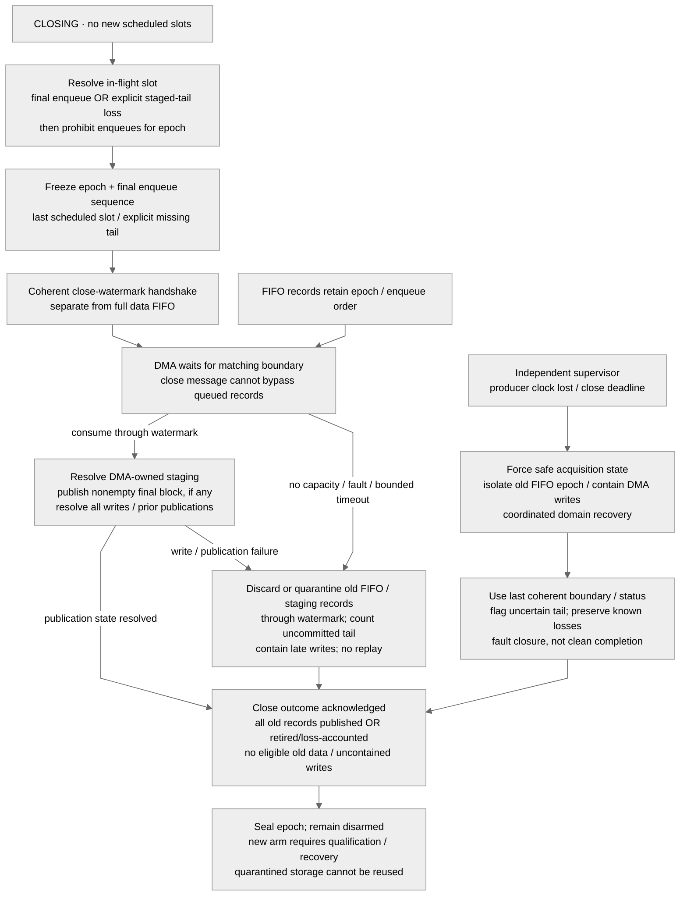
```mermaid
%%{init: {"theme":"neutral","themeVariables":{"fontFamily":"Arial,sans-serif","fontSize":"14px"},"flowchart":{"htmlLabels":true,"minNodeWidth":0,"wrappingWidth":240,"nodeSpacing":28,"rankSpacing":32,"curve":"linear"}}}%%
flowchart TB
    CLOSE["CLOSING · no new scheduled slots"] --> FINAL["Resolve in-flight slot<br/>final enqueue OR explicit staged-tail loss<br/>then prohibit enqueues for epoch"]
    FINAL --> SNAP["Freeze epoch + final enqueue sequence<br/>last scheduled slot / explicit missing tail"]
    SNAP --> MAIL["Coherent close-watermark handshake<br/>separate from full data FIFO"]
    MAIL --> DMA["DMA waits for matching boundary<br/>close message cannot bypass queued records"]
    FIFO["FIFO records retain epoch / enqueue order"] --> DMA
    DMA -->|"consume through watermark"| COMMIT["Resolve DMA-owned staging<br/>publish nonempty final block, if any<br/>resolve all writes / prior publications"]
    COMMIT -->|"publication state resolved"| ACK["Close outcome acknowledged<br/>all old records published OR retired/loss-accounted<br/>no eligible old data / uncontained writes"]
    DMA -->|"no capacity / fault / bounded timeout"| LOSS["Discard or quarantine old FIFO / staging records<br/>through watermark; count uncommitted tail<br/>contain late writes; no replay"]
    COMMIT -->|"write / publication failure"| LOSS
    LOSS --> ACK
    SUP["Independent supervisor<br/>producer clock lost / close deadline"] --> ABORT["Force safe acquisition state<br/>isolate old FIFO epoch / contain DMA writes<br/>coordinated domain recovery"]
    ABORT --> UNCERTAIN["Use last coherent boundary / status<br/>flag uncertain tail; preserve known losses<br/>fault closure, not clean completion"]
    UNCERTAIN --> ACK
    ACK --> SEAL["Seal epoch; remain disarmed<br/>new arm requires qualification / recovery<br/>quarantined storage cannot be reused"]
```

## ACQ-09 · Block assembler and capture DMA

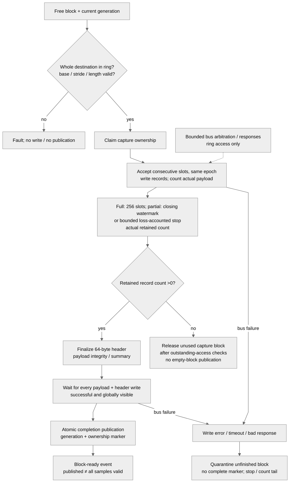
```mermaid
%%{init: {"theme":"neutral","themeVariables":{"fontFamily":"Arial,sans-serif","fontSize":"14px"},"flowchart":{"htmlLabels":true,"minNodeWidth":0,"wrappingWidth":240,"nodeSpacing":28,"rankSpacing":32,"curve":"linear"}}}%%
flowchart TB
    DESC["Free block + current generation"] --> CHECK{"Whole destination in ring?<br/>base / stride / length valid?"}
    CHECK -->|"no"| BAD["Fault; no write / no publication"]
    CHECK -->|"yes"| CLAIM["Claim capture ownership"]
    CLAIM --> FILL["Accept consecutive slots, same epoch<br/>write records; count actual payload"]
    FILL --> CLOSE["Full: 256 slots; partial: closing watermark<br/>or bounded loss-accounted stop<br/>actual retained count"]
    CLOSE --> NONEMPTY{"Retained record count >0?"}
    NONEMPTY -->|"yes"| HDR["Finalize 64-byte header<br/>payload integrity / summary"]
    NONEMPTY -->|"no"| EMPTY["Release unused capture block<br/>after outstanding-access checks<br/>no empty-block publication"]
    HDR --> WAIT["Wait for every payload + header write<br/>successful and globally visible"]
    WAIT --> PUB["Atomic completion publication<br/>generation + ownership marker"]
    PUB --> IRQ["Block-ready event<br/>published ≠ all samples valid"]
    BUS["Bounded bus arbitration / responses<br/>ring access only"] -.-> FILL
    FAIL["Write error / timeout / bad response"] --> QUAR["Quarantine unfinished block<br/>no complete marker; stop / count tail"]
    FILL -->|"bus failure"| FAIL
    WAIT -->|"bus failure"| FAIL
```

## ACQ-09 · Ring ownership

```mermaid
%%{init: {"theme":"neutral","themeVariables":{"fontFamily":"Arial,sans-serif","fontSize":"14px"},"flowchart":{"htmlLabels":true,"minNodeWidth":0,"wrappingWidth":240,"nodeSpacing":28,"rankSpacing":32,"curve":"linear"}}}%%
flowchart TB
    FREE["FREE · generation g"] --> CAP["CAPTURE-owned<br/>CPU / consumers cannot modify"]
    CAP -->|"all writes successful + globally visible"| PUB["PUBLISHED · immutable<br/>generation g + completion"]
    CAP -->|"unused empty block; accesses drained"| NEXT
    PUB --> LEASE["Mandatory recording / transport leases<br/>optional analysis admission: bounded read / copy"]
    LEASE --> RELEASE{"Required releases complete<br/>and ALL granted reads drained<br/>for generation g?"}
    RELEASE -->|"no"| HOLD["Retain; cannot reuse"]
    HOLD -->|"release / read-completion event"| RELEASE
    RELEASE -->|"yes"| NEXT["Return FREE with new generation"]
    NEXT --> FREE
    STALE["Stale release / ambiguous generation reuse"] --> REJECT["Reject; defined generation-wrap contract<br/>normal ring-index wrap remains legal"]
    CAP -->|"DMA failure"| QUAR["QUARANTINED<br/>no reuse until late writes impossible"]
    SIZE["64 blocks = 790,528 bytes<br/>327.68 ms nominal, not guaranteed free space"] -.-> FREE
    TEST["100 ms consumer-stall target<br/>start ≥24 free blocks; FIFO/bus checked separately"] -.-> LEASE
```

## ACQ-10 · Fault and event recorder

```mermaid
%%{init: {"theme":"neutral","themeVariables":{"fontFamily":"Arial,sans-serif","fontSize":"14px"},"flowchart":{"htmlLabels":true,"minNodeWidth":0,"wrappingWidth":240,"nodeSpacing":28,"rankSpacing":32,"curve":"linear"}}}%%
flowchart LR
    SRC["ADC / timing / CRC / analog / DMA<br/>clock / power / reset / overflow"] --> LATCH["Sticky first + latest fault<br/>cause / slot / epoch / tick / address"]
    SRC --> COUNT["64-bit per-cause counters<br/>coherent reads; defined wrap / clear"]
    SRC --> POLICY["Hardware severity policy"]
    POLICY -->|"recoverable frame error"| INVALID["Mark retained slot invalid"]
    POLICY -->|"fatal / capacity exhausted"| STOP["Direct quiesce / stop request<br/>independent of CPU / IRQ service"]
    SRC --> QUEUE{"Event queue space?"}
    QUEUE -->|"yes"| EVENT["Enqueue event + timestamp"]
    QUEUE -->|"no"| OV["Sticky queue-overflow + lost-event count<br/>stored outside full queue"]
    LATCH --> READ["Coherent evidence snapshot<br/>supervisor / debug-readable"]
    COUNT --> READ
    OV --> READ
    EVENT --> READ
```

## Acquisition controlled stop and tail accounting

```mermaid
%%{init: {"theme":"neutral","themeVariables":{"fontFamily":"Arial,sans-serif","fontSize":"14px"},"flowchart":{"htmlLabels":true,"minNodeWidth":0,"wrappingWidth":240,"nodeSpacing":28,"rankSpacing":32,"curve":"linear"}}}%%
flowchart TB
    REQ["Stop / full / fatal fault"] --> INHIBIT["Inhibit new CONVST pulses<br/>finish legal pulse or force defined fault state"]
    INHIBIT --> END["Enter CLOSING; latch terminal slot / tick<br/>no new slots; retain pending epoch tags"]
    END --> FLIGHT["Resolve already-triggered frame<br/>finish when safe; otherwise invalidate"]
    FLIGHT --> BARRIER["Finish or account final staged enqueue<br/>freeze final-enqueue watermark<br/>coherent closing handshake with DMA"]
    BARRIER --> DRAIN["Bounded drain / final-block publication<br/>through closing watermark<br/>resolve all DMA-owned staging / writes"]
    DRAIN -->|"drained / no capacity / deadline / bus fault"| TAIL["Count any uncommittable tail<br/>independent sticky loss record"]
    TAIL --> STOPPED["Seal epoch; STOPPED<br/>preserve committed / consumer-owned blocks"]
    STOPPED --> RESTART["Requalify / restore capacity<br/>explicit arm in new epoch"]
    BUS["Bounded outstanding writes<br/>quarantine timed-out block / late responses"] -.-> DRAIN
    FAIL["Clock / power loss prevents producer handshake"] --> RECOVER["Independent fault closure: isolate FIFO / DMA<br/>last coherent boundary; uncertain tail flagged<br/>no wait for failed producer"]
    RECOVER --> STOPPED
```

## ACQ-11 · Interrupts and coalescing

```mermaid
%%{init: {"theme":"neutral","themeVariables":{"fontFamily":"Arial,sans-serif","fontSize":"14px"},"flowchart":{"htmlLabels":true,"minNodeWidth":0,"wrappingWidth":240,"nodeSpacing":28,"rankSpacing":32,"curve":"linear"}}}%%
flowchart LR
    BLOCK["Published blocks<br/>≈195.3125/s at baseline"] --> COAL["R1: each block notification<br/>coalescing unsupported"]
    WATER["FIFO / ring watermarks"] --> PEND["Latched pending causes"]
    COAL --> PEND
    FAULT["Critical hardware fault"] -->|"bypass coalescing"| PEND
    PEND --> MASK["Enable / priority"]
    MASK --> IRQ["CPU interrupt"]
    ACK["Acknowledge serviced causes"] --> CLEAR["Set dominates simultaneous clear<br/>new events remain pending"]
    CLEAR --> PEND
    FAULT --> STOP["Hardware stop path<br/>independent of CPU masking"]
    ACK -.-> RULE["IRQ acknowledge does not release blocks,<br/>clear unrelated evidence or restart capture"]
```

## ACQ-12 · Analog controls and configuration epochs

```mermaid
%%{init: {"theme":"neutral","themeVariables":{"fontFamily":"Arial,sans-serif","fontSize":"14px"},"flowchart":{"htmlLabels":true,"minNodeWidth":0,"wrappingWidth":240,"nodeSpacing":28,"rankSpacing":32,"curve":"linear"}}}%%
flowchart TB
    REQ["Gain / filter / range / calibration change"] --> QUIET["Revoke validity; quiesce<br/>close old epoch / partial block"]
    QUIET --> APPLY["Apply actual hardware setting<br/>readback / acknowledge where available"]
    APPLY --> OK{"Setting confirmed?"}
    OK -->|"no / timeout"| FAIL["Remain invalid / fault"]
    OK -->|"yes"| EPOCH["R1: requalify while stopped<br/>new epoch only on explicit ARM"]
    EPOCH --> ARM["Arm qualified fixed schedule<br/>bounded recovery slots explicitly invalid"]
    ARM --> INVALID["Revoke analog-valid permission<br/>retain invalid-slot interval"]
    INVALID --> SETTLE{"Characterized settling / recovery<br/>criterion satisfied?"}
    SETTLE -->|"no; within bound"| INVALID
    SETTLE -->|"timeout / unqualified state"| FAIL
    SETTLE -->|"yes"| VALID["Permit analog-valid flags"]
    OVER["Actual overload / qualified monitor event<br/>restart characterized recovery interval"] --> INVALID
    TIME["Rate / phase / timebase / reset change"] --> QUIET
    RULE["Software command ≠ physical settling<br/>ADC completion ≠ analog validity"] -.-> SETTLE
```

## Reserved timestamped event input

This is a future extension. R1 rejects external trigger/event mode requests and does not expose this input as a supported recording interface.

```mermaid
%%{init: {"theme":"neutral","themeVariables":{"fontFamily":"Arial,sans-serif","fontSize":"14px"},"flowchart":{"htmlLabels":true,"minNodeWidth":0,"wrappingWidth":240,"nodeSpacing":28,"rankSpacing":32,"curve":"linear"}}}%%
flowchart TB
    PIN["External event input<br/>electrical qualification"] --> SYNC["Synchronize / detect edge<br/>pulse-width contract; conditioning if appropriate"]
    SYNC --> TAG["Latch acquisition tick + epoch<br/>document synchronization uncertainty"]
    TAG --> SPACE{"Queue capacity?"}
    SPACE -->|"yes"| Q["Bounded event queue"]
    Q --> LOG["ACQ-10 · event records"]
    SPACE -->|"no / overrun"| LOSS["Independent sticky flag + lost count"]
    CLOCK["Same acquisition timebase"] --> TAG
```

## Acquisition verification and release gates

```mermaid
%%{init: {"theme":"neutral","themeVariables":{"fontFamily":"Arial,sans-serif","fontSize":"14px"},"flowchart":{"htmlLabels":true,"minNodeWidth":0,"wrappingWidth":240,"nodeSpacing":28,"rankSpacing":32,"curve":"linear"}}}%%
flowchart LR
    MODEL["Independent ADC protocol model<br/>signed18 boundaries / status / CRC vectors"] --> CHECK["Framing / ordering / exact-slot comparison"]
    DUT["Proposed acquisition engine"] --> CHECK
    STRESS["BUSY / DOUT / reset / clock faults<br/>CPU halt / DMA stalls / full queues"] --> DUT
    INV["One slot decision per period<br/>no stale / duplicate / late-timestamped sample<br/>no owned overwrite / premature publication"] --> FORMAL["Simulation / formal properties<br/>explicit bus bounds + CDC assumptions"]
    DUT --> FORMAL
    PIN["Actual board pin timing + CDC<br/>CRC convention / pattern captures"] --> RELEASE["Implementation acceptance gates"]
    CHECK --> RELEASE
    FORMAL --> RELEASE
    AFE["Synthetic analog noise / gain / alias / recovery<br/>30 min stream + specified stall tests"] --> RELEASE
    FORMAT["Frozen format / epochs / fault semantics<br/>memory and service-latency budgets"] --> RELEASE
```
