# Memory subsystem

The memory subsystem supplies executable storage, CPU data, peripheral access and eventual acquisition buffering. The current [drg5_local_fabric.sv](../rtl/drg5_local_fabric.sv) implements synchronous local ROM/RAM and MMIO with separate instruction and data request paths. The [drg5_irq_platform.sv](../rtl/drg5_irq_platform.sv) supplies timer and retained interrupt registers. The `dram` array in the local fabric means local data RAM; it is not an external DRAM controller.

## Table of contents

| Section |
| --- |
| [Memory topology](#memory-topology) |
| [Memory planning budget](#memory-planning-budget) |
| [MEM-01 · Address map and access guards](#mem-01--address-map-and-access-guards) |
| [MEM-02 · Request and response ownership](#mem-02--request-and-response-ownership) |
| [MEM-02 · RV32 byte lanes](#mem-02--rv32-byte-lanes) |
| [MEM-02 · Optional Wishbone Classic bridge](#mem-02--optional-wishbone-classic-bridge) |
| [MEM-03 · Bounded arbitration](#mem-03--bounded-arbitration) |
| [MEM-04 · Boot ROM and independent recovery](#mem-04--boot-rom-and-independent-recovery) |
| [MEM-05 · Local instruction RAM](#mem-05--local-instruction-ram) |
| [MEM-05 · Executable-memory publication](#mem-05--executable-memory-publication) |
| [MEM-06 · Local data RAM](#mem-06--local-data-ram) |
| [MEM-07 · Shared working-memory regions](#mem-07--shared-working-memory-regions) |
| [MEM-07 · Descriptor and allocation guard](#mem-07--descriptor-and-allocation-guard) |
| [MEM-07 · Block visibility and leases](#mem-07--block-visibility-and-leases) |
| [MEM-08 · External working-RAM adapter](#mem-08--external-working-ram-adapter) |
| [MEM-09 · Optional parity or ECC](#mem-09--optional-parity-or-ecc) |
| [MEM-09 · Partial-codeword writes](#mem-09--partial-codeword-writes) |
| [MEM-10 · Register and peripheral bridge](#mem-10--register-and-peripheral-bridge) |
| [MEM-11 · Persistent flash controller](#mem-11--persistent-flash-controller) |
| [MEM-12 · Boot and recovery policy · firmware](#mem-12--boot-and-recovery-policy--firmware) |
| [MEM-12 · Trial execution and confirmation · firmware](#mem-12--trial-execution-and-confirmation--firmware) |
| [MEM-13 · Firmware update policy · firmware](#mem-13--firmware-update-policy--firmware) |
| [MEM-14 · Configuration and calibration journal · firmware](#mem-14--configuration-and-calibration-journal--firmware) |
| [MEM-14 · Journal reclamation · firmware](#mem-14--journal-reclamation--firmware) |
| [MEM-15 · Memory-domain crossings](#mem-15--memory-domain-crossings) |
| [MEM-15 · Timeout and late-effect containment](#mem-15--timeout-and-late-effect-containment) |
| [MEM-15 · Reset scopes and ownership](#mem-15--reset-scopes-and-ownership) |
| [MEM-16 · Initialization, tests and telemetry](#mem-16--initialization-tests-and-telemetry) |
| [Memory verification and release gates](#memory-verification-and-release-gates) |

| Current region | Address span | Capacity and behavior |
| --- | --- | --- |
| Boot ROM | `0x00000000`–`0x00001fff` | 8 KiB; instruction fetch and data reads, with writes rejected. |
| Instruction RAM | `0x00010000`–`0x0001ffff` | 64 KiB; instruction fetch and permitted data access. The fabric serializes conflicting instruction reads and data writes. |
| Local data RAM | `0x20000000`–`0x20007fff` | 32 KiB; CPU data access, with no instruction-fetch route. |
| Output/status registers | `0x40000000`, `0x40000004`, `0x40000008` | Word-sized MMIO with register-specific effects. |
| Timer and interrupt aperture | `0x40001000`–`0x40001fff` | Register decoding and access checks remain in the interrupt platform. |

The fabric checks full addresses before indexing memory, enforces supported access widths and byte lanes, and holds responses until the consumer accepts them. FPGA initialization may load image files; reset does not clear ordinary RAM. Reset requires platform isolation. [drg5_local_fabric_tb.sv](../tests/drg5_local_fabric_tb.sv) and [run_local_fabric.py](../tests/run_local_fabric.py) check local transaction effects and named failure controls. [run_local_platform.py](../tests/run_local_platform.py) connects the CPU, firmware and local platform. These tests do not establish an external memory controller, persistent update path or physical FPGA timing.

| Area | Current boundary | Proposed system requirement |
| --- | --- | --- |
| Shared acquisition memory | [synthetic_cpu_sim.cpp](../tests/synthetic_cpu_sim.cpp) models bounded arbitration and raw block ownership around CPU/guard RTL. | Implement capture and transport DMA, generation-tagged leases, publication after completed writes and bounded arbitration. |
| External working memory | No physical working-RAM controller implements the complete ring architecture. | Reserve at least the planned 2 MiB envelope and qualify the selected device, controller and service limits. |
| Persistent storage | [drg5_spi_read.sv](../rtl/drg5_spi_read.sv) implements read-only SPI transfers. [drg5_spi_boot.sv](../rtl/drg5_spi_boot.sv) validates application banks before [drg5_programmable_system.sv](../rtl/drg5_programmable_system.sv) releases the CPU. [image.py](../programming/image.py) builds and validates banks; [program_board.py](../programming/program_board.py) implements planning and guarded host programming. | Extend the on-device controller to flash program/erase operations, trial confirmation and a configuration journal. Physical programming, power-cycle boot and recovery qualification remain open. |
| Integrity and reset | Local access checks and isolated reset exist. | Add external-memory fault containment, quarantine, optional parity/ECC and ownership-aware cross-domain reset. |
| Capacity evidence | The local ROM and RAM arrays total 104 KiB before other logic and storage. | Keep the broader on-chip allocation and external working-memory budget separate from this implemented capacity. |

The external envelope allocates 772 KiB to the 64-block ring, 256 KiB to image/staging storage, 128 KiB to noncritical data and 256 KiB to DSP scratch or derived streams. Those allocations total 1,412 KiB and leave 636 KiB within 2 MiB. External image storage does not increase the implemented 64 KiB executable local RAM. Capture writes require 2.4125 MB/s; one complete export read raises shared traffic to 4.825 MB/s before extra service overhead. A 5 MB/s export drain overlaps capture at 7.4125 MB/s. Capacity alone cannot prove these service deadlines.

The following diagrams describe the broader proposed subsystem. Their complete persistent-storage policies, DMA, external-memory and optional ECC requirements extend beyond the current local fabric and read-only SPI boot path. The existing boot logic checks bank headers, commit markers and payload integrity; it does not implement the proposed trial-confirmation or settings-journal policies. An exposed request retains an owner until completion or positive containment; timeout and reset never authorize silent replay. [Acquisition](../acquisition/README.md) supplies records, while [signal processing](../signal-processing/README.md) consumes admitted read leases without modifying raw blocks.

## Memory topology

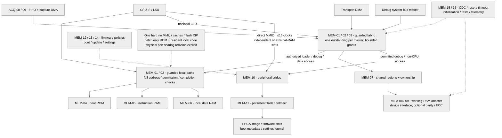
```mermaid
%%{init: {"theme":"neutral","fontFamily":"Arial,sans-serif","themeVariables":{"fontFamily":"Arial,sans-serif","fontSize":"14px"},"flowchart":{"htmlLabels":true,"minNodeWidth":0,"wrappingWidth":240,"nodeSpacing":28,"rankSpacing":32,"curve":"linear"}}}%%
flowchart TB
    CPU["CPU IF / LSU"] --> LOCAL["MEM-01 / 02 · guarded local paths<br/>full address / permission / completion checks"]
    LOCAL --> ROM["MEM-04 · boot ROM"]
    LOCAL --> IRAM["MEM-05 · instruction RAM"]
    LOCAL --> DRAM["MEM-06 · local data RAM"]
    CPU -->|"nonlocal LSU"| FAB["MEM-01 / 02 / 03 · guarded fabric<br/>one outstanding per master; bounded grants"]
    CAP["ACQ-08 / 09 · FIFO + capture DMA"] --> FAB
    TX["Transport DMA"] --> FAB
    DBG["Debug system-bus master"] --> FAB
    FAB -->|"authorized loader / debug / data access"| LOCAL
    FAB --> SHARED["MEM-07 · shared regions + ownership"]
    SHARED --> RAM["MEM-08 / 09 · working-RAM adapter<br/>device interface; optional parity / ECC"]
    CPU -->|"direct MMIO · ≤16 clocks<br/>independent of external-RAM slots"| MMIO["MEM-10 · peripheral bridge"]
    FAB -->|"permitted debug / non-CPU access"| MMIO
    MMIO --> FLASH["MEM-11 · persistent flash controller"]
    FLASH --> STORE["FPGA image / firmware slots<br/>boot metadata / settings journal"]
    FW["MEM-12 / 13 / 14 · firmware policies<br/>boot / update / settings"] -.-> MMIO
    SYS["MEM-15 / 16 · CDC / reset / timeout<br/>initialization / tests / telemetry"] -.-> FAB
    SYS -.-> RAM
    RULE["One hart; no MMU / caches / flash XIP<br/>fetch only ROM + resident local code<br/>physical port sharing remains explicit"] -.-> LOCAL
```

## Memory planning budget

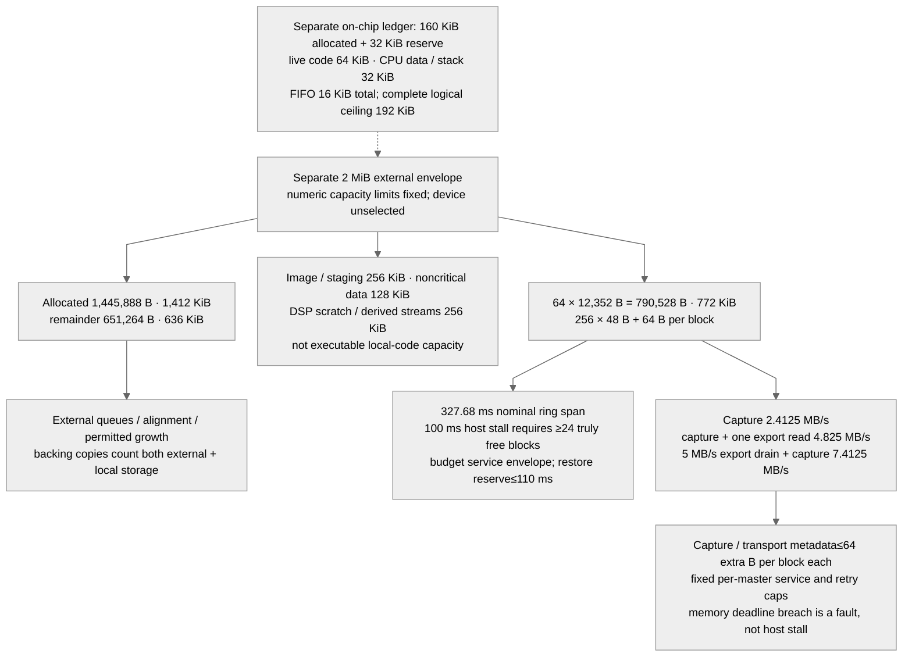
```mermaid
%%{init: {"theme":"neutral","fontFamily":"Arial,sans-serif","themeVariables":{"fontFamily":"Arial,sans-serif","fontSize":"14px"},"flowchart":{"htmlLabels":true,"minNodeWidth":0,"wrappingWidth":240,"nodeSpacing":28,"rankSpacing":32,"curve":"linear"}}}%%
flowchart TB
    PLAN["Separate 2 MiB external envelope<br/>numeric capacity limits fixed; device unselected"] --> RING["64 × 12,352 B = 790,528 B · 772 KiB<br/>256 × 48 B + 64 B per block"]
    PLAN --> ALLOW["Image / staging 256 KiB · noncritical data 128 KiB<br/>DSP scratch / derived streams 256 KiB<br/>not executable local-code capacity"]
    PLAN --> REST["Allocated 1,445,888 B · 1,412 KiB<br/>remainder 651,264 B · 636 KiB"]
    REST --> EXTRA["External queues / alignment / permitted growth<br/>backing copies count both external + local storage"]
    LOCAL["Separate on-chip ledger: 160 KiB allocated + 32 KiB reserve<br/>live code 64 KiB · CPU data / stack 32 KiB<br/>FIFO 16 KiB total; complete logical ceiling 192 KiB"] -.-> PLAN
    RING --> STALL["327.68 ms nominal ring span<br/>100 ms host stall requires ≥24 truly free blocks<br/>budget service envelope; restore reserve≤110 ms"]
    RING --> BW["Capture 2.4125 MB/s<br/>capture + one export read 4.825 MB/s<br/>5 MB/s export drain + capture 7.4125 MB/s"]
    BW --> MARGIN["Capture / transport metadata≤64 extra B per block each<br/>fixed per-master service and retry caps<br/>memory deadline breach is a fault, not host stall"]
```

## MEM-01 · Address map and access guards

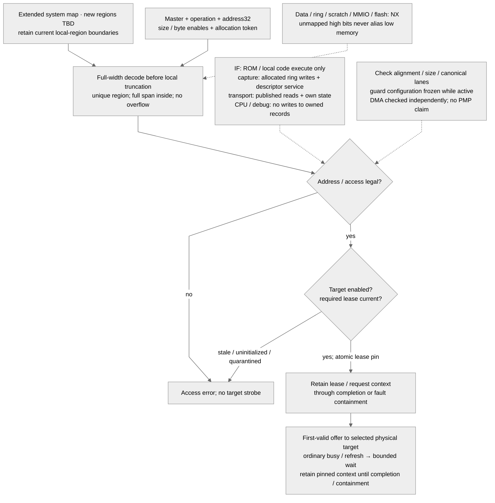
```mermaid
%%{init: {"theme":"neutral","fontFamily":"Arial,sans-serif","themeVariables":{"fontFamily":"Arial,sans-serif","fontSize":"14px"},"flowchart":{"htmlLabels":true,"minNodeWidth":0,"wrappingWidth":240,"nodeSpacing":28,"rankSpacing":32,"curve":"linear"}}}%%
flowchart TB
    MAP["Extended system map · new regions TBD<br/>retain current local-region boundaries"] --> DECODE
    REQ["Master + operation + address32<br/>size / byte enables + allocation token"] --> DECODE["Full-width decode before local truncation<br/>unique region; full span inside; no overflow"]
    DECODE --> CHECK{"Address / access legal?"}
    CHECK -->|"no"| ERR["Access error; no target strobe"]
    CHECK -->|"yes"| OWN{"Target enabled?<br/>required lease current?"}
    OWN -->|"stale / uninitialized / quarantined"| ERR
    OWN -->|"yes; atomic lease pin"| PIN["Retain lease / request context<br/>through completion or fault containment"]
    PIN --> TARGET["First-valid offer to selected physical target<br/>ordinary busy / refresh → bounded wait<br/>retain pinned context until completion / containment"]
    PERM["IF: ROM / local code execute only<br/>capture: allocated ring writes + descriptor service<br/>transport: published reads + own state<br/>CPU / debug: no writes to owned records"] -.-> CHECK
    CTRL["Check alignment / size / canonical lanes<br/>guard configuration frozen while active<br/>DMA checked independently; no PMP claim"] -.-> CHECK
    NX["Data / ring / scratch / MMIO / flash: NX<br/>unmapped high bits never alias low memory"] -.-> DECODE
```

## MEM-02 · Request and response ownership

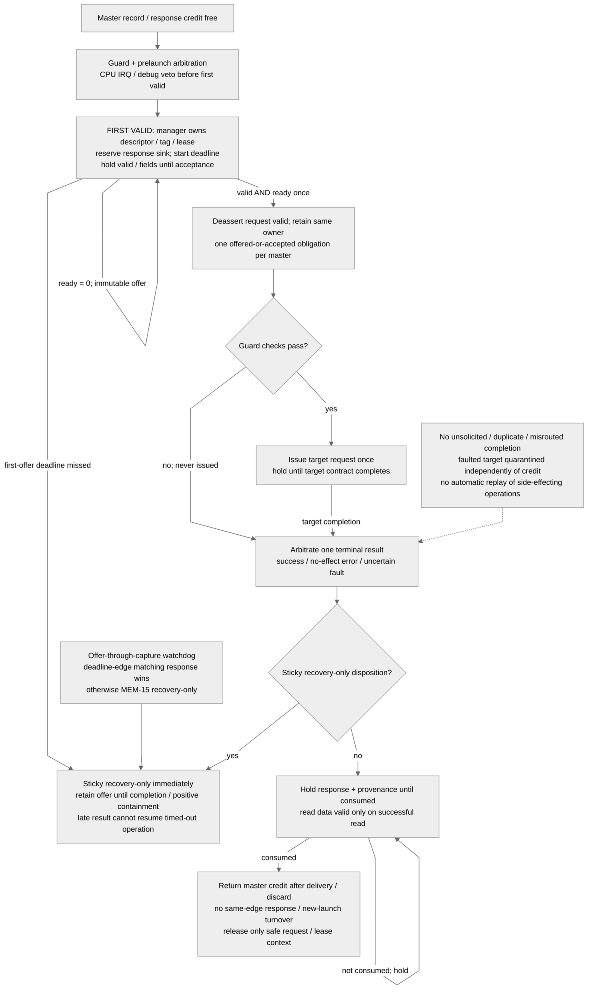
```mermaid
%%{init: {"theme":"neutral","fontFamily":"Arial,sans-serif","themeVariables":{"fontFamily":"Arial,sans-serif","fontSize":"14px"},"flowchart":{"htmlLabels":true,"minNodeWidth":0,"wrappingWidth":240,"nodeSpacing":28,"rankSpacing":32,"curve":"linear"}}}%%
flowchart TB
    IDLE["Master record / response credit free"] --> GRANT["Guard + prelaunch arbitration<br/>CPU IRQ / debug veto before first valid"]
    GRANT --> OFFER["FIRST VALID: manager owns descriptor / tag / lease<br/>reserve response sink; start deadline<br/>hold valid / fields until acceptance"]
    OFFER -->|"ready = 0; immutable offer"| OFFER
    OFFER -->|"first-offer deadline missed"| PRE["Sticky recovery-only immediately<br/>retain offer until completion / positive containment<br/>late result cannot resume timed-out operation"]
    OFFER -->|"valid AND ready once"| SLOT["Deassert request valid; retain same owner<br/>one offered-or-accepted obligation per master"]
    SLOT --> GUARD{"Guard checks pass?"}
    GUARD -->|"no; never issued"| TERM["Arbitrate one terminal result<br/>success / no-effect error / uncertain fault"]
    GUARD -->|"yes"| ISSUE["Issue target request once<br/>hold until target contract completes"]
    ISSUE -->|"target completion"| TERM
    TIMER["Offer-through-capture watchdog<br/>deadline-edge matching response wins<br/>otherwise MEM-15 recovery-only"] --> PRE
    TERM --> RECOVERY{"Sticky recovery-only disposition?"}
    RECOVERY -->|"yes"| PRE
    RECOVERY -->|"no"| RESP["Hold response + provenance until consumed<br/>read data valid only on successful read"]
    RESP -->|"not consumed; hold"| RESP
    RESP -->|"consumed"| DONE["Return master credit after delivery / discard<br/>no same-edge response / new-launch turnover<br/>release only safe request / lease context"]
    RULE["No unsolicited / duplicate / misrouted completion<br/>faulted target quarantined independently of credit<br/>no automatic replay of side-effecting operations"] -.-> TERM
```

## MEM-02 · RV32 byte lanes

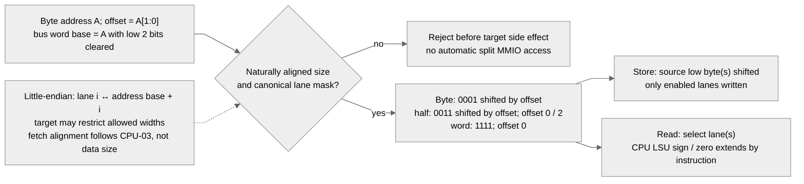
```mermaid
%%{init: {"theme":"neutral","fontFamily":"Arial,sans-serif","themeVariables":{"fontFamily":"Arial,sans-serif","fontSize":"14px"},"flowchart":{"htmlLabels":true,"minNodeWidth":0,"wrappingWidth":240,"nodeSpacing":28,"rankSpacing":32,"curve":"linear"}}}%%
flowchart LR
    A["Byte address A; offset = A[1:0]<br/>bus word base = A with low 2 bits cleared"] --> VALID{"Naturally aligned size<br/>and canonical lane mask?"}
    VALID -->|"no"| ERR["Reject before target side effect<br/>no automatic split MMIO access"]
    VALID -->|"yes"| SEL["Byte: 0001 shifted by offset<br/>half: 0011 shifted by offset; offset 0 / 2<br/>word: 1111; offset 0"]
    SEL --> WR["Store: source low byte(s) shifted<br/>only enabled lanes written"]
    SEL --> RD["Read: select lane(s)<br/>CPU LSU sign / zero extends by instruction"]
    RULE["Little-endian: lane i ↔ address base + i<br/>target may restrict allowed widths<br/>fetch alignment follows CPU-03, not data size"] -.-> VALID
```

## MEM-02 · Optional Wishbone Classic bridge

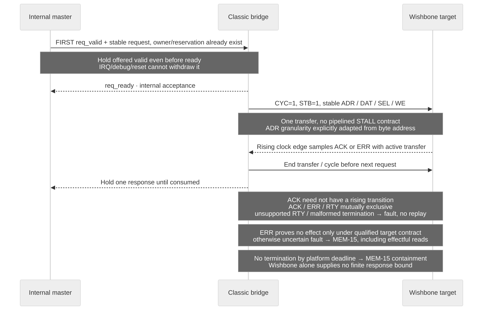
```mermaid
%%{init: {"themeCSS":".messageText { paint-order: stroke; stroke: white; stroke-width: 3px; stroke-linejoin: round; }","theme":"neutral","fontFamily":"Arial,sans-serif","themeVariables":{"fontFamily":"Arial,sans-serif","fontSize":"14px"},"flowchart":{"htmlLabels":true,"minNodeWidth":0,"wrappingWidth":240,"nodeSpacing":28,"rankSpacing":32,"curve":"linear"}}}%%
sequenceDiagram
    participant M as Internal master
    participant B as Classic bridge
    participant T as Wishbone target
    M->>B: FIRST req_valid + stable request, owner/reservation already exist
    Note over M,B: Hold offered valid even before ready<br/>IRQ/debug/reset cannot withdraw it
    B-->>M: req_ready · internal acceptance
    B->>T: CYC=1, STB=1, stable ADR / DAT / SEL / WE
    Note over B,T: One transfer, no pipelined STALL contract<br/>ADR granularity explicitly adapted from byte address
    T-->>B: Rising clock edge samples ACK or ERR with active transfer
    B->>T: End transfer / cycle before next request
    B-->>M: Hold one response until consumed
    Note over B,T: ACK need not have a rising transition<br/>ACK / ERR / RTY mutually exclusive<br/>unsupported RTY / malformed termination → fault, no replay
    Note over B,T: ERR proves no effect only under qualified target contract<br/>otherwise uncertain fault → MEM-15, including effectful reads
    Note over B,T: No termination by platform deadline → MEM-15 containment<br/>Wishbone alone supplies no finite response bound
```

## MEM-03 · Bounded arbitration

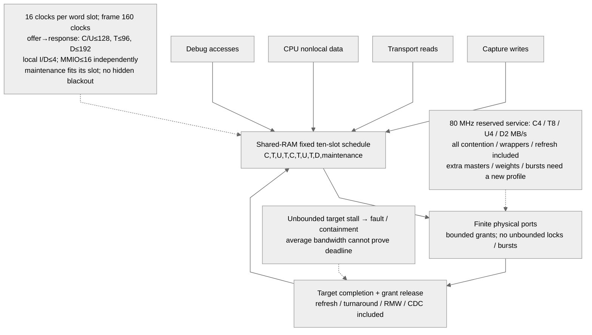
```mermaid
%%{init: {"theme":"neutral","fontFamily":"Arial,sans-serif","themeVariables":{"fontFamily":"Arial,sans-serif","fontSize":"14px"},"flowchart":{"htmlLabels":true,"minNodeWidth":0,"wrappingWidth":240,"nodeSpacing":28,"rankSpacing":32,"curve":"linear"}}}%%
flowchart TB
    CAP["Capture writes"] --> ARB["Shared-RAM fixed ten-slot schedule<br/>C,T,U,T,C,T,U,T,D,maintenance"]
    TX["Transport reads"] --> ARB
    CPU["CPU nonlocal data"] --> ARB
    DBG["Debug accesses"] --> ARB
    ARB --> PORT["Finite physical ports<br/>bounded grants; no unbounded locks / bursts"]
    PORT --> END["Target completion + grant release<br/>refresh / turnaround / RMW / CDC included"]
    END --> ARB
    PROOF["16 clocks per word slot; frame 160 clocks<br/>offer→response: C/U≤128, T≤96, D≤192<br/>local I/D≤4; MMIO≤16 independently<br/>maintenance fits its slot; no hidden blackout"] -.-> ARB
    BUDGET["80 MHz reserved service: C4 / T8 / U4 / D2 MB/s<br/>all contention / wrappers / refresh included<br/>extra masters / weights / bursts need a new profile"] -.-> PORT
    FAIL["Unbounded target stall → fault / containment<br/>average bandwidth cannot prove deadline"] -.-> END
```

## MEM-04 · Boot ROM and independent recovery

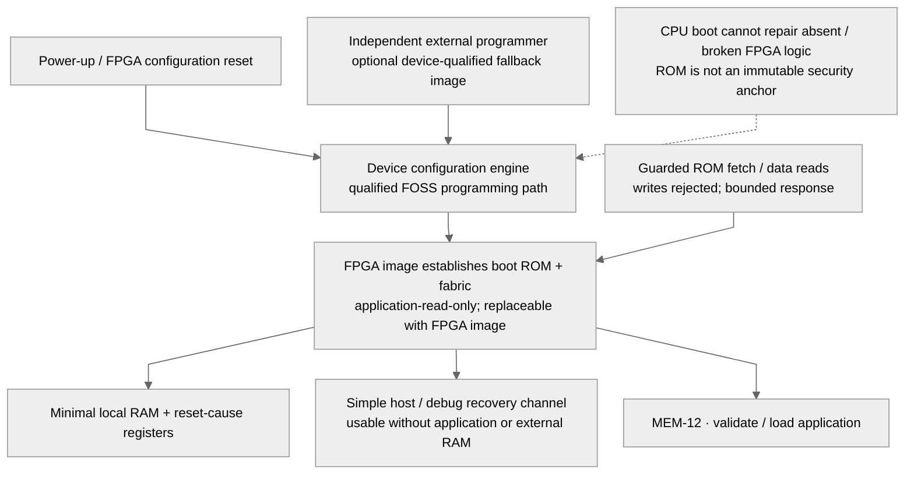
```mermaid
%%{init: {"theme":"neutral","fontFamily":"Arial,sans-serif","themeVariables":{"fontFamily":"Arial,sans-serif","fontSize":"14px"},"flowchart":{"htmlLabels":true,"minNodeWidth":0,"wrappingWidth":240,"nodeSpacing":28,"rankSpacing":32,"curve":"linear"}}}%%
flowchart TB
    POWER["Power-up / FPGA configuration reset"] --> CFG["Device configuration engine<br/>qualified FOSS programming path"]
    EXT["Independent external programmer<br/>optional device-qualified fallback image"] --> CFG
    CFG --> ROM["FPGA image establishes boot ROM + fabric<br/>application-read-only; replaceable with FPGA image"]
    ROM --> LOCAL["Minimal local RAM + reset-cause registers"]
    ROM --> REC["Simple host / debug recovery channel<br/>usable without application or external RAM"]
    ROM --> BOOT["MEM-12 · validate / load application"]
    MAP["Guarded ROM fetch / data reads<br/>writes rejected; bounded response"] --> ROM
    RULE["CPU boot cannot repair absent / broken FPGA logic<br/>ROM is not an immutable security anchor"] -.-> CFG
```

## MEM-05 · Local instruction RAM

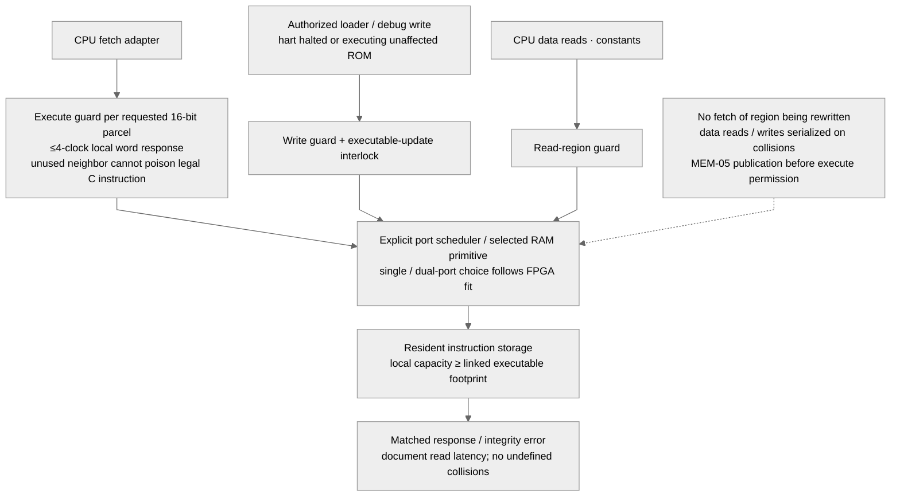
```mermaid
%%{init: {"theme":"neutral","fontFamily":"Arial,sans-serif","themeVariables":{"fontFamily":"Arial,sans-serif","fontSize":"14px"},"flowchart":{"htmlLabels":true,"minNodeWidth":0,"wrappingWidth":240,"nodeSpacing":28,"rankSpacing":32,"curve":"linear"}}}%%
flowchart TB
    IF["CPU fetch adapter"] --> X["Execute guard per requested 16-bit parcel<br/>≤4-clock local word response<br/>unused neighbor cannot poison legal C instruction"]
    LOAD["Authorized loader / debug write<br/>hart halted or executing unaffected ROM"] --> W["Write guard + executable-update interlock"]
    LSU["CPU data reads · constants"] --> R["Read-region guard"]
    X --> PORT["Explicit port scheduler / selected RAM primitive<br/>single / dual-port choice follows FPGA fit"]
    W --> PORT
    R --> PORT
    PORT --> IRAM["Resident instruction storage<br/>local capacity ≥ linked executable footprint"]
    IRAM --> RET["Matched response / integrity error<br/>document read latency; no undefined collisions"]
    INTER["No fetch of region being rewritten<br/>data reads / writes serialized on collisions<br/>MEM-05 publication before execute permission"] -.-> PORT
```

## MEM-05 · Executable-memory publication

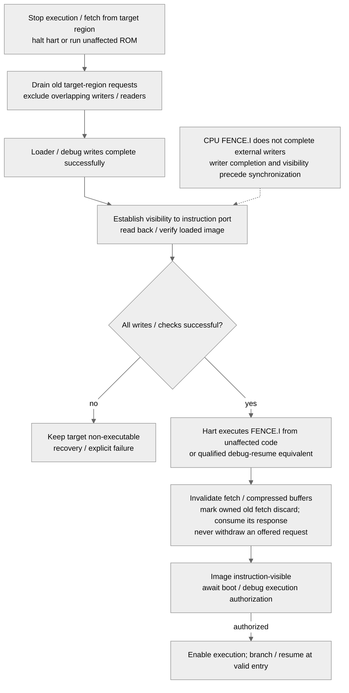
```mermaid
%%{init: {"theme":"neutral","fontFamily":"Arial,sans-serif","themeVariables":{"fontFamily":"Arial,sans-serif","fontSize":"14px"},"flowchart":{"htmlLabels":true,"minNodeWidth":0,"wrappingWidth":240,"nodeSpacing":28,"rankSpacing":32,"curve":"linear"}}}%%
flowchart TB
    START["Stop execution / fetch from target region<br/>halt hart or run unaffected ROM"] --> DRAIN["Drain old target-region requests<br/>exclude overlapping writers / readers"]
    DRAIN --> WRITE["Loader / debug writes complete successfully"]
    WRITE --> VIS["Establish visibility to instruction port<br/>read back / verify loaded image"]
    VIS --> OK{"All writes / checks successful?"}
    OK -->|"no"| FAIL["Keep target non-executable<br/>recovery / explicit failure"]
    OK -->|"yes"| SYNC["Hart executes FENCE.I from unaffected code<br/>or qualified debug-resume equivalent"]
    SYNC --> FLUSH["Invalidate fetch / compressed buffers<br/>mark owned old fetch discard; consume its response<br/>never withdraw an offered request"]
    FLUSH --> POLICY["Image instruction-visible<br/>await boot / debug execution authorization"]
    POLICY -->|"authorized"| RUN["Enable execution; branch / resume at valid entry"]
    RULE["CPU FENCE.I does not complete external writers<br/>writer completion and visibility precede synchronization"] -.-> VIS
```

## MEM-06 · Local data RAM

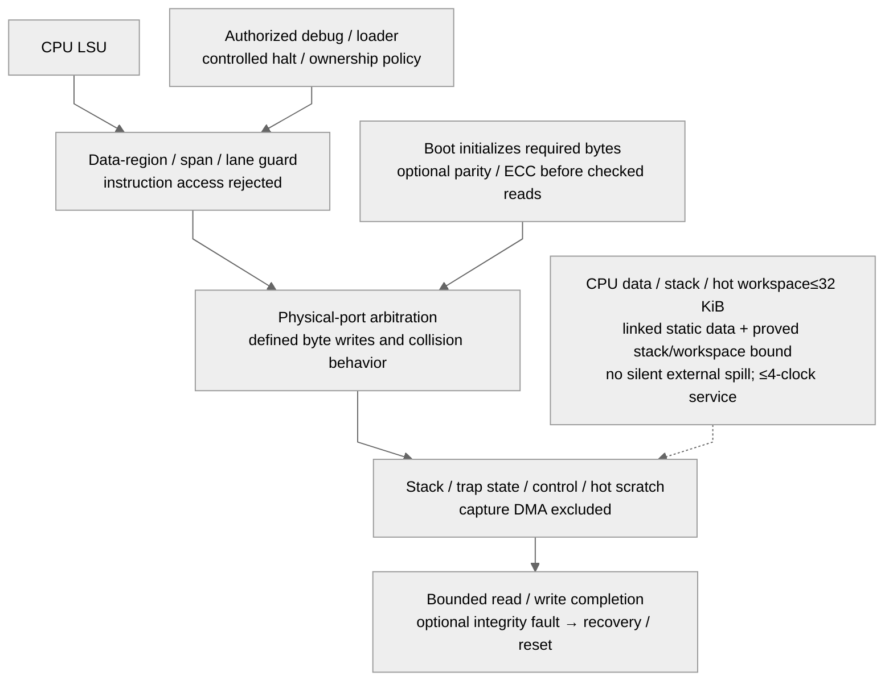
```mermaid
%%{init: {"theme":"neutral","fontFamily":"Arial,sans-serif","themeVariables":{"fontFamily":"Arial,sans-serif","fontSize":"14px"},"flowchart":{"htmlLabels":true,"minNodeWidth":0,"wrappingWidth":240,"nodeSpacing":28,"rankSpacing":32,"curve":"linear"}}}%%
flowchart TB
    LSU["CPU LSU"] --> GUARD["Data-region / span / lane guard<br/>instruction access rejected"]
    DBG["Authorized debug / loader<br/>controlled halt / ownership policy"] --> GUARD
    GUARD --> PORT["Physical-port arbitration<br/>defined byte writes and collision behavior"]
    PORT --> RAM["Stack / trap state / control / hot scratch<br/>capture DMA excluded"]
    RAM --> RESP["Bounded read / write completion<br/>optional integrity fault → recovery / reset"]
    INIT["Boot initializes required bytes<br/>optional parity / ECC before checked reads"] --> PORT
    SIZE["CPU data / stack / hot workspace≤32 KiB<br/>linked static data + proved stack/workspace bound<br/>no silent external spill; ≤4-clock service"] -.-> RAM
```

## MEM-07 · Shared working-memory regions

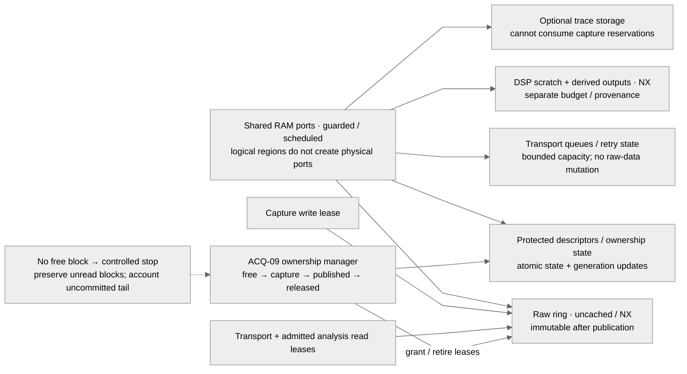
```mermaid
%%{init: {"theme":"neutral","fontFamily":"Arial,sans-serif","themeVariables":{"fontFamily":"Arial,sans-serif","fontSize":"14px"},"flowchart":{"htmlLabels":true,"minNodeWidth":0,"wrappingWidth":240,"nodeSpacing":28,"rankSpacing":32,"curve":"linear"}}}%%
flowchart LR
    PORT["Shared RAM ports · guarded / scheduled<br/>logical regions do not create physical ports"] --> RING["Raw ring · uncached / NX<br/>immutable after publication"]
    PORT --> DESC["Protected descriptors / ownership state<br/>atomic state + generation updates"]
    PORT --> TX["Transport queues / retry state<br/>bounded capacity; no raw-data mutation"]
    PORT --> DSP["DSP scratch + derived outputs · NX<br/>separate budget / provenance"]
    PORT --> TRACE["Optional trace storage<br/>cannot consume capture reservations"]
    CAP["Capture write lease"] --> RING
    READ["Transport + admitted analysis read leases"] --> RING
    OWN["ACQ-09 ownership manager<br/>free → capture → published → released"] --> DESC
    OWN -->|"grant / retire leases"| RING
    FULL["No free block → controlled stop<br/>preserve unread blocks; account uncommitted tail"] -.-> OWN
```

## MEM-07 · Descriptor and allocation guard

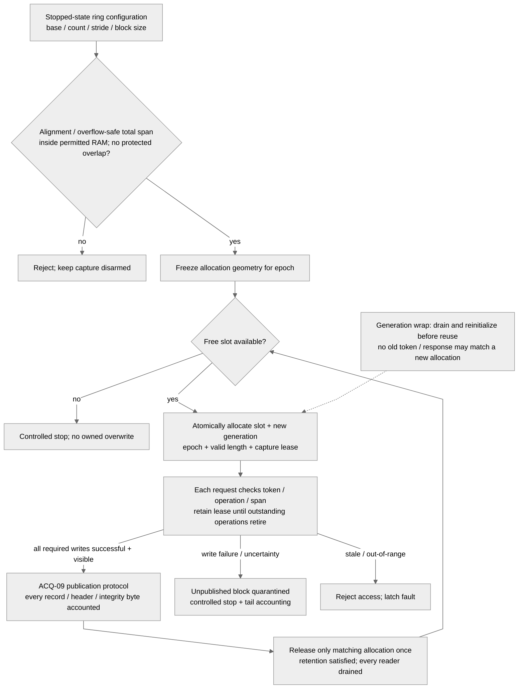
```mermaid
%%{init: {"theme":"neutral","fontFamily":"Arial,sans-serif","themeVariables":{"fontFamily":"Arial,sans-serif","fontSize":"14px"},"flowchart":{"htmlLabels":true,"minNodeWidth":0,"wrappingWidth":240,"nodeSpacing":28,"rankSpacing":32,"curve":"linear"}}}%%
flowchart TB
    CFG["Stopped-state ring configuration<br/>base / count / stride / block size"] --> CHECK{"Alignment / overflow-safe total span<br/>inside permitted RAM; no protected overlap?"}
    CHECK -->|"no"| FAIL["Reject; keep capture disarmed"]
    CHECK -->|"yes"| FREEZE["Freeze allocation geometry for epoch"]
    FREEZE --> FREE{"Free slot available?"}
    FREE -->|"no"| STOP["Controlled stop; no owned overwrite"]
    FREE -->|"yes"| ALLOC["Atomically allocate slot + new generation<br/>epoch + valid length + capture lease"]
    ALLOC --> ACCESS["Each request checks token / operation / span<br/>retain lease until outstanding operations retire"]
    ACCESS -->|"all required writes successful + visible"| PUB["ACQ-09 publication protocol<br/>every record / header / integrity byte accounted"]
    ACCESS -->|"write failure / uncertainty"| QUAR["Unpublished block quarantined<br/>controlled stop + tail accounting"]
    ACCESS -->|"stale / out-of-range"| ERR["Reject access; latch fault"]
    PUB --> RELEASE["Release only matching allocation once<br/>retention satisfied; every reader drained"]
    RELEASE --> FREE
    GEN["Generation wrap: drain and reinitialize before reuse<br/>no old token / response may match a new allocation"] -.-> ALLOC
```

## MEM-07 · Block visibility and leases

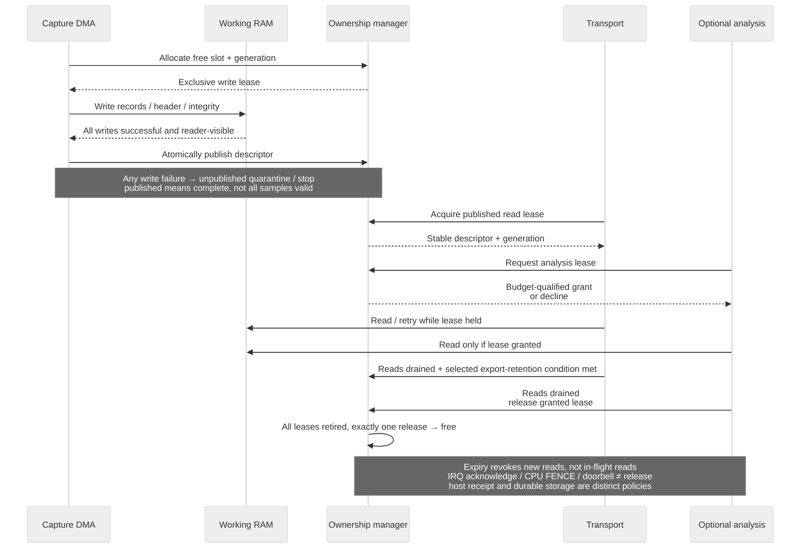
```mermaid
%%{init: {"themeCSS":".messageText { paint-order: stroke; stroke: white; stroke-width: 3px; stroke-linejoin: round; }","theme":"neutral","fontFamily":"Arial,sans-serif","themeVariables":{"fontFamily":"Arial,sans-serif","fontSize":"14px"},"flowchart":{"htmlLabels":true,"minNodeWidth":0,"wrappingWidth":240,"nodeSpacing":28,"rankSpacing":32,"curve":"linear"}}}%%
sequenceDiagram
    participant C as Capture DMA
    participant R as Working RAM
    participant O as Ownership manager
    participant T as Transport
    participant A as Optional analysis
    C->>O: Allocate free slot + generation
    O-->>C: Exclusive write lease
    C->>R: Write records / header / integrity
    R-->>C: All writes successful and reader-visible
    C->>O: Atomically publish descriptor
    Note over C,O: Any write failure → unpublished quarantine / stop<br/>published means complete, not all samples valid
    T->>O: Acquire published read lease
    O-->>T: Stable descriptor + generation
    A->>O: Request analysis lease
    O-->>A: Budget-qualified grant<br/>or decline
    T->>R: Read / retry while lease held
    A->>R: Read only if lease granted
    T->>O: Reads drained + selected export-retention condition met
    A->>O: Reads drained<br/>release granted lease
    O->>O: All leases retired, exactly one release → free
    Note over O,A: Expiry revokes new reads, not in-flight reads<br/>IRQ acknowledge / CPU FENCE / doorbell ≠ release<br/>host receipt and durable storage are distinct policies
```

## MEM-08 · External working-RAM adapter

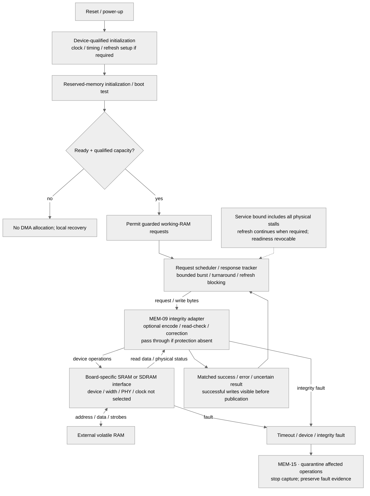
```mermaid
%%{init: {"theme":"neutral","fontFamily":"Arial,sans-serif","themeVariables":{"fontFamily":"Arial,sans-serif","fontSize":"14px"},"flowchart":{"htmlLabels":true,"minNodeWidth":0,"wrappingWidth":240,"nodeSpacing":28,"rankSpacing":32,"curve":"linear"}}}%%
flowchart TB
    BOOT["Reset / power-up"] --> INIT["Device-qualified initialization<br/>clock / timing / refresh setup if required"]
    INIT --> TEST["Reserved-memory initialization / boot test"]
    TEST --> READY{"Ready + qualified capacity?"}
    READY -->|"no"| FAIL["No DMA allocation; local recovery"]
    READY -->|"yes"| ENABLE["Permit guarded working-RAM requests"]
    ENABLE --> SCHED["Request scheduler / response tracker<br/>bounded burst / turnaround / refresh blocking"]
    SCHED -->|"request / write bytes"| ECC["MEM-09 integrity adapter<br/>optional encode / read-check / correction<br/>pass through if protection absent"]
    ECC -->|"device operations"| PHY["Board-specific SRAM or SDRAM interface<br/>device / width / PHY / clock not selected"]
    PHY -->|"read data / physical status"| ECC
    PHY <-->|"address / data / strobes"| CHIP["External volatile RAM"]
    ECC --> RESP["Matched success / error / uncertain result<br/>successful writes visible before publication"]
    RESP --> SCHED
    ERR["Timeout / device / integrity fault"] --> ISOLATE["MEM-15 · quarantine affected operations<br/>stop capture; preserve fault evidence"]
    PHY -->|"fault"| ERR
    ECC -->|"integrity fault"| ERR
    BOUND["Service bound includes all physical stalls<br/>refresh continues when required; readiness revocable"] -.-> SCHED
```

## MEM-09 · Optional parity or ECC

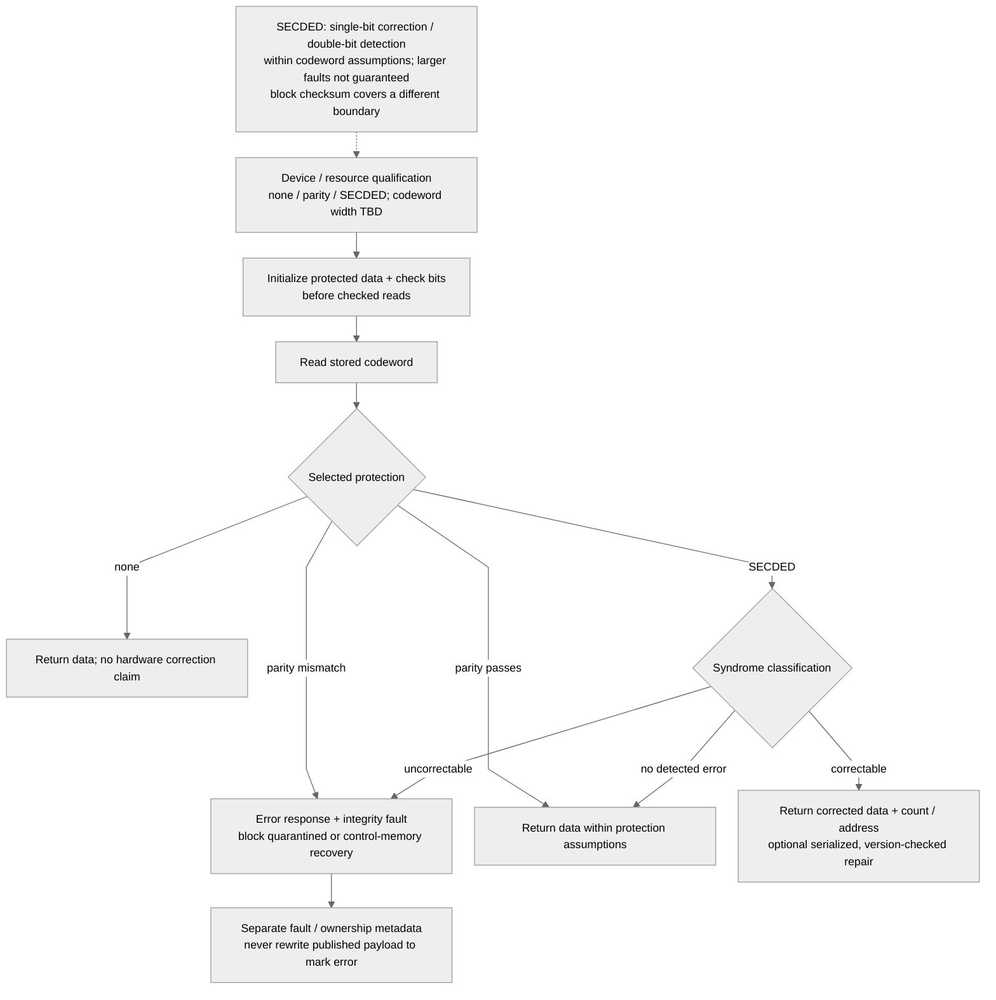
```mermaid
%%{init: {"theme":"neutral","fontFamily":"Arial,sans-serif","themeVariables":{"fontFamily":"Arial,sans-serif","fontSize":"14px"},"flowchart":{"htmlLabels":true,"minNodeWidth":0,"wrappingWidth":240,"nodeSpacing":28,"rankSpacing":32,"curve":"linear"}}}%%
flowchart TB
    SEL["Device / resource qualification<br/>none / parity / SECDED; codeword width TBD"] --> INIT["Initialize protected data + check bits<br/>before checked reads"]
    INIT --> READ["Read stored codeword"]
    READ --> MODE{"Selected protection"}
    MODE -->|"none"| RAW["Return data; no hardware correction claim"]
    MODE -->|"parity mismatch"| UE["Error response + integrity fault<br/>block quarantined or control-memory recovery"]
    MODE -->|"parity passes"| DATA["Return data within protection assumptions"]
    MODE -->|"SECDED"| SYND{"Syndrome classification"}
    SYND -->|"no detected error"| DATA
    SYND -->|"correctable"| FIX["Return corrected data + count / address<br/>optional serialized, version-checked repair"]
    SYND -->|"uncorrectable"| UE
    UE --> EVENT["Separate fault / ownership metadata<br/>never rewrite published payload to mark error"]
    LIMIT["SECDED: single-bit correction / double-bit detection<br/>within codeword assumptions; larger faults not guaranteed<br/>block checksum covers a different boundary"] -.-> SEL
```

## MEM-09 · Partial-codeword writes

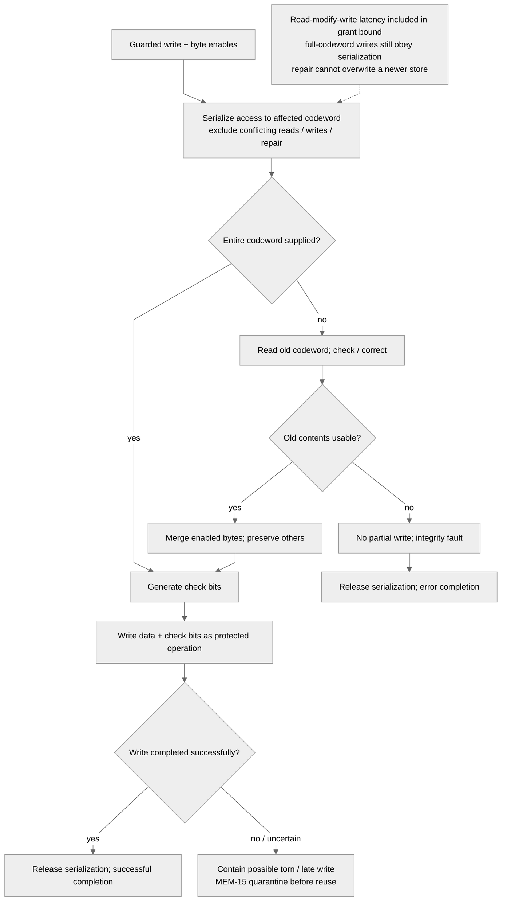
```mermaid
%%{init: {"theme":"neutral","fontFamily":"Arial,sans-serif","themeVariables":{"fontFamily":"Arial,sans-serif","fontSize":"14px"},"flowchart":{"htmlLabels":true,"minNodeWidth":0,"wrappingWidth":240,"nodeSpacing":28,"rankSpacing":32,"curve":"linear"}}}%%
flowchart TB
    REQ["Guarded write + byte enables"] --> LOCK["Serialize access to affected codeword<br/>exclude conflicting reads / writes / repair"]
    LOCK --> FULL{"Entire codeword supplied?"}
    FULL -->|"yes"| ENC["Generate check bits"]
    FULL -->|"no"| READ["Read old codeword; check / correct"]
    READ --> VALID{"Old contents usable?"}
    VALID -->|"no"| ERROR["No partial write; integrity fault"]
    VALID -->|"yes"| MERGE["Merge enabled bytes; preserve others"]
    MERGE --> ENC
    ENC --> WRITE["Write data + check bits as protected operation"]
    WRITE --> OK{"Write completed successfully?"}
    OK -->|"yes"| DONE["Release serialization; successful completion"]
    OK -->|"no / uncertain"| FAULT["Contain possible torn / late write<br/>MEM-15 quarantine before reuse"]
    ERROR --> RELEASE["Release serialization; error completion"]
    BOUND["Read-modify-write latency included in grant bound<br/>full-codeword writes still obey serialization<br/>repair cannot overwrite a newer store"] -.-> LOCK
```

## MEM-10 · Register and peripheral bridge

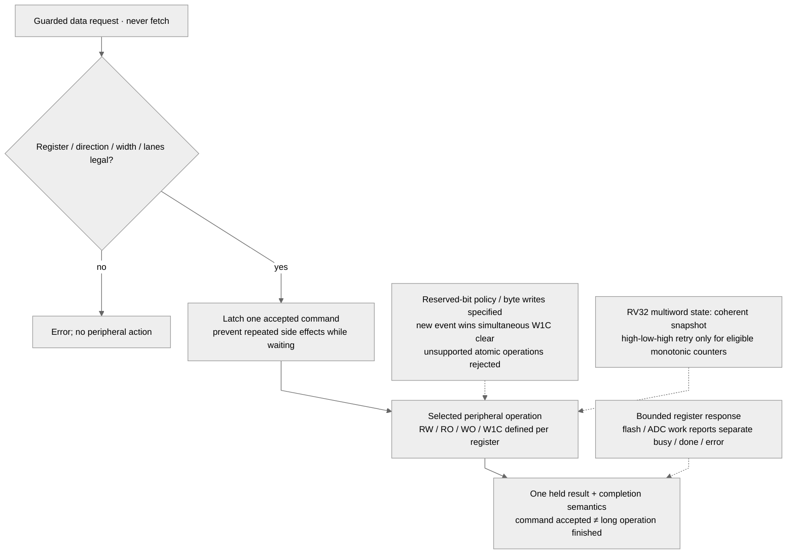
```mermaid
%%{init: {"theme":"neutral","fontFamily":"Arial,sans-serif","themeVariables":{"fontFamily":"Arial,sans-serif","fontSize":"14px"},"flowchart":{"htmlLabels":true,"minNodeWidth":0,"wrappingWidth":240,"nodeSpacing":28,"rankSpacing":32,"curve":"linear"}}}%%
flowchart TB
    REQ["Guarded data request · never fetch"] --> LEGAL{"Register / direction / width / lanes legal?"}
    LEGAL -->|"no"| ERR["Error; no peripheral action"]
    LEGAL -->|"yes"| LATCH["Latch one accepted command<br/>prevent repeated side effects while waiting"]
    LATCH --> REG["Selected peripheral operation<br/>RW / RO / WO / W1C defined per register"]
    REG --> RESP["One held result + completion semantics<br/>command accepted ≠ long operation finished"]
    RULE["Reserved-bit policy / byte writes specified<br/>new event wins simultaneous W1C clear<br/>unsupported atomic operations rejected"] -.-> REG
    SNAP["RV32 multiword state: coherent snapshot<br/>high-low-high retry only for eligible monotonic counters"] -.-> REG
    TIME["Bounded register response<br/>flash / ADC work reports separate busy / done / error"] -.-> RESP
```

## MEM-11 · Persistent flash controller

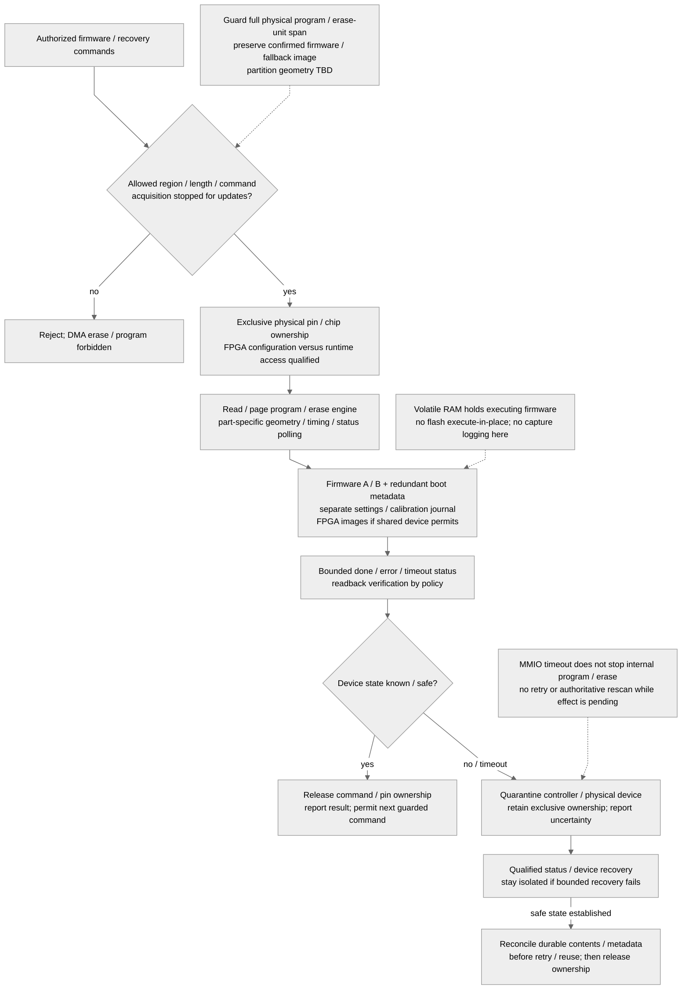
```mermaid
%%{init: {"theme":"neutral","fontFamily":"Arial,sans-serif","themeVariables":{"fontFamily":"Arial,sans-serif","fontSize":"14px"},"flowchart":{"htmlLabels":true,"minNodeWidth":0,"wrappingWidth":240,"nodeSpacing":28,"rankSpacing":32,"curve":"linear"}}}%%
flowchart TB
    CPU["Authorized firmware / recovery commands"] --> GUARD{"Allowed region / length / command<br/>acquisition stopped for updates?"}
    GUARD -->|"no"| ERR["Reject; DMA erase / program forbidden"]
    GUARD -->|"yes"| OWN["Exclusive physical pin / chip ownership<br/>FPGA configuration versus runtime access qualified"]
    OWN --> ENGINE["Read / page program / erase engine<br/>part-specific geometry / timing / status polling"]
    ENGINE --> FLASH["Firmware A / B + redundant boot metadata<br/>separate settings / calibration journal<br/>FPGA images if shared device permits"]
    FLASH --> STATUS["Bounded done / error / timeout status<br/>readback verification by policy"]
    STATUS --> SAFE{"Device state known / safe?"}
    SAFE -->|"yes"| RELEASE["Release command / pin ownership<br/>report result; permit next guarded command"]
    SAFE -->|"no / timeout"| QUAR["Quarantine controller / physical device<br/>retain exclusive ownership; report uncertainty"]
    QUAR --> RECOVER["Qualified status / device recovery<br/>stay isolated if bounded recovery fails"]
    RECOVER -->|"safe state established"| RESCAN["Reconcile durable contents / metadata<br/>before retry / reuse; then release ownership"]
    PROTECT["Guard full physical program / erase-unit span<br/>preserve confirmed firmware / fallback image<br/>partition geometry TBD"] -.-> GUARD
    RULE["Volatile RAM holds executing firmware<br/>no flash execute-in-place; no capture logging here"] -.-> FLASH
    EFFECT["MMIO timeout does not stop internal program / erase<br/>no retry or authoritative rescan while effect is pending"] -.-> QUAR
```

## MEM-12 · Boot and recovery policy · firmware

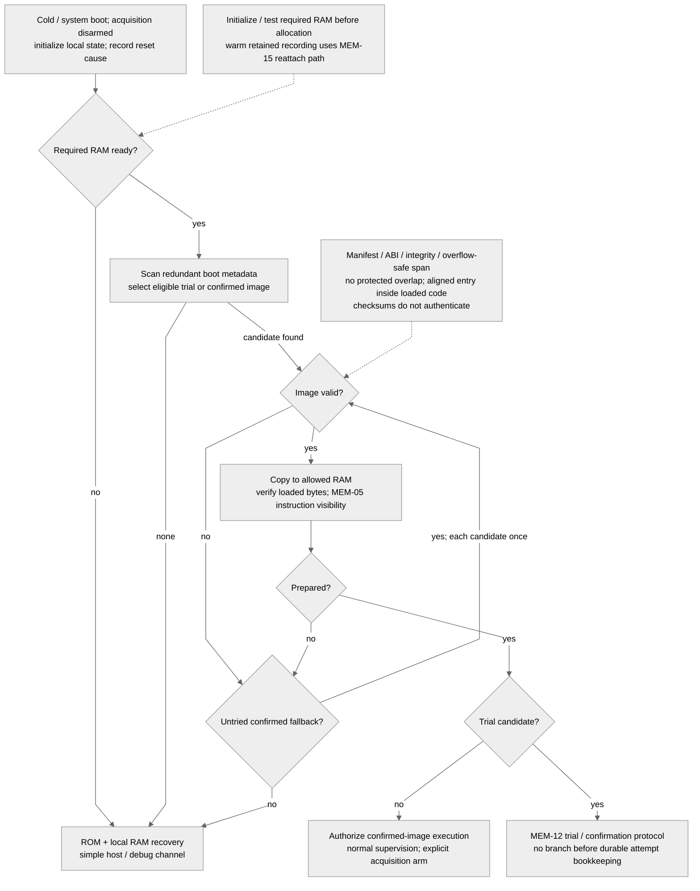
```mermaid
%%{init: {"theme":"neutral","fontFamily":"Arial,sans-serif","themeVariables":{"fontFamily":"Arial,sans-serif","fontSize":"14px"},"flowchart":{"htmlLabels":true,"minNodeWidth":0,"wrappingWidth":240,"nodeSpacing":28,"rankSpacing":32,"curve":"linear"}}}%%
flowchart TB
    RESET["Cold / system boot; acquisition disarmed<br/>initialize local state; record reset cause"] --> RAM{"Required RAM ready?"}
    RAM -->|"no"| REC["ROM + local RAM recovery<br/>simple host / debug channel"]
    RAM -->|"yes"| META["Scan redundant boot metadata<br/>select eligible trial or confirmed image"]
    META -->|"candidate found"| VALID{"Image valid?"}
    META -->|"none"| REC
    VALID -->|"no"| FALL{"Untried confirmed fallback?"}
    VALID -->|"yes"| LOAD["Copy to allowed RAM<br/>verify loaded bytes; MEM-05 instruction visibility"]
    LOAD --> OK{"Prepared?"}
    OK -->|"no"| FALL
    OK -->|"yes"| TRIAL{"Trial candidate?"}
    TRIAL -->|"no"| RUN["Authorize confirmed-image execution<br/>normal supervision; explicit acquisition arm"]
    TRIAL -->|"yes"| ATTEMPT["MEM-12 trial / confirmation protocol<br/>no branch before durable attempt bookkeeping"]
    FALL -->|"yes; each candidate once"| VALID
    FALL -->|"no"| REC
    RULE["Manifest / ABI / integrity / overflow-safe span<br/>no protected overlap; aligned entry inside loaded code<br/>checksums do not authenticate"] -.-> VALID
    INIT["Initialize / test required RAM before allocation<br/>warm retained recording uses MEM-15 reattach path"] -.-> RAM
```

## MEM-12 · Trial execution and confirmation · firmware

```mermaid
%%{init: {"theme":"neutral","fontFamily":"Arial,sans-serif","themeVariables":{"fontFamily":"Arial,sans-serif","fontSize":"14px"},"flowchart":{"htmlLabels":true,"minNodeWidth":0,"wrappingWidth":240,"nodeSpacing":28,"rankSpacing":32,"curve":"linear"}}}%%
flowchart TB
    READY["Validated, loaded, instruction-visible trial<br/>previous confirmed image retained"] --> ATTEMPT["Persist consumed trial attempt<br/>read back committed metadata"]
    ATTEMPT --> SAVED{"Verified?"}
    SAVED -->|"no"| FAIL["Remain disarmed; contain uncertain flash work<br/>rescan / bounded fallback / local recovery"]
    SAVED -->|"yes"| RUN["Arm independent bounded boot supervision<br/>authorize execution at trial entry"]
    RUN --> HEALTH{"Health checks pass?"}
    HEALTH -->|"no / timeout"| FAIL
    HEALTH -->|"yes; before deadline"| CONF["Commit confirmation; preserve valid metadata<br/>read back committed result"]
    CONF --> VERIFIED{"Verified before deadline?"}
    VERIFIED -->|"no"| FAIL
    VERIFIED -->|"yes"| APP["Confirmed application ready<br/>normal supervision; explicit acquisition arm"]
    RESET["Reset / power loss before verified confirmation"] --> SCAN["Boot rescans valid committed metadata<br/>consumed unconfirmed trial is not retried forever"]
    SCAN --> SELECT["MEM-12 boot selection<br/>valid confirmation or previous confirmed fallback"]
    BOUND["Trial watchdog stays active through confirmation<br/>timeout during commit → contain / reboot rescan"] -.-> CONF
```

## MEM-13 · Firmware update policy · firmware

```mermaid
%%{init: {"theme":"neutral","fontFamily":"Arial,sans-serif","themeVariables":{"fontFamily":"Arial,sans-serif","fontSize":"14px"},"flowchart":{"htmlLabels":true,"minNodeWidth":0,"wrappingWidth":240,"nodeSpacing":28,"rankSpacing":32,"curve":"linear"}}}%%
flowchart TB
    START["Stop acquisition; close epoch<br/>drain / contain DMA; serialize flash users"] --> VALIDATE["Validate candidate ABI / format / size<br/>inactive slot bounds + erase geometry"]
    VALIDATE --> CHECK{"Valid?"}
    CHECK -->|"no; before erase"| ABORT["Report failure; preserve confirmed image<br/>reboot eligibility follows validated metadata"]
    CHECK -->|"yes"| WRITE["Erase / program inactive firmware slot<br/>retain confirmed image and valid boot metadata"]
    WRITE --> VERIFY{"Readback checks pass?"}
    VERIFY -->|"no / write error"| ABORT
    VERIFY -->|"yes"| META["Write redundant trial metadata<br/>generation / integrity; commit marker last"]
    META --> COMMIT{"Commit verified?"}
    COMMIT -->|"no"| ABORT
    COMMIT -->|"yes"| TRIAL["Eligible on subsequent boot<br/>MEM-12 bounded trial / confirm / revert"]
    CUT["Power loss / write error at any stage"] --> SCAN["Reboot scans complete valid committed records<br/>torn-write rules qualified for selected flash"]
    SCAN --> BOOT["Choose valid trial or previous confirmed<br/>never infer success from an interrupted write"]
    RULE["No assumed atomic flash page / sector write<br/>metadata reclamation keeps a verified valid copy<br/>FPGA-image updates use separate recovery path"] -.-> META
```

## MEM-14 · Configuration and calibration journal · firmware

```mermaid
%%{init: {"theme":"neutral","fontFamily":"Arial,sans-serif","themeVariables":{"fontFamily":"Arial,sans-serif","fontSize":"14px"},"flowchart":{"htmlLabels":true,"minNodeWidth":0,"wrappingWidth":240,"nodeSpacing":28,"rankSpacing":32,"curve":"linear"}}}%%
flowchart TB
    REQ["Validated settings / calibration record<br/>schema + generation + payload + integrity"] --> SPACE{"Append space?"}
    SPACE -->|"no"| GC["MEM-14 journal reclamation<br/>resume append only after verified success"]
    SPACE -->|"yes"| WRITE["Append to erased space<br/>preserve last committed valid record"]
    GC -->|"success"| WRITE
    GC -->|"failure"| FAIL["Report failure; retain prior valid settings<br/>no implicit hardware application"]
    WRITE --> CHECK{"Payload verified?"}
    CHECK -->|"no"| FAIL
    CHECK -->|"yes"| COMMIT["Commit last; read back complete record<br/>part-qualified torn-write convention"]
    COMMIT --> VALID{"Commit verified?"}
    VALID -->|"definite failure"| FAIL
    VALID -->|"unknown durability"| UNCERTAIN["Report indeterminate commit; keep applied settings<br/>MEM-11 containment → rescan durable state<br/>reconcile before retry; new record may be valid"]
    VALID -->|"yes"| USE["Selected persistent settings<br/>application requires explicit control policy"]
    BOOT["Reboot scans complete valid compatible records<br/>newest eligible generation; wrap rule defined<br/>no valid record → defaults / recovery"] --> USE
    USE -->|"apply requested"| APPLY["ACQ-12 · quiesce; apply / read back hardware<br/>new configuration epoch; settling validity"]
    STOP["Persistent writes only in qualified stopped session<br/>serialize with firmware-update / flash users"] -.-> WRITE
    RULE["Stored configuration ≠ applied hardware state<br/>failed commit / application cannot silently arm capture"] -.-> APPLY
```

## MEM-14 · Journal reclamation · firmware

```mermaid
%%{init: {"theme":"neutral","fontFamily":"Arial,sans-serif","themeVariables":{"fontFamily":"Arial,sans-serif","fontSize":"14px"},"flowchart":{"htmlLabels":true,"minNodeWidth":0,"wrappingWidth":240,"nodeSpacing":28,"rankSpacing":32,"curve":"linear"}}}%%
flowchart TB
    FULL["Insufficient append space<br/>exclusive journal / flash ownership"] --> SPARE["Prepare spare erase unit<br/>preserve current valid unit"]
    SPARE --> COPY["Copy every live retained record<br/>including referenced calibration versions"]
    COPY --> COMMIT["Commit copied records; read back<br/>verify complete replacement set"]
    COMMIT --> OK{"Verified?"}
    OK -->|"no / any earlier error"| FAIL["Report reclamation failure<br/>preserve old valid unit"]
    OK -->|"yes"| ERASE["Erase old unit; validate erased space"]
    ERASE --> DONE{"Erase successful?"}
    DONE -->|"no"| LIMITED["Retain verified replacement<br/>report reduced capacity / failure"]
    DONE -->|"yes"| APPEND["Resume append with capacity / reserve checks"]
    RULE["At least one valid committed copy survives each step<br/>power loss → boot scan; never erase sole valid copy<br/>spare capacity / wear policy qualified for flash"] -.-> SPARE
```

## MEM-15 · Memory-domain crossings

```mermaid
%%{init: {"theme":"neutral","fontFamily":"Arial,sans-serif","themeVariables":{"fontFamily":"Arial,sans-serif","fontSize":"14px"},"flowchart":{"htmlLabels":true,"minNodeWidth":0,"wrappingWidth":240,"nodeSpacing":28,"rankSpacing":32,"curve":"linear"}}}%%
flowchart LR
    SRC["Surviving source-domain request manager<br/>owner from first valid; tag / lease / stable payload"] --> Q["Bounded async request FIFO<br/>or acknowledged bundled-data handshake"]
    Q --> DST["Destination-domain target adapter<br/>one matched operation"]
    DST --> R["Bounded async response FIFO<br/>tag + result; reserve return capacity"]
    R --> MATCH["Match owned tag, including quarantined epoch<br/>capture into reserved sink; deliver or drain/discard"]
    RST["Coordinated reset / isolation protocol<br/>stop new offers; retain existing valid / owners<br/>reset CDC storage only after drain / positive fence"] -.-> Q
    RST -.-> R
    CLOCK["Clock-stop supervision in functioning domain<br/>isolate and recover if remote handshake cannot finish"] -.-> DST
    RULE["Never synchronize multibit payload bit-by-bit<br/>tag width / reuse / reset rules exclude stale matches<br/>CDC timing constraints + physical verification required"] -.-> Q
```

## MEM-15 · Timeout and late-effect containment

```mermaid
%%{init: {"theme":"neutral","fontFamily":"Arial,sans-serif","themeVariables":{"fontFamily":"Arial,sans-serif","fontSize":"14px"},"flowchart":{"htmlLabels":true,"minNodeWidth":0,"wrappingWidth":240,"nodeSpacing":28,"rankSpacing":32,"curve":"linear"}}}%%
flowchart TB
    TIME["First-offer completion deadline edge"] --> ONTIME{"Matching terminal response<br/>captured on / before that edge?"}
    ONTIME -->|"yes"| STATUS{"Response disposition"}
    STATUS -->|"success / proven no-effect rejection"| DONE["Normal tagged completion<br/>precise rejection has no target effect"]
    STATUS -->|"uncertain / protocol failure"| UNCERTAIN
    ONTIME -->|"no"| STICKY["Set sticky recovery-only immediately<br/>forbid architectural delivery / retirement<br/>containment indication within four clocks"]
    STICKY --> ISSUED{"Could target have observed<br/>the operation?"}
    ISSUED -->|"no"| SAFE["Retain offered valid / owner<br/>real acceptance + no-effect response, or positive fence<br/>no fabricated pre-acceptance completion"]
    ISSUED -->|"yes / unknown"| UNCERTAIN["Explicit uncertain completion<br/>MMIO side effect may already have occurred"]
    SAFE --> Q["Surviving manager quarantines target / context<br/>block new unsafe launches; stop affected capture path"]
    UNCERTAIN --> Q
    Q --> DRAIN["Drain or isolate / reset under target contract<br/>prove no further old physical effects possible"]
    DRAIN --> PROVEN{"Containment established?"}
    PROVEN -->|"no / stopped clock"| HOLD["Remain isolated; independent supervisor recovery"]
    PROVEN -->|"yes"| REQUAL["Reconcile effects already possible<br/>reinitialize / revalidate; new generation before reuse"]
    LATE["Late target response"] --> DROP["Capture only into old recovery context<br/>cannot clear violation, retire or resume operation<br/>cannot complete a later request"]
    DROP -.-> Q
    RULE["Dropping replies does not cancel physical writes<br/>no blind replay; no precise no-effect store-fault claim<br/>timeout / normal response resolved exactly once"] -.-> UNCERTAIN
```

## MEM-15 · Reset scopes and ownership

```mermaid
%%{init: {"theme":"neutral","fontFamily":"Arial,sans-serif","themeVariables":{"fontFamily":"Arial,sans-serif","fontSize":"14px"},"flowchart":{"htmlLabels":true,"minNodeWidth":0,"wrappingWidth":240,"nodeSpacing":28,"rankSpacing":32,"curve":"linear"}}}%%
flowchart TB
    REQ["Reset request / fault"] --> SCOPE{"Reset scope"}
    SCOPE -->|"invalid scope11"| REJECT["Finite error response; no reset effect<br/>no active / complete pulse; hart keeps running"]
    SCOPE -->|"hart warm reset"| CPU["Block new CPU offers; reset-abort tokens once<br/>surviving managers hold valid / capture old outcomes<br/>drain / positively contain before release"]
    CPU --> POLICY{"Retention policy qualified?"}
    POLICY -->|"yes"| KEEP["Close acquisition epoch through controlled stop<br/>preserve committed buffers / fault evidence / leases<br/>retain timebase; validate state before reattachment"]
    POLICY -->|"no"| STOP
    SCOPE -->|"memory / fabric / system reset"| STOP["Revoke capture validity; close / fault epoch<br/>block new traffic; preserve evidence where possible"]
    STOP --> OLD["Keep offered valid and accepted records owned<br/>drain or positively isolate; then reset target / CDC state<br/>quarantine uncertain writes"]
    OLD --> TEST["Reconcile affected state; test RAM if retention unproven<br/>reset ownership only after no further old effects possible"]
    TEST --> START["New generation / epoch; explicit re-arm"]
    SCOPE -->|"FPGA reconfiguration / power loss"| BOOT["No assumed volatile record retention<br/>record cold start + unknown prior completion<br/>fence / reconcile external targets before ROM execution"]
    CLK["Failed domain cannot acknowledge reset<br/>independent working supervisor isolates it"] -.-> OLD
```

## MEM-16 · Initialization, tests and telemetry

```mermaid
%%{init: {"theme":"neutral","fontFamily":"Arial,sans-serif","themeVariables":{"fontFamily":"Arial,sans-serif","fontSize":"14px"},"flowchart":{"htmlLabels":true,"minNodeWidth":0,"wrappingWidth":240,"nodeSpacing":28,"rankSpacing":32,"curve":"linear"}}}%%
flowchart TB
    BOOT["Cold initialization / recovery"] --> OWN["Reserve test region; exclude live code / leases<br/>acquisition stopped for destructive tests"]
    OWN --> TEST["Address / data patterns + alias checks<br/>optional check-bit initialization + injected errors"]
    TEST --> PASS{"Required checks pass?"}
    PASS -->|"no"| REC["Withhold ready; local recovery / fault"]
    PASS -->|"yes"| READY["Release qualified regions for allocation"]
    EVENTS["Guard / timeout / integrity / CDC faults<br/>occupancy / service latency / reset cause"] --> LOG["First-fault latch + saturating / overflow-aware counts<br/>coherent RV32 snapshots; explicit clear semantics"]
    LOG --> IRQ["Sticky fault + interrupt / status<br/>new event wins simultaneous clear"]
    LOG --> HOST["Session metadata + diagnostics<br/>region map / image ABI / protection / clock IDs"]
    LIMIT["Boot test is finite evidence, not lifetime correctness<br/>runtime tests / optional scrub obey leases and service bound"] -.-> TEST
```

## Memory verification and release gates

```mermaid
%%{init: {"theme":"neutral","fontFamily":"Arial,sans-serif","themeVariables":{"fontFamily":"Arial,sans-serif","fontSize":"14px"},"flowchart":{"htmlLabels":true,"minNodeWidth":0,"wrappingWidth":240,"nodeSpacing":28,"rankSpacing":32,"curve":"linear"}}}%%
flowchart TB
    BUS["Decode / parcel / lane / lease guards<br/>one first-valid owner through delivery / containment<br/>offered stalls / reset / late responses; effect once"] --> CHECK["Independent simulation + formal properties<br/>bounded-service / CDC assumptions explicit"]
    OWN["Publication visibility / generations / read leases<br/>no owned overwrite; all readers drain before reuse"] --> CHECK
    FAULT["Timeout racing response / late writes<br/>clock stop / mid-transfer reset / integrity errors"] --> CHECK
    BOOT["Power cut at every program / erase / commit step<br/>bad images / metadata / external-RAM failure"] --> CHECK
    CHECK --> RELEASE["Implementation release gates · not yet demonstrated"]
    PHYS["Exact FPGA / RAM / flash + FOSS Ubuntu flow<br/>port mapping / CDC constraints / timing closure<br/>measured worst-case service and simultaneous traffic"] --> RELEASE
    LOAD["Linked code + stack / workspace / integrity overhead<br/>30 min synthetic stream + 100 ms host-stall target<br/>full queues / retries / debug / reset accounting"] --> RELEASE
```
