# Signal processing

Signal processing will derive calibrated traces, quality indicators, spectra and optional event statistics from preserved extracellular recordings. The current implementation exercises the CPU with a small deterministic arithmetic workload. [main.c](../firmware/synthetic/main.c) reads sixteen channel-zero values at frame indices 0, 16, …, 240 from a test-only aperture; [kernel.h](../firmware/synthetic/kernel.h) applies the three-tap second difference `[1, -2, 1]` with zero history at each block boundary. It accumulates squared values and a position-weighted signature modulo 2³², then divides the wrapped square sum by a runtime divisor. These outputs are diagnostic arithmetic values, not physical energy, RMS or a validated neural feature.

| Area | Current implementation or verification | Proposed extension |
| --- | --- | --- |
| Firmware workload | Compiled RV32IMC firmware performs integer loads, filtering, multiplication and division. The foreground owns arithmetic; the trap handler queues block identity. | Process admitted full-channel workloads with explicit numerical, timing and workspace budgets. |
| Input and storage | [synthetic_cpu_sim.cpp](../tests/synthetic_cpu_sim.cpp) generates deterministic frames and models acquisition buffering, shared memory and transport. The firmware's synthetic aperture is not a production memory map. | Consume published raw blocks under bounded read leases and copy required samples into private analysis storage. |
| Numerical checks | [replay_synthetic_cpu.py](../tests/replay_synthetic_cpu.py) independently checks recorded execution and widened reference arithmetic; [run_synthetic_cpu.py](../tests/run_synthetic_cpu.py) includes a deliberate bad-result control. | Verify scaling, coefficient quantization, causal state, decimation, spectra and derived-output provenance against independent references. |
| Longer workload model | [stress.cpp](../synthetic/stress.cpp), [run_stress.py](../synthetic/run_stress.py) and [audit_synthetic.py](../synthetic/audit_synthetic.py) model longer synthetic campaigns. | Qualify equivalent production RTL, firmware and physical host/archive behavior; a cost model is not elapsed RTL execution. |
| Analysis and acceleration | No complete calibrated filter, FFT, spike detector or MAC accelerator implements the diagrams below. | Add firmware stages incrementally; consider the optional accelerator only after profiling the complete workload. |

Cultured DRG neurons remain the provisional extracellular source. A voltage spectrum, spike waveform and rhythm in detected event times describe different observables. The proposed analysis does not establish an intracellular oscillator, disease biomarker or therapeutic response. Biological interpretation and stimulation control remain outside this implementation.

Raw capture and archival ownership take priority over optional analysis. Future processing must preserve original codes, status, gaps, configuration and time provenance. A missed processing deadline skips or invalidates a derived interval explicitly; it must not silently discard or overwrite raw records. The synthetic arithmetic test does not qualify the proposed eight-channel analysis workload.

| Illustrative workload | Cost or capacity | Qualification needed |
| --- | --- | --- |
| Full input stream | 400,000 channel samples/s | The proposed 80 MHz clock provides 200 gross cycles per channel sample before stalls and other work. |
| Direct FIR on all channels | 12.8 MMAC/s for 32 taps; 25.6 MMAC/s for 64 taps | Count loads, state, scaling and memory service as well as arithmetic. |
| Four five-multiply biquads per channel | 8 million multiplications/s | Check fixed-point range, stability and state handling across invalid intervals. |
| 1024-point radix-2 FFT, eight channels, 50% overlap | 4 million butterflies/s at 50 kSPS; 160,000/s at 2 kSPS | These are operation counts rather than measured CPU throughput. |
| Ten seconds at 2 kSPS, eight signed 32-bit channels | 640,000 bytes | This exceeds the illustrative 256 KiB DSP allocation before workspace. |
| Optional MAC datapath | Signed 32-bit products and a 72-bit accumulator | The width covers a fresh sum of at most 256 full-range products; scaling, retained state and accepted job bounds require separate checks. |

The following diagrams specify proposed firmware modules and optional accelerator internals. They do not imply that those modules already exist. The [acquisition design](../acquisition/README.md) defines source continuity, and the [memory design](../memory/README.md) defines raw ownership and service limits.

## Signal-processing boundary

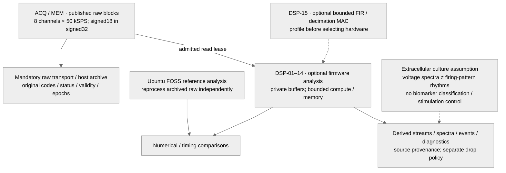
```mermaid
%%{init: {"theme":"neutral","fontFamily":"Arial,sans-serif","themeVariables":{"fontFamily":"Arial,sans-serif","fontSize":"14px"},"flowchart":{"htmlLabels":true,"minNodeWidth":0,"wrappingWidth":240,"nodeSpacing":28,"rankSpacing":32,"curve":"linear"}}}%%
flowchart TB
    RAW["ACQ / MEM · published raw blocks<br/>8 channels × 50 kSPS; signed18 in signed32"] --> ARCHIVE["Mandatory raw transport / host archive<br/>original codes / status / validity / epochs"]
    RAW -->|"admitted read lease"| DSP["DSP-01–14 · optional firmware analysis<br/>private buffers; bounded compute / memory"]
    DSP --> RESULT["Derived streams / spectra / events / diagnostics<br/>source provenance; separate drop policy"]
    HOST["Ubuntu FOSS reference analysis<br/>reprocess archived raw independently"] --> CHECK["Numerical / timing comparisons"]
    DSP --> CHECK
    ACC["DSP-15 · optional bounded FIR / decimation MAC<br/>profile before selecting hardware"] -.-> DSP
    SCOPE["Extracellular culture assumption<br/>voltage spectra ≠ firing-pattern rhythms<br/>no biomarker classification / stimulation control"] -.-> RESULT
```

## Signal-processing data paths

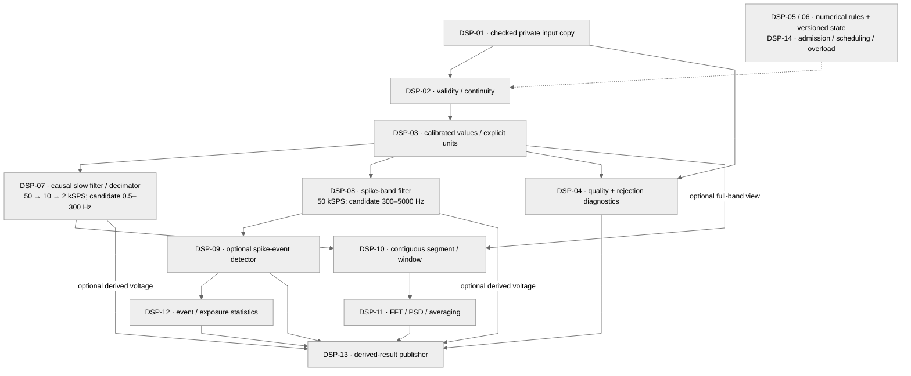
```mermaid
%%{init: {"theme":"neutral","fontFamily":"Arial,sans-serif","themeVariables":{"fontFamily":"Arial,sans-serif","fontSize":"14px"},"flowchart":{"htmlLabels":true,"minNodeWidth":0,"wrappingWidth":240,"nodeSpacing":28,"rankSpacing":32,"curve":"linear"}}}%%
flowchart TB
    IN["DSP-01 · checked private input copy"] --> VALID["DSP-02 · validity / continuity"]
    IN --> QUALITY["DSP-04 · quality + rejection diagnostics"]
    VALID --> CAL["DSP-03 · calibrated values / explicit units"]
    CAL --> SLOW["DSP-07 · causal slow filter / decimator<br/>50 → 10 → 2 kSPS; candidate 0.5–300 Hz"]
    CAL --> SPIKE["DSP-08 · spike-band filter<br/>50 kSPS; candidate 300–5000 Hz"]
    CAL --> QUALITY
    SLOW --> WIN["DSP-10 · contiguous segment / window"]
    CAL -->|"optional full-band view"| WIN
    WIN --> FFT["DSP-11 · FFT / PSD / averaging"]
    SPIKE --> EVENT["DSP-09 · optional spike-event detector"]
    EVENT --> RATE["DSP-12 · event / exposure statistics"]
    FFT --> PUB["DSP-13 · derived-result publisher"]
    RATE --> PUB
    EVENT --> PUB
    QUALITY --> PUB
    SLOW -->|"optional derived voltage"| PUB
    SPIKE -->|"optional derived voltage"| PUB
    SHARED["DSP-05 / 06 · numerical rules + versioned state<br/>DSP-14 · admission / scheduling / overload"] -.-> VALID
```

## DSP-01 · Raw preservation and analysis ingress

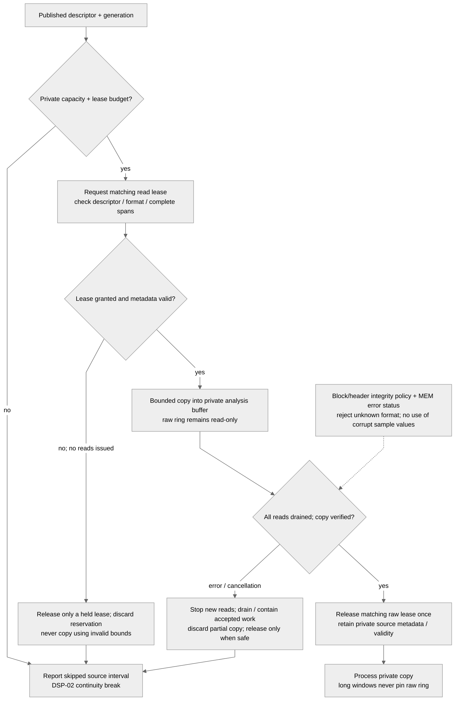
```mermaid
%%{init: {"theme":"neutral","fontFamily":"Arial,sans-serif","themeVariables":{"fontFamily":"Arial,sans-serif","fontSize":"14px"},"flowchart":{"htmlLabels":true,"minNodeWidth":0,"wrappingWidth":240,"nodeSpacing":28,"rankSpacing":32,"curve":"linear"}}}%%
flowchart TB
    DESC["Published descriptor + generation"] --> ADMIT{"Private capacity + lease budget?"}
    ADMIT -->|"no"| SKIP["Report skipped source interval<br/>DSP-02 continuity break"]
    ADMIT -->|"yes"| LEASE["Request matching read lease<br/>check descriptor / format / complete spans"]
    LEASE --> CHECK{"Lease granted and metadata valid?"}
    CHECK -->|"no; no reads issued"| DECLINE["Release only a held lease; discard reservation<br/>never copy using invalid bounds"]
    DECLINE --> SKIP
    CHECK -->|"yes"| COPY["Bounded copy into private analysis buffer<br/>raw ring remains read-only"]
    COPY --> DONE{"All reads drained; copy verified?"}
    DONE -->|"yes"| RELEASE["Release matching raw lease once<br/>retain private source metadata / validity"]
    RELEASE --> PROCESS["Process private copy<br/>long windows never pin raw ring"]
    DONE -->|"error / cancellation"| FAULT["Stop new reads; drain / contain accepted work<br/>discard partial copy; release only when safe"]
    FAULT --> SKIP
    INTEGRITY["Block/header integrity policy + MEM error status<br/>reject unknown format; no use of corrupt sample values"] -.-> DONE
```

## DSP-02 · Validity and provenance gate

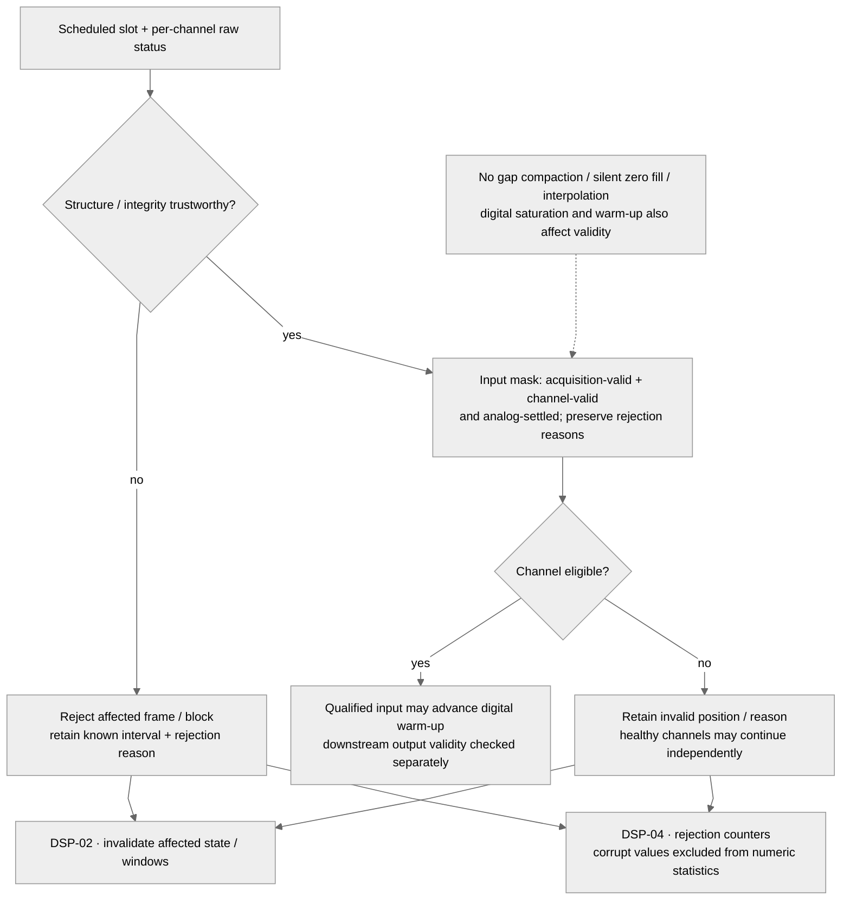
```mermaid
%%{init: {"theme":"neutral","fontFamily":"Arial,sans-serif","themeVariables":{"fontFamily":"Arial,sans-serif","fontSize":"14px"},"flowchart":{"htmlLabels":true,"minNodeWidth":0,"wrappingWidth":240,"nodeSpacing":28,"rankSpacing":32,"curve":"linear"}}}%%
flowchart TB
    SLOT["Scheduled slot + per-channel raw status"] --> TRUST{"Structure / integrity trustworthy?"}
    TRUST -->|"no"| BAD["Reject affected frame / block<br/>retain known interval + rejection reason"]
    TRUST -->|"yes"| MASK["Input mask: acquisition-valid + channel-valid<br/>and analog-settled; preserve rejection reasons"]
    MASK --> QUAL{"Channel eligible?"}
    QUAL -->|"yes"| DATA["Qualified input may advance digital warm-up<br/>downstream output validity checked separately"]
    QUAL -->|"no"| GAP["Retain invalid position / reason<br/>healthy channels may continue independently"]
    GAP --> STATE["DSP-02 · invalidate affected state / windows"]
    BAD --> STATE
    BAD --> Q["DSP-04 · rejection counters<br/>corrupt values excluded from numeric statistics"]
    GAP --> Q
    RULE["No gap compaction / silent zero fill / interpolation<br/>digital saturation and warm-up also affect validity"] -.-> MASK
```

## DSP-02 · Streaming state and discontinuities

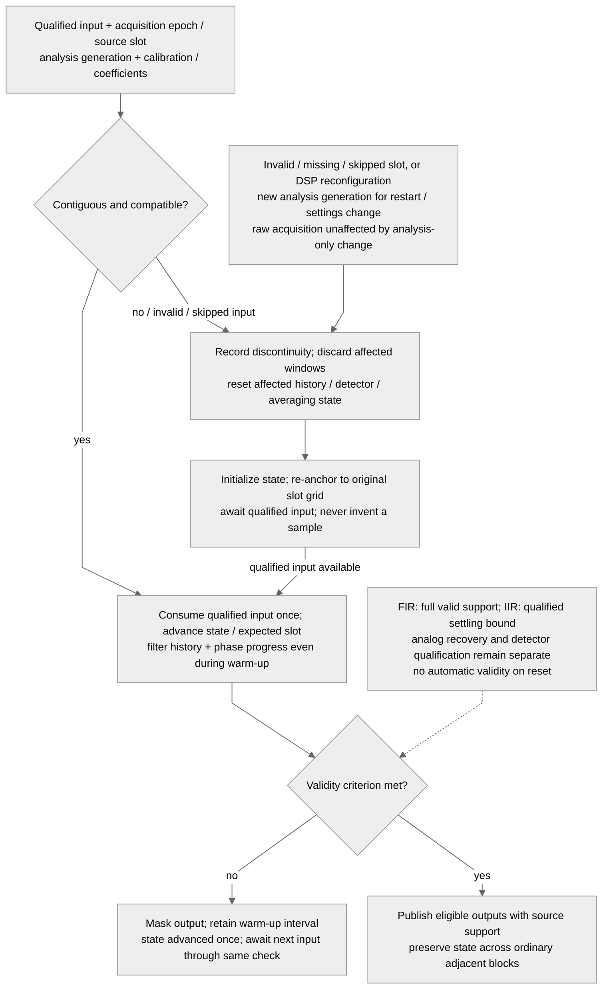
```mermaid
%%{init: {"theme":"neutral","fontFamily":"Arial,sans-serif","themeVariables":{"fontFamily":"Arial,sans-serif","fontSize":"14px"},"flowchart":{"htmlLabels":true,"minNodeWidth":0,"wrappingWidth":240,"nodeSpacing":28,"rankSpacing":32,"curve":"linear"}}}%%
flowchart TB
    INPUT["Qualified input + acquisition epoch / source slot<br/>analysis generation + calibration / coefficients"] --> MATCH{"Contiguous and compatible?"}
    MATCH -->|"yes"| STEP["Consume qualified input once; advance state / expected slot<br/>filter history + phase progress even during warm-up"]
    MATCH -->|"no / invalid / skipped input"| BREAK["Record discontinuity; discard affected windows<br/>reset affected history / detector / averaging state"]
    BREAK --> PHASE["Initialize state; re-anchor to original slot grid<br/>await qualified input; never invent a sample"]
    PHASE -->|"qualified input available"| STEP
    STEP --> READY{"Validity criterion met?"}
    READY -->|"no"| WARM["Mask output; retain warm-up interval<br/>state advanced once; await next input through same check"]
    READY -->|"yes"| OUTPUT["Publish eligible outputs with source support<br/>preserve state across ordinary adjacent blocks"]
    RESET["Invalid / missing / skipped slot, or DSP reconfiguration<br/>new analysis generation for restart / settings change<br/>raw acquisition unaffected by analysis-only change"] --> BREAK
    RULE["FIR: full valid support; IIR: qualified settling bound<br/>analog recovery and detector qualification remain separate<br/>no automatic validity on reset"] -.-> READY
```

## DSP-03 · Calibration and physical units

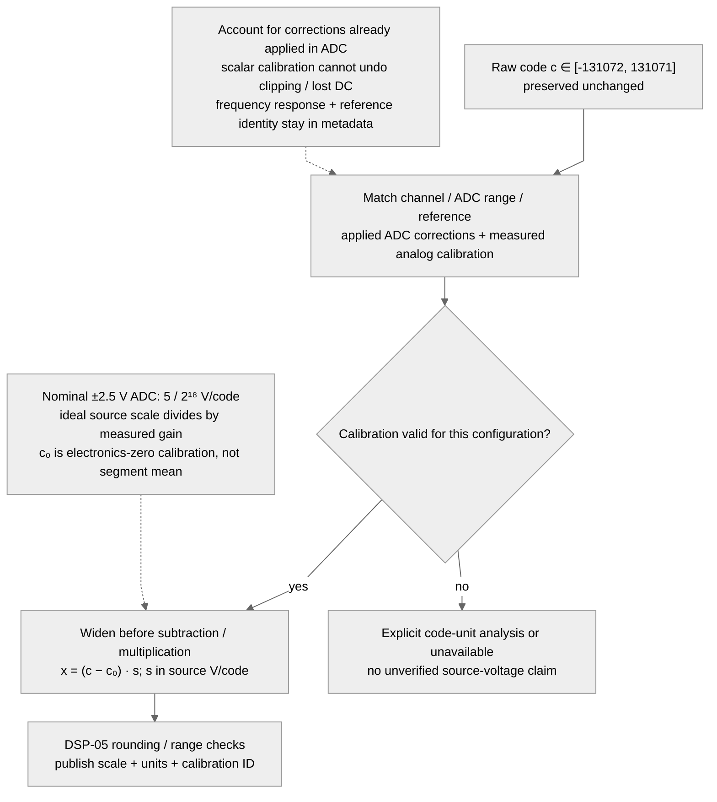
```mermaid
%%{init: {"theme":"neutral","fontFamily":"Arial,sans-serif","themeVariables":{"fontFamily":"Arial,sans-serif","fontSize":"14px"},"flowchart":{"htmlLabels":true,"minNodeWidth":0,"wrappingWidth":240,"nodeSpacing":28,"rankSpacing":32,"curve":"linear"}}}%%
flowchart TB
    C["Raw code c ∈ [-131072, 131071]<br/>preserved unchanged"] --> META["Match channel / ADC range / reference<br/>applied ADC corrections + measured analog calibration"]
    META --> OK{"Calibration valid for this configuration?"}
    OK -->|"yes"| SCALE["Widen before subtraction / multiplication<br/>x = (c − c₀) · s; s in source V/code"]
    SCALE --> FORMAT["DSP-05 rounding / range checks<br/>publish scale + units + calibration ID"]
    OK -->|"no"| CODES["Explicit code-unit analysis or unavailable<br/>no unverified source-voltage claim"]
    NOM["Nominal ±2.5 V ADC: 5 / 2¹⁸ V/code<br/>ideal source scale divides by measured gain<br/>c₀ is electronics-zero calibration, not segment mean"] -.-> SCALE
    LIMIT["Account for corrections already applied in ADC<br/>scalar calibration cannot undo clipping / lost DC<br/>frequency response + reference identity stay in metadata"] -.-> META
```

## DSP-04 · Quality monitor

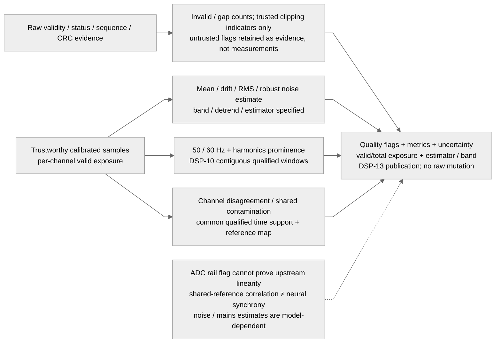
```mermaid
%%{init: {"theme":"neutral","fontFamily":"Arial,sans-serif","themeVariables":{"fontFamily":"Arial,sans-serif","fontSize":"14px"},"flowchart":{"htmlLabels":true,"minNodeWidth":0,"wrappingWidth":240,"nodeSpacing":28,"rankSpacing":32,"curve":"linear"}}}%%
flowchart LR
    STATUS["Raw validity / status / sequence / CRC evidence"] --> COUNT["Invalid / gap counts; trusted clipping indicators only<br/>untrusted flags retained as evidence, not measurements"]
    VALUES["Trustworthy calibrated samples<br/>per-channel valid exposure"] --> STATS["Mean / drift / RMS / robust noise estimate<br/>band / detrend / estimator specified"]
    VALUES --> MAINS["50 / 60 Hz + harmonics prominence<br/>DSP-10 contiguous qualified windows"]
    VALUES --> CROSS["Channel disagreement / shared contamination<br/>common qualified time support + reference map"]
    COUNT --> REPORT["Quality flags + metrics + uncertainty<br/>valid/total exposure + estimator / band<br/>DSP-13 publication; no raw mutation"]
    STATS --> REPORT
    MAINS --> REPORT
    CROSS --> REPORT
    LIMIT["ADC rail flag cannot prove upstream linearity<br/>shared-reference correlation ≠ neural synchrony<br/>noise / mains estimates are model-dependent"] -.-> REPORT
```

## DSP-05 · Fixed-point numerical contract

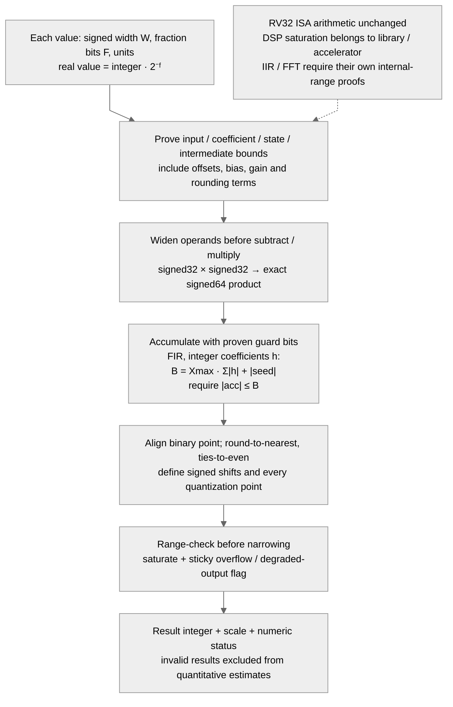
```mermaid
%%{init: {"theme":"neutral","fontFamily":"Arial,sans-serif","themeVariables":{"fontFamily":"Arial,sans-serif","fontSize":"14px"},"flowchart":{"htmlLabels":true,"minNodeWidth":0,"wrappingWidth":240,"nodeSpacing":28,"rankSpacing":32,"curve":"linear"}}}%%
flowchart TB
    SPEC["Each value: signed width W, fraction bits F, units<br/>real value = integer · 2⁻ᶠ"] --> RANGE["Prove input / coefficient / state / intermediate bounds<br/>include offsets, bias, gain and rounding terms"]
    RANGE --> WIDE["Widen operands before subtract / multiply<br/>signed32 × signed32 → exact signed64 product"]
    WIDE --> ACC["Accumulate with proven guard bits<br/>FIR, integer coefficients h:<br/>B = Xmax · Σ|h| + |seed|<br/>require |acc| ≤ B"]
    ACC --> ROUND["Align binary point; round-to-nearest, ties-to-even<br/>define signed shifts and every quantization point"]
    ROUND --> SAT["Range-check before narrowing<br/>saturate + sticky overflow / degraded-output flag"]
    SAT --> OUT["Result integer + scale + numeric status<br/>invalid results excluded from quantitative estimates"]
    RULE["RV32 ISA arithmetic unchanged<br/>DSP saturation belongs to library / accelerator<br/>IIR / FFT require their own internal-range proofs"] -.-> RANGE
```

## DSP-05 · IIR second-order sections · [reference](https://docs.scipy.org/doc/scipy/reference/generated/scipy.signal.sosfilt.html)

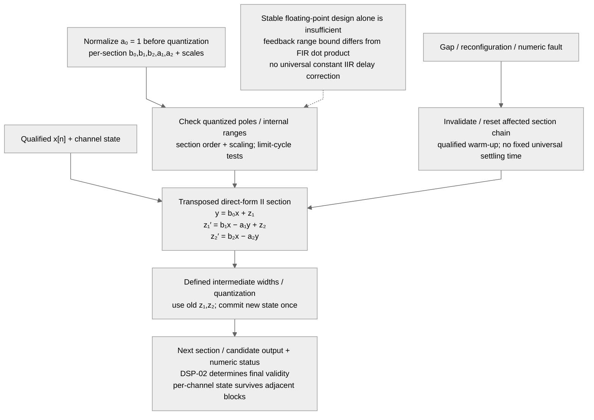
```mermaid
%%{init: {"theme":"neutral","fontFamily":"Arial,sans-serif","themeVariables":{"fontFamily":"Arial,sans-serif","fontSize":"14px"},"flowchart":{"htmlLabels":true,"minNodeWidth":0,"wrappingWidth":240,"nodeSpacing":28,"rankSpacing":32,"curve":"linear"}}}%%
flowchart TB
    COEF["Normalize a₀ = 1 before quantization<br/>per-section b₀,b₁,b₂,a₁,a₂ + scales"] --> CHECK["Check quantized poles / internal ranges<br/>section order + scaling; limit-cycle tests"]
    X["Qualified x[n] + channel state"] --> SOS["Transposed direct-form II section<br/>y = b₀x + z₁<br/>z₁′ = b₁x − a₁y + z₂<br/>z₂′ = b₂x − a₂y"]
    CHECK --> SOS
    SOS --> Q["Defined intermediate widths / quantization<br/>use old z₁,z₂; commit new state once"]
    Q --> NEXT["Next section / candidate output + numeric status<br/>DSP-02 determines final validity<br/>per-channel state survives adjacent blocks"]
    BAD["Gap / reconfiguration / numeric fault"] --> RESET["Invalidate / reset affected section chain<br/>qualified warm-up; no fixed universal settling time"]
    RESET --> SOS
    LIMIT["Stable floating-point design alone is insufficient<br/>feedback range bound differs from FIR dot product<br/>no universal constant IIR delay correction"] -.-> CHECK
```

## DSP-06 · Coefficients, configuration and state banks

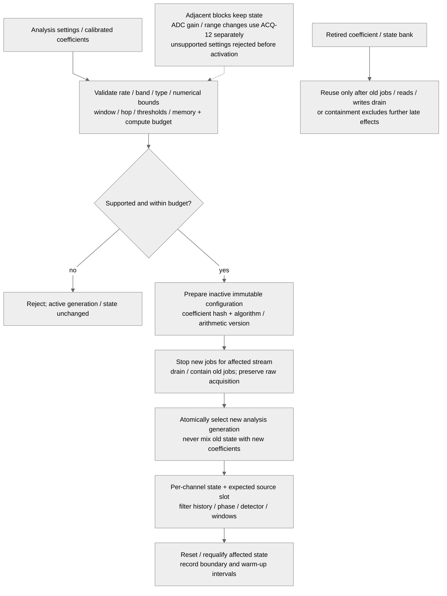
```mermaid
%%{init: {"theme":"neutral","fontFamily":"Arial,sans-serif","themeVariables":{"fontFamily":"Arial,sans-serif","fontSize":"14px"},"flowchart":{"htmlLabels":true,"minNodeWidth":0,"wrappingWidth":240,"nodeSpacing":28,"rankSpacing":32,"curve":"linear"}}}%%
flowchart TB
    REQ["Analysis settings / calibrated coefficients"] --> CHECK["Validate rate / band / type / numerical bounds<br/>window / hop / thresholds / memory + compute budget"]
    CHECK --> PASS{"Supported and within budget?"}
    PASS -->|"no"| REJECT["Reject; active generation / state unchanged"]
    PASS -->|"yes"| BUILD["Prepare inactive immutable configuration<br/>coefficient hash + algorithm / arithmetic version"]
    BUILD --> SWITCH["Stop new jobs for affected stream<br/>drain / contain old jobs; preserve raw acquisition"]
    SWITCH --> COMMIT["Atomically select new analysis generation<br/>never mix old state with new coefficients"]
    COMMIT --> STATE["Per-channel state + expected source slot<br/>filter history / phase / detector / windows"]
    STATE --> WARM["Reset / requalify affected state<br/>record boundary and warm-up intervals"]
    OLD["Retired coefficient / state bank"] --> REUSE["Reuse only after old jobs / reads / writes drain<br/>or containment excludes further late effects"]
    RULE["Adjacent blocks keep state<br/>ADC gain / range changes use ACQ-12 separately<br/>unsupported settings rejected before activation"] -.-> CHECK
```

## DSP-07 · Slow-voltage branch and anti-alias stages

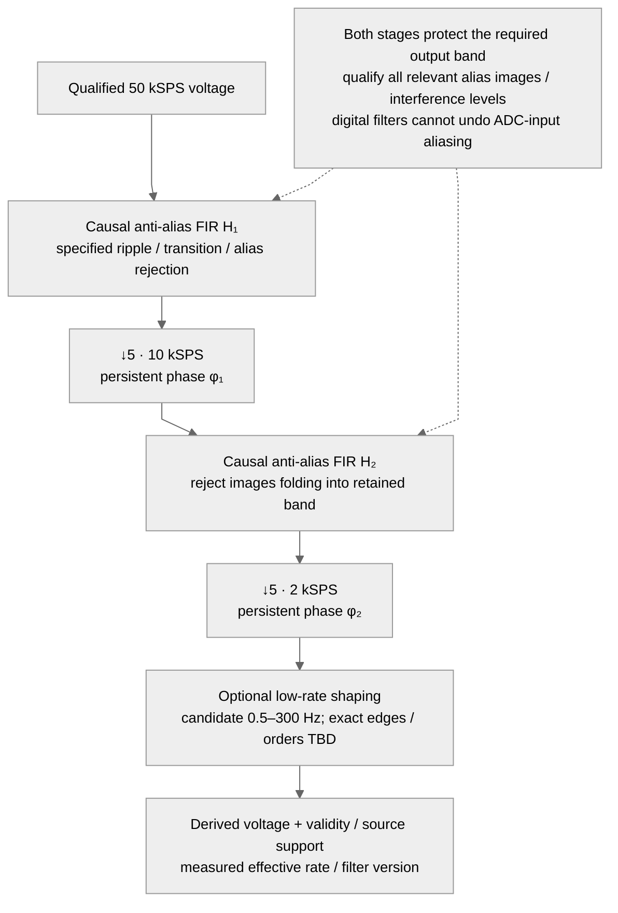
```mermaid
%%{init: {"theme":"neutral","fontFamily":"Arial,sans-serif","themeVariables":{"fontFamily":"Arial,sans-serif","fontSize":"14px"},"flowchart":{"htmlLabels":true,"minNodeWidth":0,"wrappingWidth":240,"nodeSpacing":28,"rankSpacing":32,"curve":"linear"}}}%%
flowchart TB
    IN["Qualified 50 kSPS voltage"] --> A["Causal anti-alias FIR H₁<br/>specified ripple / transition / alias rejection"]
    A --> D1["↓5 · 10 kSPS<br/>persistent phase φ₁"]
    D1 --> B["Causal anti-alias FIR H₂<br/>reject images folding into retained band"]
    B --> D2["↓5 · 2 kSPS<br/>persistent phase φ₂"]
    D2 --> SLOW["Optional low-rate shaping<br/>candidate 0.5–300 Hz; exact edges / orders TBD"]
    SLOW --> OUT["Derived voltage + validity / source support<br/>measured effective rate / filter version"]
    SPEC["Both stages protect the required output band<br/>qualify all relevant alias images / interference levels<br/>digital filters cannot undo ADC-input aliasing"] -.-> A
    SPEC -.-> B
```

## DSP-07 · Causal polyphase state and timing · [reference](https://docs.scipy.org/doc/scipy/reference/generated/scipy.signal.upfirdn.html)

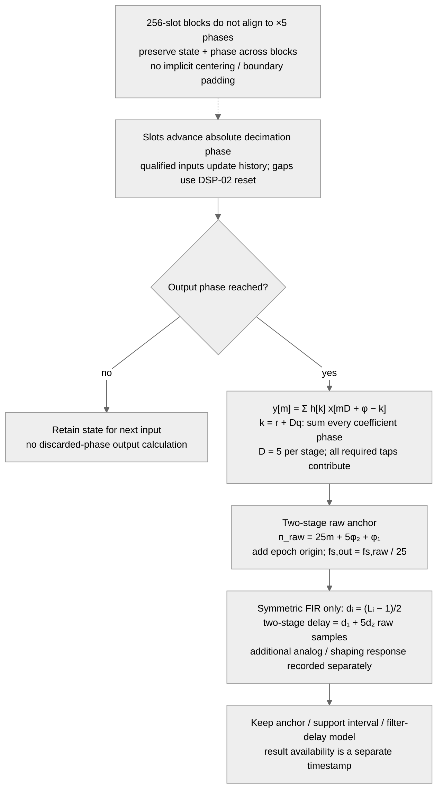
```mermaid
%%{init: {"theme":"neutral","fontFamily":"Arial,sans-serif","themeVariables":{"fontFamily":"Arial,sans-serif","fontSize":"14px"},"flowchart":{"htmlLabels":true,"minNodeWidth":0,"wrappingWidth":240,"nodeSpacing":28,"rankSpacing":32,"curve":"linear"}}}%%
flowchart TB
    IN["Slots advance absolute decimation phase<br/>qualified inputs update history; gaps use DSP-02 reset"] --> PHASE{"Output phase reached?"}
    PHASE -->|"no"| KEEP["Retain state for next input<br/>no discarded-phase output calculation"]
    PHASE -->|"yes"| DOT["y[m] = Σ h[k] x[mD + φ − k]<br/>k = r + Dq: sum every coefficient phase<br/>D = 5 per stage; all required taps contribute"]
    DOT --> TAG["Two-stage raw anchor<br/>n_raw = 25m + 5φ₂ + φ₁<br/>add epoch origin; fs,out = fs,raw / 25"]
    TAG --> DELAY["Symmetric FIR only: dᵢ = (Lᵢ − 1)/2<br/>two-stage delay = d₁ + 5d₂ raw samples<br/>additional analog / shaping response recorded separately"]
    DELAY --> TIME["Keep anchor / support interval / filter-delay model<br/>result availability is a separate timestamp"]
    RULE["256-slot blocks do not align to ×5 phases<br/>preserve state + phase across blocks<br/>no implicit centering / boundary padding"] -.-> IN
```

## DSP-08 · Spike-band filter

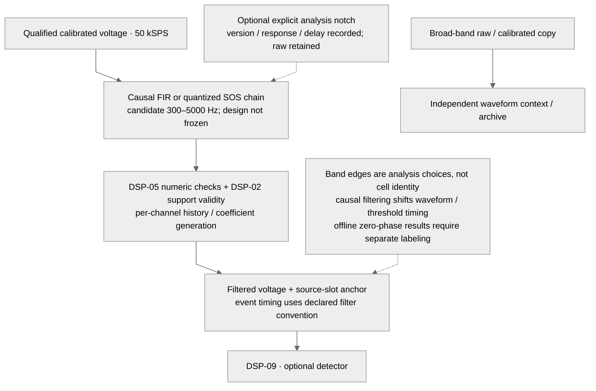
```mermaid
%%{init: {"theme":"neutral","fontFamily":"Arial,sans-serif","themeVariables":{"fontFamily":"Arial,sans-serif","fontSize":"14px"},"flowchart":{"htmlLabels":true,"minNodeWidth":0,"wrappingWidth":240,"nodeSpacing":28,"rankSpacing":32,"curve":"linear"}}}%%
flowchart TB
    IN["Qualified calibrated voltage · 50 kSPS"] --> FILTER["Causal FIR or quantized SOS chain<br/>candidate 300–5000 Hz; design not frozen"]
    FILTER --> CHECK["DSP-05 numeric checks + DSP-02 support validity<br/>per-channel history / coefficient generation"]
    CHECK --> OUT["Filtered voltage + source-slot anchor<br/>event timing uses declared filter convention"]
    OUT --> DET["DSP-09 · optional detector"]
    RAW["Broad-band raw / calibrated copy"] --> CONTEXT["Independent waveform context / archive"]
    NOTCH["Optional explicit analysis notch<br/>version / response / delay recorded; raw retained"] -.-> FILTER
    RULE["Band edges are analysis choices, not cell identity<br/>causal filtering shifts waveform / threshold timing<br/>offline zero-phase results require separate labeling"] -.-> OUT
```

## DSP-09 · Optional spike-event detector

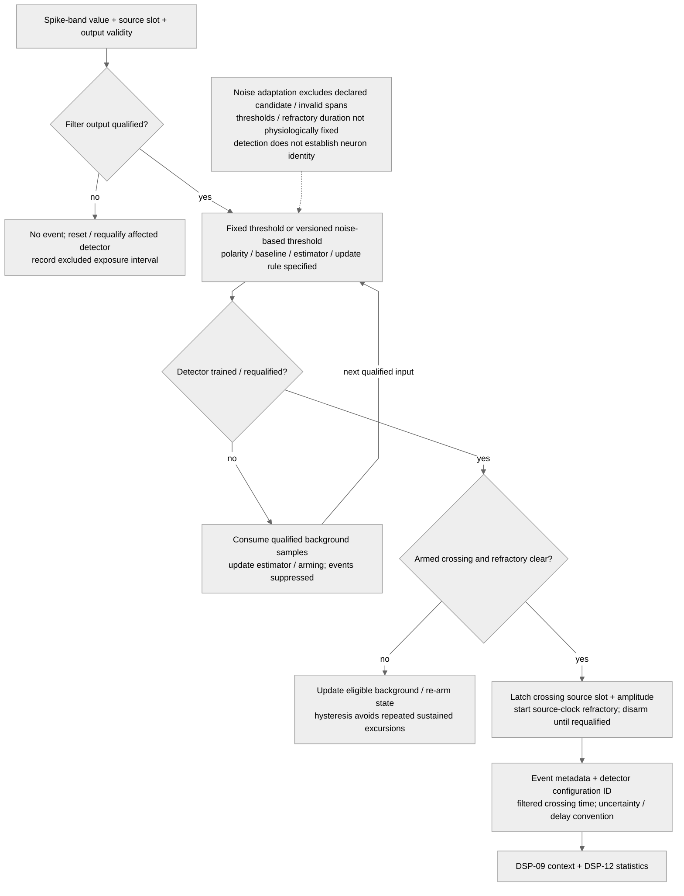
```mermaid
%%{init: {"theme":"neutral","fontFamily":"Arial,sans-serif","themeVariables":{"fontFamily":"Arial,sans-serif","fontSize":"14px"},"flowchart":{"htmlLabels":true,"minNodeWidth":0,"wrappingWidth":240,"nodeSpacing":28,"rankSpacing":32,"curve":"linear"}}}%%
flowchart TB
    IN["Spike-band value + source slot + output validity"] --> VALID{"Filter output qualified?"}
    VALID -->|"no"| RESET["No event; reset / requalify affected detector<br/>record excluded exposure interval"]
    VALID -->|"yes"| BASE["Fixed threshold or versioned noise-based threshold<br/>polarity / baseline / estimator / update rule specified"]
    BASE --> READY{"Detector trained / requalified?"}
    READY -->|"no"| TRAIN["Consume qualified background samples<br/>update estimator / arming; events suppressed"]
    TRAIN -->|"next qualified input"| BASE
    READY -->|"yes"| CROSS{"Armed crossing and refractory clear?"}
    CROSS -->|"no"| TRACK["Update eligible background / re-arm state<br/>hysteresis avoids repeated sustained excursions"]
    CROSS -->|"yes"| EVENT["Latch crossing source slot + amplitude<br/>start source-clock refractory; disarm until requalified"]
    EVENT --> OUT["Event metadata + detector configuration ID<br/>filtered crossing time; uncertainty / delay convention"]
    OUT --> CONTEXT["DSP-09 context + DSP-12 statistics"]
    RULE["Noise adaptation excludes declared candidate / invalid spans<br/>thresholds / refractory duration not physiologically fixed<br/>detection does not establish neuron identity"] -.-> BASE
```

## DSP-09 · Waveform context and event queues

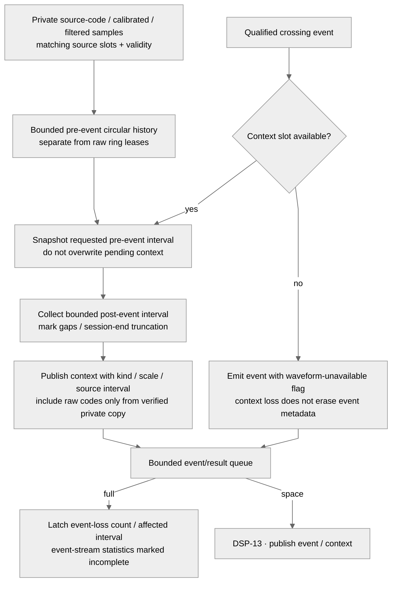
```mermaid
%%{init: {"theme":"neutral","fontFamily":"Arial,sans-serif","themeVariables":{"fontFamily":"Arial,sans-serif","fontSize":"14px"},"flowchart":{"htmlLabels":true,"minNodeWidth":0,"wrappingWidth":240,"nodeSpacing":28,"rankSpacing":32,"curve":"linear"}}}%%
flowchart TB
    COPY["Private source-code / calibrated / filtered samples<br/>matching source slots + validity"] --> HISTORY["Bounded pre-event circular history<br/>separate from raw ring leases"]
    E["Qualified crossing event"] --> SLOT{"Context slot available?"}
    SLOT -->|"yes"| PRE["Snapshot requested pre-event interval<br/>do not overwrite pending context"]
    HISTORY --> PRE
    PRE --> POST["Collect bounded post-event interval<br/>mark gaps / session-end truncation"]
    POST --> WAVE["Publish context with kind / scale / source interval<br/>include raw codes only from verified private copy"]
    SLOT -->|"no"| FLAG["Emit event with waveform-unavailable flag<br/>context loss does not erase event metadata"]
    WAVE --> QUEUE["Bounded event/result queue"]
    FLAG --> QUEUE
    QUEUE -->|"full"| LOSS["Latch event-loss count / affected interval<br/>event-stream statistics marked incomplete"]
    QUEUE -->|"space"| PUB["DSP-13 · publish event / context"]
```

## DSP-10 · Segments, overlap and windowing

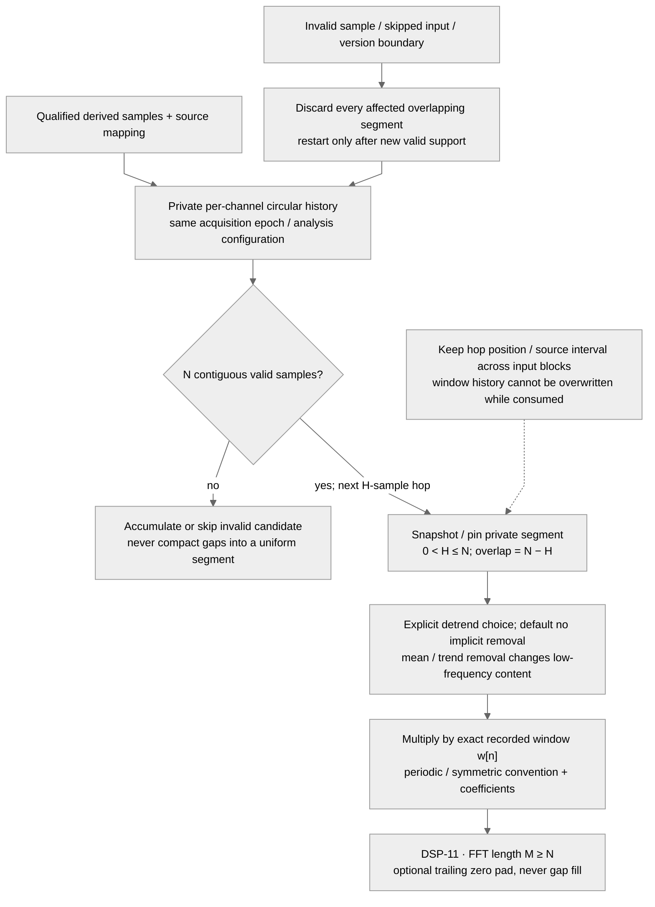
```mermaid
%%{init: {"theme":"neutral","fontFamily":"Arial,sans-serif","themeVariables":{"fontFamily":"Arial,sans-serif","fontSize":"14px"},"flowchart":{"htmlLabels":true,"minNodeWidth":0,"wrappingWidth":240,"nodeSpacing":28,"rankSpacing":32,"curve":"linear"}}}%%
flowchart TB
    IN["Qualified derived samples + source mapping"] --> RING["Private per-channel circular history<br/>same acquisition epoch / analysis configuration"]
    RING --> FULL{"N contiguous valid samples?"}
    FULL -->|"no"| WAIT["Accumulate or skip invalid candidate<br/>never compact gaps into a uniform segment"]
    FULL -->|"yes; next H-sample hop"| SNAP["Snapshot / pin private segment<br/>0 < H ≤ N; overlap = N − H"]
    SNAP --> DETREND["Explicit detrend choice; default no implicit removal<br/>mean / trend removal changes low-frequency content"]
    DETREND --> WINDOW["Multiply by exact recorded window w[n]<br/>periodic / symmetric convention + coefficients"]
    WINDOW --> FFT["DSP-11 · FFT length M ≥ N<br/>optional trailing zero pad, never gap fill"]
    GAP["Invalid sample / skipped input / version boundary"] --> FLUSH["Discard every affected overlapping segment<br/>restart only after new valid support"]
    FLUSH --> RING
    RULE["Keep hop position / source interval across input blocks<br/>window history cannot be overwritten while consumed"] -.-> SNAP
```

## DSP-10 · Observation length and workspace budget

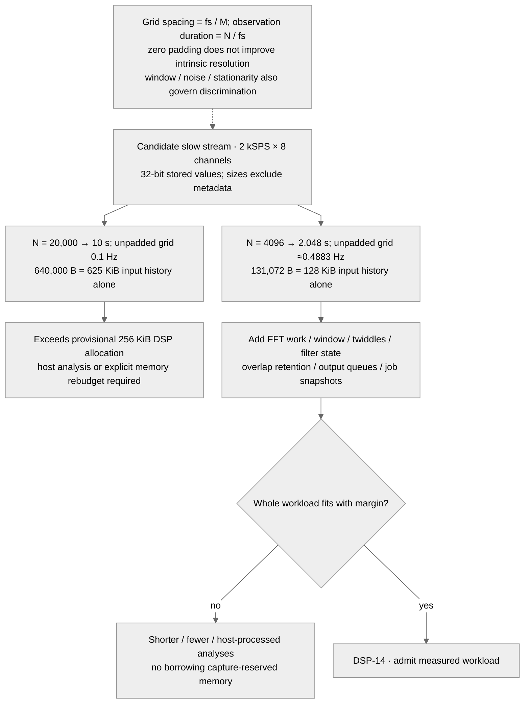
```mermaid
%%{init: {"theme":"neutral","fontFamily":"Arial,sans-serif","themeVariables":{"fontFamily":"Arial,sans-serif","fontSize":"14px"},"flowchart":{"htmlLabels":true,"minNodeWidth":0,"wrappingWidth":240,"nodeSpacing":28,"rankSpacing":32,"curve":"linear"}}}%%
flowchart TB
    PLAN["Candidate slow stream · 2 kSPS × 8 channels<br/>32-bit stored values; sizes exclude metadata"] --> LONG["N = 20,000 → 10 s; unpadded grid 0.1 Hz<br/>640,000 B = 625 KiB input history alone"]
    PLAN --> SHORT["N = 4096 → 2.048 s; unpadded grid ≈0.4883 Hz<br/>131,072 B = 128 KiB input history alone"]
    LONG --> OVER["Exceeds provisional 256 KiB DSP allocation<br/>host analysis or explicit memory rebudget required"]
    SHORT --> CHECK["Add FFT work / window / twiddles / filter state<br/>overlap retention / output queues / job snapshots"]
    CHECK --> FIT{"Whole workload fits with margin?"}
    FIT -->|"no"| REDUCE["Shorter / fewer / host-processed analyses<br/>no borrowing capture-reserved memory"]
    FIT -->|"yes"| ADMIT["DSP-14 · admit measured workload"]
    RULE["Grid spacing = fs / M; observation duration = N / fs<br/>zero padding does not improve intrinsic resolution<br/>window / noise / stationarity also govern discrimination"] -.-> PLAN
```

## DSP-11 · FFT engine · firmware baseline · [reference](https://docs.scipy.org/doc/scipy/reference/generated/scipy.fft.fft.html)

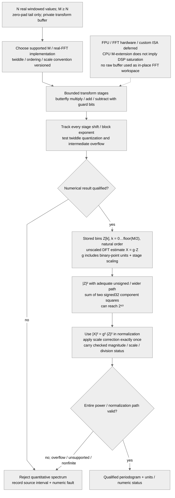
```mermaid
%%{init: {"theme":"neutral","fontFamily":"Arial,sans-serif","themeVariables":{"fontFamily":"Arial,sans-serif","fontSize":"14px"},"flowchart":{"htmlLabels":true,"minNodeWidth":0,"wrappingWidth":240,"nodeSpacing":28,"rankSpacing":32,"curve":"linear"}}}%%
flowchart TB
    INPUT["N real windowed values; M ≥ N<br/>zero-pad tail only; private transform buffer"] --> CFG["Choose supported M / real-FFT implementation<br/>twiddle / ordering / scale convention versioned"]
    CFG --> FFT["Bounded transform stages<br/>butterfly multiply / add / subtract with guard bits"]
    FFT --> SCALE["Track every stage shift / block exponent<br/>test twiddle quantization and intermediate overflow"]
    SCALE --> OK{"Numerical result qualified?"}
    OK -->|"no"| BAD["Reject quantitative spectrum<br/>record source interval + numeric fault"]
    OK -->|"yes"| Z["Stored bins Z[k], k = 0…floor(M/2), natural order<br/>unscaled DFT estimate X = g·Z<br/>g includes binary-point units + stage scaling"]
    Z --> MAG["|Z|² with adequate unsigned / wider path<br/>sum of two signed32 component squares<br/>can reach 2⁶³"]
    MAG --> PSD["Use |X|² = g²·|Z|² in normalization<br/>apply scale correction exactly once<br/>carry checked magnitude / scale / division status"]
    PSD --> POST{"Entire power / normalization path valid?"}
    POST -->|"no; overflow / unsupported / nonfinite"| BAD
    POST -->|"yes"| PERIOD["Qualified periodogram + units / numeric status"]
    RULE["FPU / FFT hardware / custom ISA deferred<br/>CPU M-extension does not imply DSP saturation<br/>no raw buffer used as in-place FFT workspace"] -.-> FFT
```

## DSP-11 · Spectral normalization · [reference](https://docs.scipy.org/doc/scipy/tutorial/signal.html#spectral-analysis)

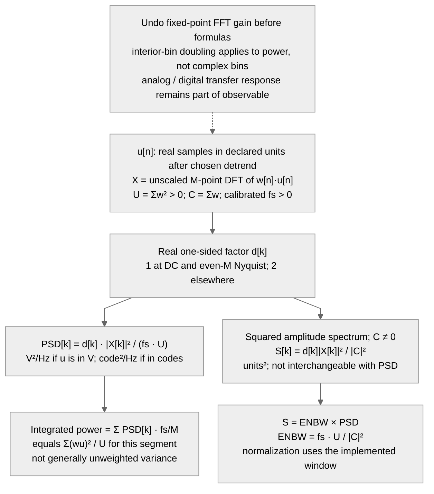
```mermaid
%%{init: {"theme":"neutral","fontFamily":"Arial,sans-serif","themeVariables":{"fontFamily":"Arial,sans-serif","fontSize":"14px"},"flowchart":{"htmlLabels":true,"minNodeWidth":0,"wrappingWidth":240,"nodeSpacing":28,"rankSpacing":32,"curve":"linear"}}}%%
flowchart TB
    DEF["u[n]: real samples in declared units after chosen detrend<br/>X = unscaled M-point DFT of w[n]·u[n]<br/>U = Σw² > 0; C = Σw; calibrated fs > 0"] --> FACTOR["Real one-sided factor d[k]<br/>1 at DC and even-M Nyquist; 2 elsewhere"]
    FACTOR --> PSD["PSD[k] = d[k] · |X[k]|² / (fs · U)<br/>V²/Hz if u is in V; code²/Hz if in codes"]
    FACTOR --> SPEC["Squared amplitude spectrum; C ≠ 0<br/>S[k] = d[k]|X[k]|² / |C|²<br/>units²; not interchangeable with PSD"]
    PSD --> POWER["Integrated power = Σ PSD[k] · fs/M<br/>equals Σ(wu)² / U for this segment<br/>not generally unweighted variance"]
    SPEC --> ENBW["S = ENBW × PSD<br/>ENBW = fs · U / |C|²<br/>normalization uses the implemented window"]
    RULE["Undo fixed-point FFT gain before formulas<br/>interior-bin doubling applies to power, not complex bins<br/>analog / digital transfer response remains part of observable"] -.-> DEF
```

## DSP-11 · Welch averaging · [reference](https://docs.scipy.org/doc/scipy/reference/generated/scipy.signal.welch.html)

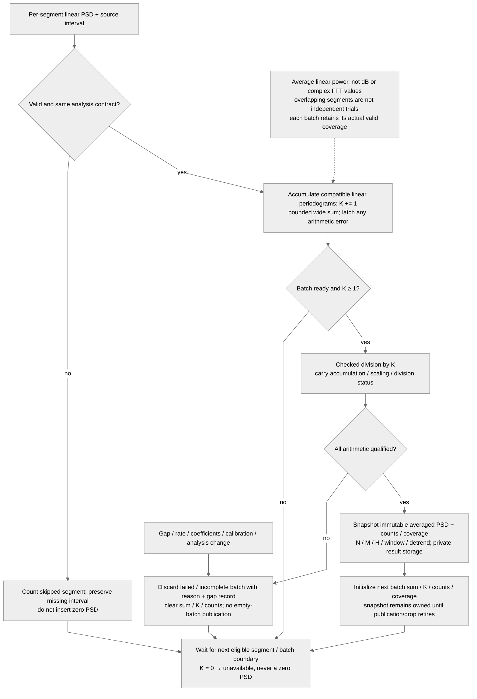
```mermaid
%%{init: {"theme":"neutral","fontFamily":"Arial,sans-serif","themeVariables":{"fontFamily":"Arial,sans-serif","fontSize":"14px"},"flowchart":{"htmlLabels":true,"minNodeWidth":0,"wrappingWidth":240,"nodeSpacing":28,"rankSpacing":32,"curve":"linear"}}}%%
flowchart TB
    P["Per-segment linear PSD + source interval"] --> COMPAT{"Valid and same analysis contract?"}
    COMPAT -->|"no"| SKIP["Count skipped segment; preserve missing interval<br/>do not insert zero PSD"]
    COMPAT -->|"yes"| AVG["Accumulate compatible linear periodograms; K += 1<br/>bounded wide sum; latch any arithmetic error"]
    AVG --> READY{"Batch ready and K ≥ 1?"}
    READY -->|"no"| WAIT["Wait for next eligible segment / batch boundary<br/>K = 0 → unavailable, never a zero PSD"]
    READY -->|"yes"| MEAN["Checked division by K<br/>carry accumulation / scaling / division status"]
    MEAN --> NUM{"All arithmetic qualified?"}
    NUM -->|"no"| CLEAR
    NUM -->|"yes"| PSD["Snapshot immutable averaged PSD + counts / coverage<br/>N / M / H / window / detrend; private result storage"]
    PSD --> NEXT["Initialize next batch sum / K / counts / coverage<br/>snapshot remains owned until publication/drop retires"]
    NEXT --> WAIT
    SKIP --> WAIT
    RESET["Gap / rate / coefficients / calibration / analysis change"] --> CLEAR["Discard failed / incomplete batch with reason + gap record<br/>clear sum / K / counts; no empty-batch publication"]
    CLEAR --> WAIT
    RULE["Average linear power, not dB or complex FFT values<br/>overlapping segments are not independent trials<br/>each batch retains its actual valid coverage"] -.-> AVG
```

## DSP-11 · Spectral summaries

```mermaid
%%{init: {"theme":"neutral","fontFamily":"Arial,sans-serif","themeVariables":{"fontFamily":"Arial,sans-serif","fontSize":"14px"},"flowchart":{"htmlLabels":true,"minNodeWidth":0,"wrappingWidth":240,"nodeSpacing":28,"rankSpacing":32,"curve":"linear"}}}%%
flowchart TB
    PSD["Qualified PSD + frequency grid + units<br/>source / window / averaging provenance"] --> BAND["Band power: declared bin / edge-weight rule<br/>sum PSD × frequency-bin width"]
    PSD --> PEAK["Candidate peaks / mains prominence<br/>frequency grid + quality / uncertainty"]
    PSD --> DB["Optional display dB; positive reference<br/>10 log₁₀(power / reference)<br/>display floor / zero handling disclosed"]
    BAND --> OUT["Checked derived metric + units + numeric status<br/>DSP-13 publication; invalid math never quantitative-valid"]
    PEAK --> OUT
    DB --> OUT
    RULE["Peak alone does not establish pathological oscillation<br/>selected band and preprocessing define the observable<br/>summary computation leaves input PSD / raw unchanged"] -.-> PEAK
```

## DSP-12 · Event timing, exposure and firing-pattern statistics

```mermaid
%%{init: {"theme":"neutral","fontFamily":"Arial,sans-serif","themeVariables":{"fontFamily":"Arial,sans-serif","fontSize":"14px"},"flowchart":{"htmlLabels":true,"minNodeWidth":0,"wrappingWidth":240,"nodeSpacing":28,"rankSpacing":32,"curve":"linear"}}}%%
flowchart TB
    E["Qualified detected events<br/>source times + detector version"] --> VALID["Check event sequence / loss flags<br/>preserve channel + analysis generation"]
    EXP["Qualified detector exposure intervals<br/>exclude source gaps / warm-up / skipped analysis"] --> VALID
    VALID --> WATERMARK{"Event + exposure streams settled to interval end?<br/>including explicit loss / exclusion markers"}
    WATERMARK -->|"no"| WAIT["Provisional / unavailable; wait for per-channel watermarks<br/>pending events cannot become a false zero count"]
    WATERMARK -->|"yes"| RATE["Rate = accepted event count / valid exposure time<br/>zero exposure → unavailable; loss → incomplete"]
    WATERMARK -->|"yes"| ISI["Inter-event intervals only within complete continuous runs<br/>source gap / event loss / detector reset breaks pairing"]
    WATERMARK -->|"yes"| RHYTHM["Optional binned count/rate or point-process analysis<br/>bin width / exposure / method explicitly specified"]
    RHYTHM --> CHECK["Event loss / missing exposure excludes affected segments<br/>baseline FFT: contiguous equal bins, complete exposure<br/>other missing-data methods require a separate contract"]
    RATE --> PUB["DSP-13 · counts / exposure / method / validity"]
    ISI --> PUB
    CHECK --> PUB
    RULE["Observed threshold-event rate, not guaranteed neuron rate<br/>refractory / threshold selection affects counts<br/>event-pattern spectra differ from voltage PSD"] -.-> PUB
```

## DSP-13 · Derived-result publication

```mermaid
%%{init: {"theme":"neutral","fontFamily":"Arial,sans-serif","themeVariables":{"fontFamily":"Arial,sans-serif","fontSize":"14px"},"flowchart":{"htmlLabels":true,"minNodeWidth":0,"wrappingWidth":240,"nodeSpacing":28,"rankSpacing":32,"curve":"linear"}}}%%
flowchart TB
    RESULT["Completed analysis result in private storage"] --> META["Attach acquisition epoch / channel-reference map<br/>source anchor interval + full input support<br/>analysis / coefficient / calibration / arithmetic IDs"]
    META --> FORMAT["Units / scale / effective rate / phase / delay model<br/>validity / warm-up / saturation / loss / coverage<br/>schema / length / sequence / integrity"]
    FORMAT --> SPACE{"Queue slot + output / link budget reserved?"}
    SPACE -->|"yes"| WRITE["Finish payload + metadata writes<br/>retain private ownership until publication"]
    WRITE --> OK{"All writes successful and visible?"}
    OK -->|"yes"| COMMIT["Atomically publish into reserved queue slot<br/>descriptor / payload immutable to producer"]
    COMMIT --> SEND["Bounded derived transport / host display<br/>mandatory raw service retains reservation"]
    SPACE -->|"no"| DROP["Drop unpublished result; release tentative reservations<br/>record result-sequence gap / drop count"]
    OK -->|"no / uncertain"| FAULT["No publication; MEM-15 drain / containment<br/>report failure; reclaim only after no late effects"]
    SEND --> FREE["Release after reader / transport leases drain"]
    DROP --> FREE
    FAULT -->|"safe to reclaim"| FREE
    RULE["Output-only drop need not reset already valid DSP state<br/>skipped inputs or partial jobs do require continuity handling<br/>shared-memory hardware faults still use MEM / ACQ containment"] -.-> DROP
```

## DSP-14 · Processing scheduler and overload

```mermaid
%%{init: {"theme":"neutral","fontFamily":"Arial,sans-serif","themeVariables":{"fontFamily":"Arial,sans-serif","fontSize":"14px"},"flowchart":{"htmlLabels":true,"minNodeWidth":0,"wrappingWidth":240,"nodeSpacing":28,"rankSpacing":32,"curve":"linear"}}}%%
flowchart TB
    BLOCK["Published block / private derived input ready"] --> COST["Check compute / memory service / workspace<br/>attempt input/output/completion reservations"]
    COST --> ADMIT{"Budget + complete reservation successful?"}
    ADMIT -->|"no"| SKIP["Roll back all tentative reservations<br/>skip input interval; count overload; invalidate affected state"]
    ADMIT -->|"yes"| RUN["Bounded firmware slice or optional MAC job<br/>capture / transport retain service guarantees"]
    RUN --> DONE{"Successful before deadline?"}
    DONE -->|"yes"| COMMIT["Commit state / results at known source position<br/>publish or explicitly drop completed result"]
    DONE -->|"no / cancel"| STOP["Stop new work; drain / contain accepted DMA<br/>discard uncommitted outputs; poison/reset partial state"]
    STOP --> SKIP
    COMMIT --> PROFILE["Measure cycles / stalls / memory / high-water / latency<br/>admit future workload only within qualified bounds"]
    RULE["Optional overload never silently overwrites raw data<br/>deferred work must still fit backlog / lease deadlines<br/>fault containment may stop acquisition when memory is unsafe"] -.-> RUN
```

## DSP-14 · Workload and memory-service budget

```mermaid
%%{init: {"theme":"neutral","fontFamily":"Arial,sans-serif","themeVariables":{"fontFamily":"Arial,sans-serif","fontSize":"14px"},"flowchart":{"htmlLabels":true,"minNodeWidth":0,"wrappingWidth":240,"nodeSpacing":28,"rankSpacing":32,"curve":"linear"}}}%%
flowchart TB
    BASE["8 × 50 kSPS = 400,000 samples/s<br/>256-frame block every 5.12 ms"] --> CPU["50 / 80 / 100 MHz → 125 / 200 / 250<br/>gross cycles per channel sample; not measured capacity"]
    BASE --> FIR["Direct 32 / 64-tap FIR: 12.8 / 25.6 MMAC/s<br/>four 5-multiply biquads: 8 M multiplies/s"]
    BASE --> FFT["1024-point radix-2: 5120 butterflies/transform<br/>8 channels, 50% overlap: 4 M/s at 50 kSPS<br/>160,000/s at 2 kSPS"]
    FIR --> RAM["Keep coefficients / history local when feasible<br/>64 taps × 2 × 4-byte words × 400,000/s<br/>= 204.8 MB/s naive operand reads alone"]
    CPU --> QUAL["Include loads / stores / stalls / supervision / scaling<br/>polyphase counts only retained outputs<br/>prove worst service and complete workload footprint"]
    FFT --> QUAL
    RAM --> QUAL
    QUAL --> SELECT["Firmware first; add DSP-15 only after profiling<br/>extra DMA master → new MEM-03 arbitration proof"]
```

## DSP-15 · Optional FIR / decimation accelerator

```mermaid
%%{init: {"theme":"neutral","fontFamily":"Arial,sans-serif","themeVariables":{"fontFamily":"Arial,sans-serif","fontSize":"14px"},"flowchart":{"htmlLabels":true,"minNodeWidth":0,"wrappingWidth":240,"nodeSpacing":28,"rankSpacing":32,"curve":"linear"}}}%%
flowchart TB
    CPU["CPU firmware · standard RV32 ISA"] --> JOB["ACC-01 · guarded job interface<br/>one active bounded job initially"]
    JOB --> SEQ["ACC-04 · channel / output / tap sequencer"]
    COEF["ACC-02 · immutable coefficient RAM"] --> MAC["ACC-05 · signed multiplier + accumulator"]
    STATE["ACC-03 · per-channel history / phase / validity"] --> MAC
    SEQ --> MAC
    MAC --> SCALE["ACC-06 · scaling / rounding / saturation"]
    SCALE --> DMA["ACC-07 · bounded input/output DMA + FIFOs"]
    DMA --> STATE
    DMA <-->|"guarded private analysis regions"| MEM["MEM fabric · requalified service budget"]
    DMA --> DONE["ACC-08 · atomic job commit / completion / fault"]
    DONE --> CPU
    DONE -->|"commit state checkpoint"| STATE
    SCOPE["Candidate acceleration: FIR / retained-phase decimation<br/>SOS / FFT remain firmware unless separately qualified<br/>latency / resource fit / energy benefit unmeasured"] -.-> JOB
```

## DSP-15 / ACC-01 · Job registers and admission

```mermaid
%%{init: {"theme":"neutral","fontFamily":"Arial,sans-serif","themeVariables":{"fontFamily":"Arial,sans-serif","fontSize":"14px"},"flowchart":{"htmlLabels":true,"minNodeWidth":0,"wrappingWidth":240,"nodeSpacing":28,"rankSpacing":32,"curve":"linear"}}}%%
flowchart TB
    CPU["Prepare immutable descriptor + input data<br/>complete CPU writes before doorbell"] --> SNAP["Latch job ID / generation / channel contexts<br/>input/output spans / strides / counts<br/>coefficient / state / arithmetic versions"]
    SNAP --> CHECK{"Descriptor valid?"}
    CHECK -->|"no"| REJECT["Reject before job acceptance<br/>no DMA / state side effect"]
    CHECK -->|"yes"| RESERVE["Attempt private buffer / state / coefficient leases<br/>output + completion capacity; bounded service"]
    RESERVE --> CREDIT{"Resources available?"}
    CREDIT -->|"no"| BUSY["Roll back every tentative reservation<br/>report busy / decline; retain no partial leases"]
    CREDIT -->|"yes"| ACCEPT["Accept once; freeze descriptor<br/>one active job; ACC-04 executes"]
    LIMIT["Supported FIR mode / D; 1 ≤ taps ≤ 256<br/>overflow-safe complete spans; no raw writes / unsafe alias<br/>contiguous qualified inputs; expected slot / version match"] -.-> CHECK
    CTRL["Separate accepted / busy / done / fault registers<br/>MEM-10 byte / W1C / snapshot semantics<br/>doorbell acceptance ≠ job completion"] -.-> ACCEPT
```

## DSP-15 / ACC-02 · Coefficient storage

```mermaid
%%{init: {"theme":"neutral","fontFamily":"Arial,sans-serif","themeVariables":{"fontFamily":"Arial,sans-serif","fontSize":"14px"},"flowchart":{"htmlLabels":true,"minNodeWidth":0,"wrappingWidth":240,"nodeSpacing":28,"rankSpacing":32,"curve":"linear"}}}%%
flowchart TB
    HOST["Validated quantized coefficient set<br/>tap count / fraction bits / phase / filter hash"] --> WRITE["Load inactive coefficient bank<br/>bounds / integrity / readback checks"]
    WRITE --> VALID{"Complete verified set?"}
    VALID -->|"no"| REJECT["Reject bank; keep prior valid configuration"]
    VALID -->|"yes"| READY["Publish bank ID + generation<br/>immutable while any accepted job references it"]
    READY --> READ["Scheduled local coefficient reads<br/>explicit RAM ports / read latency"]
    READ --> MAC["ACC-05 · tagged coefficient operand"]
    RETIRE["No outstanding job / read for old bank"] --> FREE["Permit bank reuse; new generation"]
    RULE["Swap only at declared analysis boundary<br/>reset incompatible history; no implicit ADC reset<br/>optional RAM parity / ECC follows MEM-09"] -.-> READY
```

## DSP-15 / ACC-03 · Channel history and state checkpoints

```mermaid
%%{init: {"theme":"neutral","fontFamily":"Arial,sans-serif","themeVariables":{"fontFamily":"Arial,sans-serif","fontSize":"14px"},"flowchart":{"htmlLabels":true,"minNodeWidth":0,"wrappingWidth":240,"nodeSpacing":28,"rankSpacing":32,"curve":"linear"}}}%%
flowchart TB
    CONTEXT["Channel / stage / analysis generation<br/>expected slot + coefficient ID + current phase"] --> CHECK{"Checkpoint compatible?"}
    CHECK -->|"no / gap"| INIT["Initialize history / support mask<br/>re-anchor phase; warm-up outputs invalid"]
    CHECK -->|"yes"| COPY["Copy committed checkpoint to working state"]
    INIT --> WORK["Private working history + write pointer<br/>input-support validity + decimation phase"]
    COPY --> WORK
    WORK --> MAC["Read old history / append new sample once<br/>arbitrate physical RAM ports / collisions"]
    MAC --> END{"Job commits successfully?"}
    END -->|"yes"| COMMIT["ACC-08 atomically selects new checkpoint<br/>advance expected source position exactly once"]
    END -->|"no"| ABORT["Discard working state if checkpoint intact<br/>otherwise invalidate / reset affected context"]
    RULE["Do not reuse state until old arithmetic / DMA retires<br/>later skipped source interval still forces DSP-02 reset<br/>no cross-channel state mixing"] -.-> WORK
```

## DSP-15 / ACC-04 · Bounded job sequencer

```mermaid
%%{init: {"theme":"neutral","fontFamily":"Arial,sans-serif","themeVariables":{"fontFamily":"Arial,sans-serif","fontSize":"14px"},"flowchart":{"htmlLabels":true,"minNodeWidth":0,"wrappingWidth":240,"nodeSpacing":28,"rankSpacing":32,"curve":"linear"}}}%%
flowchart TB
    JOB["Accepted immutable job"] --> INPUT["Select channel; accept next qualified input<br/>append once; latch this input's source-slot phase"]
    INPUT --> PHASE{"This input is a retained phase?"}
    PHASE -->|"no"| NEXT["Advance next-input phase / input / channel counters"]
    PHASE -->|"yes"| CLEAR["Start output token; clear accumulator<br/>freeze tap base / coefficient / state generation"]
    CLEAR --> TAP["Issue exactly L tagged sample/coefficient pairs<br/>1 ≤ L ≤ 256; honor operand / arithmetic ready-valid"]
    TAP --> WAIT["Verify exactly L matching products accumulated once<br/>recurrence scheduled to actual arithmetic latency"]
    WAIT --> OUT["Hold completed sum until scaler accepts<br/>ACC-06 → ACC-07 result / numeric status"]
    OUT --> NEXT
    NEXT --> MORE{"Inputs remain?"}
    MORE -->|"yes"| INPUT
    MORE -->|"no"| DRAIN["Drain arithmetic / DMA; check expected output count<br/>ACC-08 commit or fault"]
    CANCEL["Cancel / deadline / operand fault"] --> STOP["Stop new issues; retire / contain old tokens<br/>uncommitted state and outputs never published"]
    STOP --> DRAIN
```

## DSP-15 / ACC-05 · Signed multiply-accumulate datapath

```mermaid
%%{init: {"theme":"neutral","fontFamily":"Arial,sans-serif","themeVariables":{"fontFamily":"Arial,sans-serif","fontSize":"14px"},"flowchart":{"htmlLabels":true,"minNodeWidth":0,"wrappingWidth":240,"nodeSpacing":28,"rankSpacing":32,"curve":"linear"}}}%%
flowchart LR
    X["Signed32 sample<br/>job / output / tap tag"] --> MUL["Signed32 × signed32<br/>exact signed64 product"]
    H["Signed32 coefficient<br/>matched tag / validity"] --> MUL
    MUL --> EXT["Sign-extend product to signed72"]
    EXT --> ADD["72-bit add + accumulator register<br/>add exactly once on accepted product"]
    ADD --> HOLD["Hold final sum + tag<br/>output valid persists until accepted"]
    START["Sequencer start-output token<br/>clear only after prior output retired"] --> ADD
    BOUND["Zero seed; ≤256 full products; no pre-sum shift / bias<br/>maximum positive sum = 256 × 2⁶² = 2⁷⁰<br/>signed71 fails that endpoint; signed72 suffices"] -.-> ADD
    LIMIT["Multiplier / adder latency and initiation rate TBD<br/>pipeline valid bits stall coherently<br/>bound does not cover IIR / FFT / longer sums"] -.-> MUL
```

## DSP-15 / ACC-06 · Output scaling and numerical status

```mermaid
%%{init: {"theme":"neutral","fontFamily":"Arial,sans-serif","themeVariables":{"fontFamily":"Arial,sans-serif","fontSize":"14px"},"flowchart":{"htmlLabels":true,"minNodeWidth":0,"wrappingWidth":240,"nodeSpacing":28,"rankSpacing":32,"curve":"linear"}}}%%
flowchart TB
    ACC["Signed72 sum + sample/coefficient/output formats"] --> SHIFT["Binary-point alignment with bounded shift<br/>prove any left-shift range; reject unsupported format"]
    SHIFT --> ROUND["Round-to-nearest, ties-to-even<br/>signed guard / round / sticky handling"]
    ROUND --> RANGE{"Fits declared output width?"}
    RANGE -->|"yes"| PACK["Pack signed32 result + format ID"]
    RANGE -->|"no"| SAT["Clamp to declared endpoint<br/>per-output overflow + sticky job status"]
    SAT --> PACK
    PACK --> VALID["Combine input-support / warm-up / numeric flags<br/>saturated value is not silently quantitative-valid"]
    VALID --> HOLD["Hold value / tag / flags until DMA accepts<br/>advance output token / FIFO exactly once<br/>history follows inputs; checkpoint follows ACC-08 commit"]
```

## DSP-15 / ACC-07 · DMA adapters and elastic buffers

```mermaid
%%{init: {"theme":"neutral","fontFamily":"Arial,sans-serif","themeVariables":{"fontFamily":"Arial,sans-serif","fontSize":"14px"},"flowchart":{"htmlLabels":true,"minNodeWidth":0,"wrappingWidth":240,"nodeSpacing":28,"rankSpacing":32,"curve":"linear"}}}%%
flowchart TB
    MEM["Private input region<br/>pinned for accepted job"] --> READ["Reserve response/FIFO slot before each read<br/>guard span / alignment / token; bounded grants"]
    READ --> FIFO["Input FIFO · channel / source slot / job tag<br/>backpressure stops new requests"]
    FIFO --> CORE["ACC-03 / 04 / 05 / 06<br/>local history + coefficients + arithmetic"]
    CORE --> OUT["Output FIFO · result + status + tag<br/>backpressure holds producer stable"]
    OUT --> WRITE["Guarded writes to reserved private output<br/>no raw / firmware / MMIO destination"]
    WRITE --> RESP["Track all accepted read/write completions<br/>reader-visible writes before ACC-08 publication"]
    ERR["Cancel / timeout / memory fault / stale response"] --> CONTAIN["Stop new issues; drain / discard returning tokens<br/>consumer halt must not block response disposal<br/>MEM-15 containment before buffer reuse"]
    RULE["One outstanding per declared bus-master port<br/>release grant after response; no stalled-consumer lock<br/>new accelerator port requires renewed MEM-03 proof"] -.-> READ
```

## DSP-15 / ACC-08 · Atomic commit and terminal arbitration

```mermaid
%%{init: {"theme":"neutral","fontFamily":"Arial,sans-serif","themeVariables":{"fontFamily":"Arial,sans-serif","fontSize":"14px"},"flowchart":{"htmlLabels":true,"minNodeWidth":0,"wrappingWidth":240,"nodeSpacing":28,"rankSpacing":32,"curve":"linear"}}}%%
flowchart TB
    ACTIVE["Accepted job ID / generation"] --> DRAIN["All arithmetic retired; reads drained<br/>all output/state writes successful and visible"]
    DRAIN --> CHECK{"Counts / state / numerical policy pass?"}
    CHECK -->|"yes; ready to commit"| ARB["Match live uncommitted job generation<br/>commit requires ready; cancel / fault / reset veto<br/>latch decision and publish on the same edge"]
    CHECK -->|"no; fault"| ARB
    ARB -->|"commit wins"| COMMIT["One local atomic register transition<br/>expose result queue entry + select state checkpoint<br/>no fallible bus write at this commit point"]
    COMMIT --> DONE["One held success completion<br/>sticky status / interrupt until consumed"]
    REQ["Matched cancellation / deadline / reset / fault<br/>ACC-08 cancellation view"] --> ARB
    ARB -->|"termination wins before commit"| FAIL["No publication; enter cancellation / containment view"]
    DONE --> RETIRE["Retire job references; result buffers keep reader leases<br/>reuse only after all relevant ownership drains"]
    RULE["Reset after publication follows MEM-15 ownership policy<br/>late tags cannot complete newer jobs<br/>unknown partial state never becomes a valid checkpoint"] -.-> COMMIT
```

## DSP-15 / ACC-08 · Cancellation, containment and reset

```mermaid
%%{init: {"theme":"neutral","fontFamily":"Arial,sans-serif","themeVariables":{"fontFamily":"Arial,sans-serif","fontSize":"14px"},"flowchart":{"htmlLabels":true,"minNodeWidth":0,"wrappingWidth":240,"nodeSpacing":28,"rankSpacing":32,"curve":"linear"}}}%%
flowchart TB
    CANCEL["Cancel request + job ID / generation"] --> MATCH{"Current job tag?"}
    MATCH -->|"no"| IGNORE["Stale / idle request: no job mutation"]
    MATCH -->|"yes"| PUBLISHED{"Committed?"}
    PUBLISHED -->|"yes"| KEEP["Preserve established terminal outcome<br/>never roll back visible committed state"]
    PUBLISHED -->|"no"| ARB["Request termination at shared local terminal arbiter<br/>recheck job / generation at arbitration edge"]
    FAULT["Deadline / reset / engine fault<br/>current uncommitted job"] --> ARB
    ARB --> WIN{"Termination wins?"}
    WIN -->|"no; stale / another outcome won"| KEEP
    WIN -->|"yes"| STOP["Revoke new job issues; drain / contain old work<br/>prove no further old physical effects possible"]
    STOP --> SAFE{"Containment proven?"}
    SAFE -->|"no"| QUAR["Remain isolated; independent supervision<br/>MEM / ACQ fault policy if shared memory unsafe"]
    QUAR -->|"recovery establishes containment"| SAFE
    SAFE -->|"yes"| FAIL["Discard unpublished output / working state<br/>rollback or invalidate affected context"]
    FAIL --> ERROR["One error/cancel completion for live accepted job<br/>reset retains evidence or explicitly closes job generation"]
    ERROR --> RETIRE["Retire safe job references<br/>new generation before reuse; no stale completion"]
```

## Signal-processing verification and release gates

```mermaid
%%{init: {"theme":"neutral","fontFamily":"Arial,sans-serif","themeVariables":{"fontFamily":"Arial,sans-serif","fontSize":"14px"},"flowchart":{"htmlLabels":true,"minNodeWidth":0,"wrappingWidth":240,"nodeSpacing":28,"rankSpacing":32,"curve":"linear"}}}%%
flowchart TB
    REF["Pinned Ubuntu FOSS NumPy / SciPy + exact integers<br/>independent high-precision and bit-accurate references"] --> NUM["Impulse / DC / multitone / noise / saturation<br/>MIN×MIN / rounding ties / worst sums / limit cycles"]
    STREAM["Random block splits / all decimation phases<br/>gaps / version swaps / reset / late DMA / cancellation"] --> CHECK["Chunk-invariant valid outputs + source mapping<br/>no raw mutation / stale state / hidden loss"]
    NUM --> CHECK
    SIGNAL["Alias rejection / calibrated gain / delay<br/>PSD weighted-power identity + spectral units<br/>known event crossings / exposure / context boundaries"] --> CHECK
    CHECK --> RELEASE["Implementation acceptance gates · not yet demonstrated"]
    HW["Optional RTL: Verilator / cocotb / SBY + open solvers<br/>Yosys / nextpnr timing + actual memory-service limits"] --> RELEASE
    SYSTEM["Complete RAM / worst-case compute + bandwidth budget<br/>capture under full DSP + host contention<br/>measure analog noise under switching load"] --> RELEASE
    RULE["Reference must match causal / initial-state conventions<br/>centered resampling or zero-phase offline filters are not<br/>an unmodified oracle for causal streaming"] -.-> REF
```
